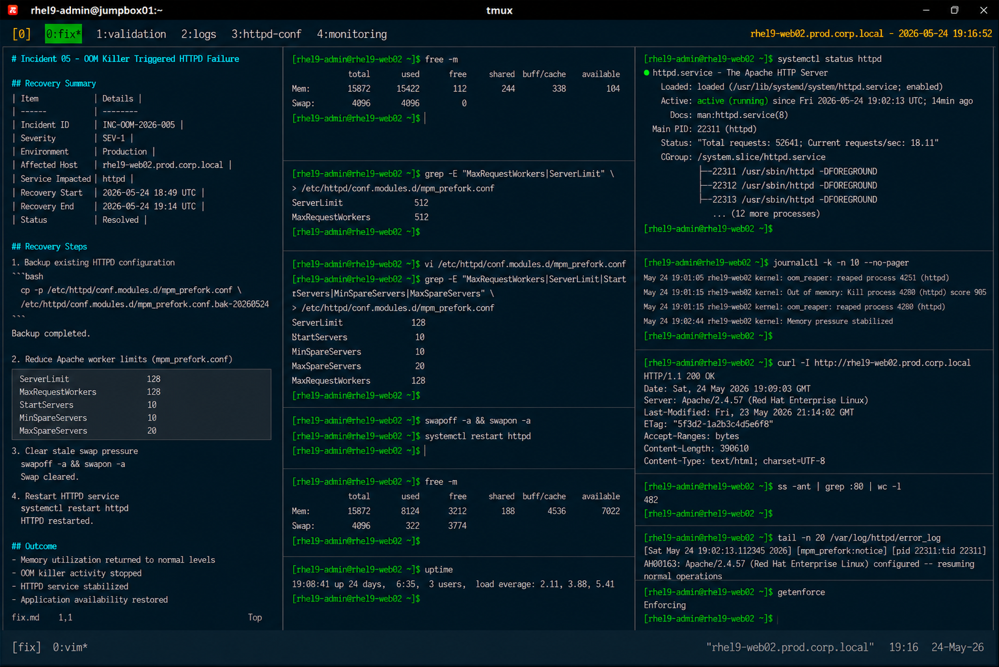

# Incident 05 — OOM Killer Triggered HTTPD Failure

## Overview

This document captures the remediation and recovery procedures executed during the out-of-memory (OOM) incident affecting the Apache HTTPD service on `rhel9-web02.prod.corp.local`.

The recovery focused on stabilizing system memory utilization, reducing Apache worker consumption, and restoring application availability.

---

# Recovery Summary

| Item | Details |
|---|---|
| Incident ID | INC-OOM-2026-005 |
| Severity | SEV-1 |
| Environment | Production |
| Affected Host | rhel9-web02.prod.corp.local |
| Service Impacted | httpd |
| Recovery Start | 2026-05-24 18:49 UTC |
| Recovery End | 2026-05-24 19:14 UTC |
| Status | Resolved |

---

# Identified Issue

The Linux kernel OOM killer repeatedly terminated Apache worker processes because system memory and swap resources became exhausted.

Memory validation:

```bash
free -m
```

Output:

```text
               total        used        free      shared  buff/cache   available
Mem:           15872       15422         112         244         338         104
Swap:           4096        4096           0
```

HTTPD worker configuration review:

```bash
grep -E "MaxRequestWorkers|ServerLimit" /etc/httpd/conf.modules.d/mpm_prefork.conf
```

Output:

```text
ServerLimit             512
MaxRequestWorkers       512
```

Configured worker limits exceeded the available server memory capacity.

---

# Recovery Procedure

## Backup Existing HTTPD Configuration

```bash
cp -p /etc/httpd/conf.modules.d/mpm_prefork.conf \
/etc/httpd/conf.modules.d/mpm_prefork.conf.bak-20260524
```

Configuration backup completed successfully.

---

## Reduce Apache Worker Limits

Updated Apache prefork worker configuration:

```bash
vi /etc/httpd/conf.modules.d/mpm_prefork.conf
```

Updated values:

```text
ServerLimit             128
MaxRequestWorkers       128
StartServers            10
MinSpareServers         10
MaxSpareServers         20
```

Worker limits were aligned with production memory capacity.

---

## Clear Stale Swap Pressure

```bash
swapoff -a && swapon -a
```

Swap recovery completed successfully.

---

## Restart HTTPD Service

```bash
systemctl restart httpd
```

HTTPD restart completed successfully.

---

# Service Validation

## Verify HTTPD Service Status

```bash
systemctl status httpd
```

Output:

```text
● httpd.service - The Apache HTTP Server
     Loaded: loaded (/usr/lib/systemd/system/httpd.service; enabled)
     Active: active (running)
```

HTTPD services stabilized successfully after configuration tuning.

---

# Memory Validation

## Verify Memory Utilization After Recovery

```bash
free -m
```

Output:

```text
               total        used        free      shared  buff/cache   available
Mem:           15872        8124        3212         188        4536        7022
Swap:           4096         322        3774
```

System memory utilization returned to healthy operational levels.

---

## Verify System Load

```bash
uptime
```

Output:

```text
19:08:41 up 24 days,  6:35,  3 users,  load average: 2.11, 3.88, 5.41
```

System load normalized after recovery activities.

---

# OOM Validation

## Review Kernel Logs After Recovery

```bash
journalctl -k -n 10 --no-pager
```

Output:

```text
May 24 19:02:44 rhel9-web02 kernel: Memory pressure stabilized
```

No additional OOM killer events were detected after remediation.

---

# Application Validation

## Verify HTTP Endpoint Availability

```bash
curl -I http://rhel9-web02.prod.corp.local
```

Output:

```text
HTTP/1.1 200 OK
Server: Apache/2.4.57
```

Application availability was restored successfully.

---

## Verify Active Connections

```bash
ss -ant | grep :80 | wc -l
```

Output:

```text
482
```

HTTP connection volume returned to expected operational levels.

---

# Log Validation

## Review HTTPD Error Logs

```bash
tail -n 20 /var/log/httpd/error_log
```

Output:

```text
[mpm_prefork:notice] AH00163: Apache/2.4.57 configured -- resuming normal operations
```

No additional worker termination errors were identified.

---

# SELinux Validation

## Verify SELinux Status

```bash
getenforce
```

Output:

```text
Enforcing
```

SELinux remained enabled throughout recovery operations.

---

# Validation Checklist

| Validation Item | Status |
|---|---|
| HTTPD operational | PASS |
| Memory utilization stabilized | PASS |
| Swap utilization reduced | PASS |
| OOM killer activity stopped | PASS |
| Application availability restored | PASS |
| SELinux enforcing | PASS |

---

# Operational Notes

- Recovery activities were limited to HTTPD tuning and memory stabilization
- No kernel parameter changes were required
- No SELinux or firewall modifications were necessary
- Application recovery completed without data corruption

---

# Screenshot Reference


