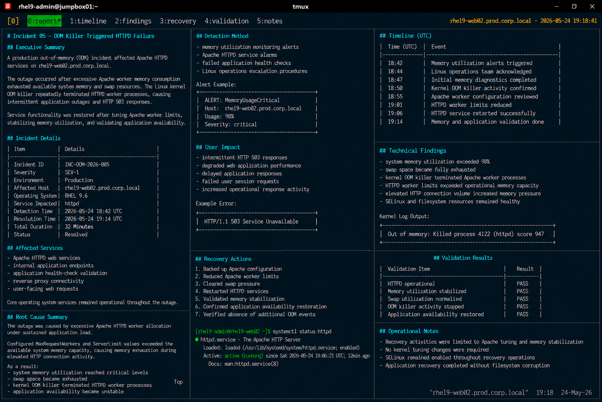

# Incident 05 — OOM Killer Triggered HTTPD Failure

## Executive Summary

A production out-of-memory (OOM) incident affected Apache HTTPD services on `rhel9-web02.prod.corp.local`.

The outage occurred after excessive Apache worker memory consumption exhausted available system memory and swap resources. The Linux kernel OOM killer repeatedly terminated HTTPD worker processes, causing intermittent application outages and HTTP 503 responses.

Service functionality was restored after tuning Apache worker limits, stabilizing memory utilization, and validating application availability.

---

# Incident Details

| Item | Details |
|---|---|
| Incident ID | INC-OOM-2026-005 |
| Severity | SEV-1 |
| Environment | Production |
| Affected Host | rhel9-web02.prod.corp.local |
| Operating System | RHEL 9.6 |
| Service Impacted | httpd |
| Detection Time | 2026-05-24 18:42 UTC |
| Resolution Time | 2026-05-24 19:14 UTC |
| Total Duration | 32 Minutes |
| Status | Resolved |

---

# Affected Services

The following operational services were impacted during the incident:

- Apache HTTPD web services
- internal application endpoints
- application health-check validation
- reverse proxy connectivity
- user-facing web requests

Core operating system services remained operational throughout the outage.

---

# Detection Method

The incident was detected through:

- memory utilization monitoring alerts
- Apache HTTPD service alarms
- failed application health checks
- Linux operations escalation procedures

Monitoring alert example:

```text
ALERT: MemoryUsageCritical
Host: rhel9-web02.prod.corp.local
Usage: 98%
Severity: critical
```

---

# User Impact

Operational impact during the incident included:

- intermittent HTTP 503 responses
- degraded web application performance
- delayed application responses
- failed user session requests
- increased operational response activity

Example application error:

```text
HTTP/1.1 503 Service Unavailable
```

---

# Timeline

| Time (UTC) | Event |
|---|---|
| 18:42 | Memory utilization alerts triggered |
| 18:44 | Linux operations team acknowledged incident |
| 18:47 | Initial memory diagnostics completed |
| 18:50 | Kernel OOM killer activity confirmed |
| 18:55 | Apache worker configuration reviewed |
| 19:01 | HTTPD worker limits reduced |
| 19:06 | HTTPD service restarted successfully |
| 19:14 | Memory and application validation completed |

---

# Technical Findings

Investigation identified the following conditions:

- system memory utilization exceeded 98%
- swap space became fully exhausted
- kernel OOM killer terminated Apache worker processes
- HTTPD worker limits exceeded operational memory capacity
- elevated HTTP connection volume increased memory pressure
- SELinux and filesystem resources remained healthy

Relevant kernel log output:

```text
Out of memory: Killed process 4122 (httpd) score 947
```

---

# Root Cause Summary

The outage was caused by excessive Apache HTTPD worker allocation under sustained application load.

Configured `MaxRequestWorkers` and `ServerLimit` values exceeded the available system memory capacity, causing memory exhaustion during elevated HTTP connection activity.

As a result:

- system memory utilization reached critical levels
- swap space became exhausted
- kernel OOM killer terminated HTTPD worker processes
- application availability became unstable

---

# Recovery Actions

The following recovery actions were completed:

- backed up Apache configuration
- reduced Apache worker limits
- cleared swap pressure
- restarted HTTPD services
- validated memory stabilization
- confirmed application availability restoration
- verified absence of additional OOM events

---

# Validation Results

| Validation Item | Result |
|---|---|
| HTTPD operational | PASS |
| Memory utilization stabilized | PASS |
| Swap utilization normalized | PASS |
| OOM killer activity stopped | PASS |
| Application availability restored | PASS |

---

# Operational Notes

- Recovery activities were limited to Apache tuning and memory stabilization
- No kernel tuning changes were required
- SELinux remained enabled throughout recovery operations
- Application recovery completed without filesystem corruption

---

# Screenshot Reference


