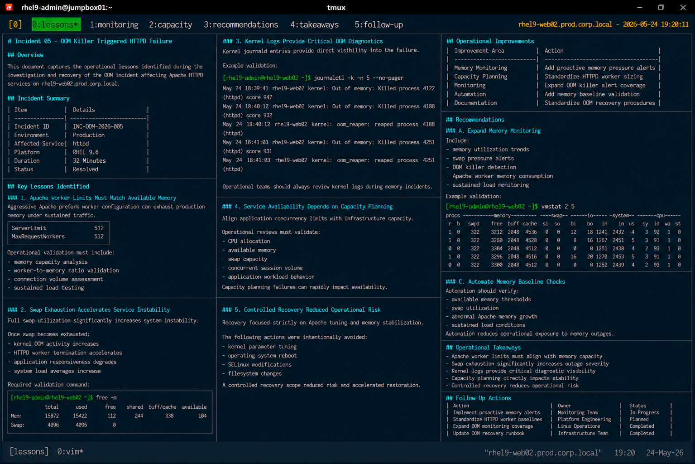

# Incident 05 — OOM Killer Triggered HTTPD Failure

## Overview

This document captures the operational lessons identified during the investigation and recovery of the out-of-memory (OOM) incident affecting Apache HTTPD services on `rhel9-web02.prod.corp.local`.

The objective is to improve memory monitoring, Apache capacity planning, and operational response procedures across the enterprise Linux infrastructure.

---

# Incident Summary

| Item | Details |
|---|---|
| Incident ID | INC-OOM-2026-005 |
| Environment | Production |
| Affected Service | httpd |
| Platform | RHEL 9.6 |
| Duration | 32 Minutes |
| Status | Resolved |

---

# Key Lessons Identified

## Apache Worker Limits Must Match Available Memory

The incident confirmed that aggressive Apache prefork worker configuration can exhaust production memory resources under sustained traffic conditions.

The following configuration exceeded the available system capacity:

```text
ServerLimit             512
MaxRequestWorkers       512
```

Operational validation must include:

- memory capacity analysis
- worker-to-memory ratio validation
- connection volume assessment
- sustained load testing

---

## Swap Exhaustion Accelerates Service Instability

The outage demonstrated that full swap utilization significantly increased system instability during memory pressure conditions.

Once swap became exhausted:

- kernel OOM activity increased
- HTTPD worker termination accelerated
- application responsiveness degraded
- system load averages increased

Required validation command:

```bash
free -m
```

---

## Kernel Logs Provide Critical OOM Diagnostics

Kernel journald entries provided direct visibility into the failure condition.

Example validation:

```bash
journalctl -k
```

Relevant log output:

```text
Out of memory: Killed process 4122 (httpd)
```

Operational teams should always review kernel logs during memory-related incidents.

---

## Service Availability Depends on Capacity Planning

The incident highlighted the importance of aligning application concurrency limits with infrastructure capacity.

Operational reviews must validate:

- CPU allocation
- available memory
- swap capacity
- concurrent session volume
- application workload behavior

Capacity planning failures can rapidly affect application availability.

---

## Controlled Recovery Reduced Operational Risk

Recovery activities focused strictly on Apache worker tuning and memory stabilization.

The following unnecessary actions were intentionally avoided:

- kernel parameter tuning
- operating system reboot
- SELinux modifications
- filesystem changes

Maintaining a controlled recovery scope reduced operational exposure and accelerated restoration.

---

# Operational Improvements

The following operational improvements were identified:

| Improvement Area | Action |
|---|---|
| Memory Monitoring | Add proactive memory pressure alerts |
| Capacity Planning | Standardize HTTPD worker sizing |
| Monitoring | Expand OOM killer alert coverage |
| Automation | Add memory baseline validation |
| Documentation | Standardize OOM recovery procedures |

---

# Recommendations

## Expand Memory Monitoring

Monitoring controls should include:

- memory utilization trends
- swap pressure alerts
- OOM killer detection
- Apache worker memory consumption
- sustained load monitoring

Example validation:

```bash
vmstat 2 5
```

---

## Standardize HTTPD Capacity Validation

Operational procedures should validate:

- `MaxRequestWorkers`
- `ServerLimit`
- memory utilization during peak traffic
- concurrent session handling capacity

Example validation:

```bash
grep -E "MaxRequestWorkers|ServerLimit" \
/etc/httpd/conf.modules.d/mpm_prefork.conf
```

---

## Automate Memory Baseline Checks

Infrastructure automation should verify:

- available memory thresholds
- swap utilization
- abnormal Apache memory growth
- sustained load conditions

Automation-based validation reduces operational exposure to memory-related outages.

---

# Operational Takeaways

- Apache worker limits must align with system memory capacity
- Swap exhaustion significantly increases outage severity
- Kernel logs provide critical diagnostic visibility
- Capacity planning directly impacts application stability
- Controlled recovery procedures reduce operational risk

---

# Follow-Up Actions

| Action | Owner | Status |
|---|---|---|
| Implement proactive memory alerts | Monitoring Team | In Progress |
| Standardize HTTPD worker baselines | Platform Engineering | Planned |
| Expand OOM monitoring coverage | Linux Operations | Completed |
| Update OOM recovery runbook | Infrastructure Team | Completed |

---

# Screenshot Reference


