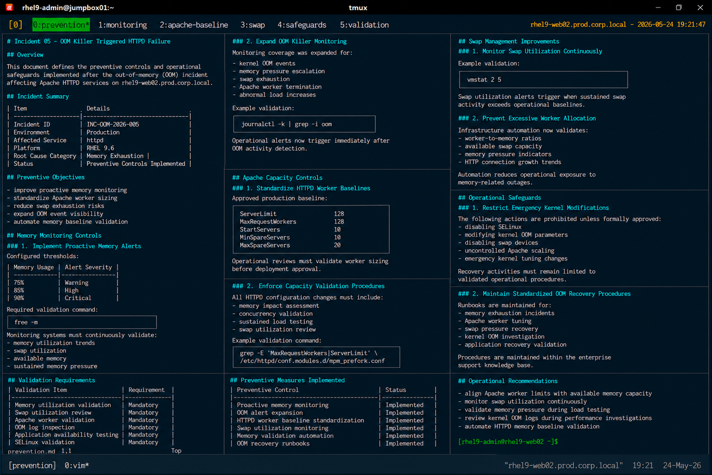

# Incident 05 — OOM Killer Triggered HTTPD Failure

## Overview

This document defines the preventive controls and operational safeguards implemented after the out-of-memory (OOM) incident affecting Apache HTTPD services on `rhel9-web02.prod.corp.local`.

The objective is to reduce the likelihood of future memory exhaustion events caused by excessive Apache worker allocation and sustained application load.

---

# Incident Summary

| Item | Details |
|---|---|
| Incident ID | INC-OOM-2026-005 |
| Environment | Production |
| Affected Service | httpd |
| Platform | RHEL 9.6 |
| Root Cause Category | Memory Exhaustion |
| Status | Preventive Controls Implemented |

---

# Preventive Objectives

The following preventive objectives were established after the incident:

- improve proactive memory monitoring
- standardize Apache worker sizing
- reduce swap exhaustion risks
- expand OOM event visibility
- automate memory baseline validation

---

# Memory Monitoring Controls

## Implement Proactive Memory Alerts

Monitoring thresholds were updated to improve visibility before memory exhaustion occurs.

Configured thresholds:

| Memory Usage | Alert Severity |
|---|---|
| 75% | Warning |
| 85% | High |
| 90% | Critical |

Required validation command:

```bash
free -m
```

Monitoring systems must continuously validate:

- memory utilization trends
- swap utilization
- available memory
- sustained memory pressure

---

## Expand OOM Killer Monitoring

Monitoring coverage was expanded for:

- kernel OOM events
- memory pressure escalation
- swap exhaustion
- Apache worker termination
- abnormal load increases

Example validation:

```bash
journalctl -k | grep -i oom
```

Operational alerts now trigger immediately after OOM activity detection.

---

# Apache Capacity Controls

## Standardize HTTPD Worker Baselines

Apache worker limits were standardized according to available system memory.

Approved production baseline:

```text
ServerLimit             128
MaxRequestWorkers       128
StartServers            10
MinSpareServers         10
MaxSpareServers         20
```

Operational reviews must validate worker sizing before deployment approval.

---

## Enforce Capacity Validation Procedures

All HTTPD configuration changes must include:

- memory impact assessment
- concurrency validation
- sustained load testing
- swap utilization review

Example validation command:

```bash
grep -E "MaxRequestWorkers|ServerLimit" \
/etc/httpd/conf.modules.d/mpm_prefork.conf
```

---

# Swap Management Improvements

## Monitor Swap Utilization Continuously

Operational procedures now require swap monitoring during peak traffic windows.

Example validation:

```bash
vmstat 2 5
```

Swap utilization alerts trigger when sustained swap activity exceeds operational baselines.

---

## Prevent Excessive Worker Allocation

Infrastructure automation now validates:

- worker-to-memory ratios
- available swap capacity
- memory pressure indicators
- HTTP connection growth trends

Automation-based validation reduces operational exposure to memory-related outages.

---

# Operational Safeguards

## Restrict Emergency Kernel Modifications

The following actions are prohibited during standard incident recovery unless formally approved:

- disabling SELinux
- modifying kernel OOM parameters
- disabling swap devices
- uncontrolled Apache scaling
- emergency kernel tuning changes

Recovery activities must remain limited to validated operational procedures.

---

## Maintain Standardized OOM Recovery Procedures

The Linux operations team implemented standardized runbooks for:

- memory exhaustion incidents
- Apache worker tuning
- swap pressure recovery
- kernel OOM investigation
- application recovery validation

Operational procedures are maintained within the enterprise support knowledge base.

---

# Validation Requirements

The following validation checklist must be completed after HTTPD configuration changes:

| Validation Item | Requirement |
|---|---|
| Memory utilization validation | Mandatory |
| Swap utilization review | Mandatory |
| Apache worker validation | Mandatory |
| OOM log inspection | Mandatory |
| Application availability testing | Mandatory |
| SELinux validation | Mandatory |

---

# Preventive Measures Implemented

| Preventive Control | Status |
|---|---|
| Proactive memory monitoring | Implemented |
| OOM alert expansion | Implemented |
| HTTPD worker baseline standardization | Implemented |
| Swap utilization monitoring | Implemented |
| Memory validation automation | Implemented |
| OOM recovery runbooks | Implemented |

---

# Operational Recommendations

- align Apache worker limits with available memory capacity
- monitor swap utilization continuously
- validate memory pressure during load testing
- review kernel OOM logs during performance investigations
- automate HTTPD memory baseline validation

---

# Screenshot Reference


