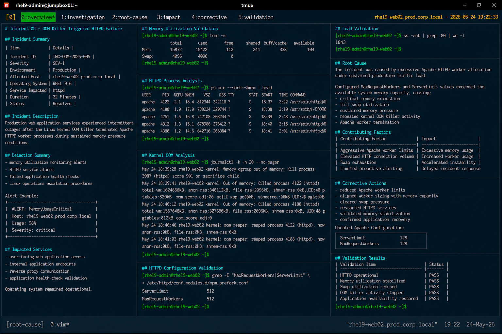

# Incident 05 — OOM Killer Triggered HTTPD Failure

## Overview

This document provides the root cause analysis (RCA) for the out-of-memory (OOM) incident affecting Apache HTTPD services on `rhel9-web02.prod.corp.local`.

The analysis identifies the technical failure condition, contributing operational factors, impact scope, and corrective actions implemented to restore application stability.

---

# Incident Summary

| Item | Details |
|---|---|
| Incident ID | INC-OOM-2026-005 |
| Severity | SEV-1 |
| Environment | Production |
| Affected Host | rhel9-web02.prod.corp.local |
| Operating System | RHEL 9.6 |
| Service Impacted | httpd |
| Duration | 32 Minutes |
| Status | Resolved |

---

# Incident Description

Production web application services experienced intermittent outages after the Linux kernel OOM killer terminated Apache HTTPD worker processes during sustained memory pressure conditions.

The issue disrupted:

- user-facing web application access
- internal application endpoints
- reverse proxy communication
- application health-check validation

Although the operating system remained operational, excessive memory consumption destabilized Apache service availability.

---

# Detection Summary

The issue was detected through:

- memory utilization monitoring alerts
- HTTPD service alarms
- failed application health checks
- Linux operations escalation procedures

Example monitoring event:

```text
ALERT: MemoryUsageCritical
Host: rhel9-web02.prod.corp.local
Usage: 98%
Severity: critical
```

---

# Technical Investigation

## Memory Utilization Validation

System memory and swap utilization reached critical thresholds.

```bash
free -m
```

Output:

```text
               total        used        free      shared  buff/cache   available
Mem:           15872       15422         112         244         338         104
Swap:           4096        4096           0
```

Available memory became critically limited during the incident.

---

## HTTPD Process Analysis

Apache worker processes consumed excessive memory resources.

```bash
ps aux --sort=-%mem | head
```

Output:

```text
apache    4122 18.4 21.8 812344 342118 ? S 18:37 3:22 /usr/sbin/httpd -DFOREGROUND
apache    4188 17.9 20.9 788224 329744 ? S 18:38 3:10 /usr/sbin/httpd -DFOREGROUND
```

HTTPD worker memory allocation exceeded expected operational baselines.

---

## Kernel OOM Analysis

Kernel logs confirmed repeated OOM killer activity.

```bash
journalctl -k -n 20 --no-pager
```

Output:

```text
May 24 18:39:41 rhel9-web02 kernel: Out of memory: Killed process 4122 (httpd) score 947
May 24 18:40:12 rhel9-web02 kernel: Out of memory: Killed process 4188 (httpd) score 932
```

The Linux kernel terminated Apache worker processes to recover system memory resources.

---

## HTTPD Configuration Validation

Apache worker configuration exceeded available infrastructure capacity.

```bash
grep -E "MaxRequestWorkers|ServerLimit" \
/etc/httpd/conf.modules.d/mpm_prefork.conf
```

Output:

```text
ServerLimit             512
MaxRequestWorkers       512
```

Configured worker limits significantly exceeded recommended baselines for the available system memory.

---

## Load Validation

The server experienced elevated HTTP connection volume during the incident.

```bash
ss -ant | grep :80 | wc -l
```

Output:

```text
1843
```

Sustained connection growth accelerated memory pressure conditions.

---

# Root Cause

The incident was caused by excessive Apache HTTPD worker allocation under sustained production traffic load.

Configured `MaxRequestWorkers` and `ServerLimit` values exceeded the available system memory capacity, causing:

- critical memory exhaustion
- full swap utilization
- sustained memory pressure
- repeated kernel OOM killer activity
- Apache worker termination

As a result, application availability became unstable and intermittent HTTP 503 responses occurred.

---

# Contributing Factors

The following operational conditions contributed to the incident:

| Contributing Factor | Impact |
|---|---|
| Aggressive Apache worker limits | Excessive memory allocation |
| Elevated HTTP connection volume | Increased worker utilization |
| Swap exhaustion | Accelerated system instability |
| Limited proactive memory alerting | Reduced operational response time |

---

# Impact Assessment

The incident caused the following operational impact:

- intermittent web application outages
- HTTP 503 responses
- degraded application responsiveness
- elevated system load averages
- increased operational response activity

No operating system kernel panic or filesystem corruption occurred during the incident.

---

# Corrective Actions

The following corrective actions were completed:

- reduced Apache worker limits
- aligned worker sizing with memory capacity
- cleared swap pressure
- restarted HTTPD services
- validated memory stabilization
- confirmed application recovery

Updated Apache configuration:

```text
ServerLimit             128
MaxRequestWorkers       128
```

---

# Validation Results

| Validation Item | Status |
|---|---|
| HTTPD operational | PASS |
| Memory utilization stabilized | PASS |
| Swap utilization reduced | PASS |
| OOM killer activity stopped | PASS |
| Application availability restored | PASS |

---

# Preventive Recommendations

The following preventive measures were identified during RCA review:

- standardize Apache worker baselines
- automate memory baseline validation
- expand OOM killer monitoring
- validate memory pressure during load testing
- improve proactive memory alerting

---

# Final Assessment

The incident originated from application capacity misconfiguration rather than operating system instability or hardware failure.

The operating system, filesystem integrity, SELinux policies, and network services remained healthy throughout the incident lifecycle.

The failure condition was isolated to excessive Apache worker allocation causing sustained memory exhaustion under elevated application traffic.

---

# Screenshot Reference


