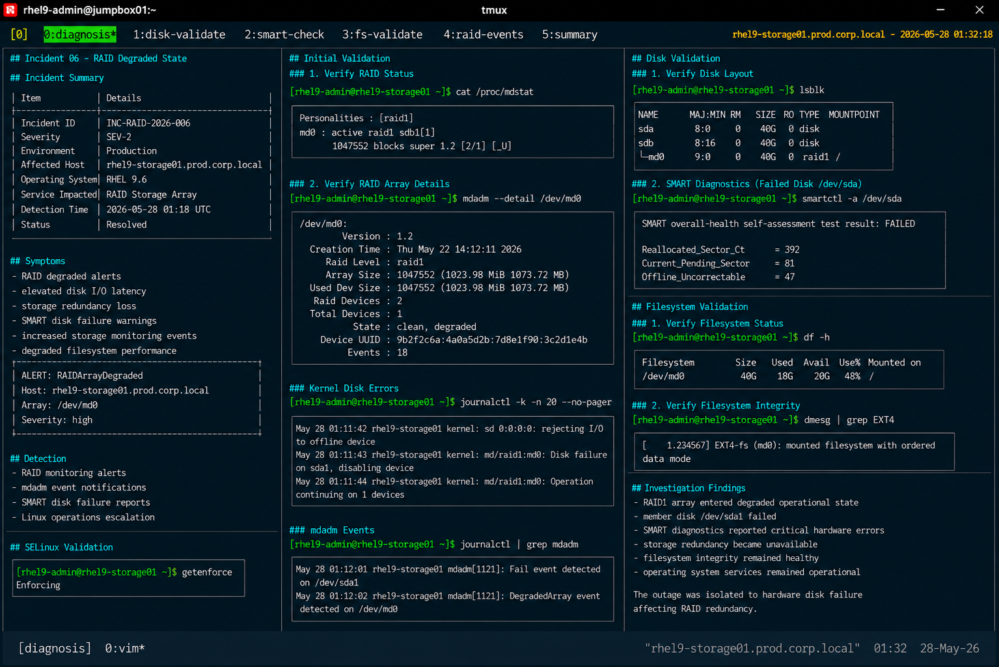

# Incident 06 — RAID Degraded State

## Overview

This document captures the diagnostic investigation performed during a RAID degradation incident affecting `rhel9-storage01.prod.corp.local`.

The incident resulted in reduced storage redundancy after a member disk failure caused the software RAID array to enter a degraded operational state.

---

# Incident Summary

| Item | Details |
|---|---|
| Incident ID | INC-RAID-2026-006 |
| Severity | SEV-2 |
| Environment | Production |
| Affected Host | rhel9-storage01.prod.corp.local |
| Operating System | RHEL 9.6 |
| Service Impacted | RAID Storage Array |
| Detection Time | 2026-05-28 01:18 UTC |
| Status | Resolved |

---

# Symptoms

Observed symptoms during the incident:

- RAID degraded alerts
- elevated disk I/O latency
- storage redundancy loss
- SMART disk failure warnings
- increased storage monitoring events
- degraded filesystem performance

Monitoring alert example:

```text
ALERT: RAIDArrayDegraded
Host: rhel9-storage01.prod.corp.local
Array: /dev/md0
Severity: high
```

---

# Detection

The issue was identified through:

- RAID monitoring alerts
- mdadm event notifications
- SMART disk failure reports
- Linux operations escalation

---

# Initial Validation

## Verify RAID Status

```bash
cat /proc/mdstat
```

Output:

```text
Personalities : [raid1]
md0 : active raid1 sdb1[1]
      1047552 blocks super 1.2 [2/1] [_U]
```

The RAID1 array entered degraded mode after loss of one member disk.

---

## Verify RAID Array Details

```bash
mdadm --detail /dev/md0
```

Output:

```text
/dev/md0:
        Version : 1.2
  Creation Time : Thu May 22 14:12:11 2026
     Raid Level : raid1
     Array Size : 1047552
  Used Dev Size : 1047552
   Raid Devices : 2
  Total Devices : 1
    State : clean, degraded
```

RAID redundancy was unavailable during the incident.

---

# Disk Validation

## Identify Failed Disk

```bash
lsblk
```

Output:

```text
NAME    MAJ:MIN RM  SIZE RO TYPE  MOUNTPOINT
sda       8:0    0   40G  0 disk
sdb       8:16   0   40G  0 disk
└─md0     9:0    0   40G  0 raid1 /
```

The `sda` member disk was unavailable from the active array.

---

## Review Kernel Disk Errors

```bash
journalctl -k -n 20 --no-pager
```

Output:

```text
May 28 01:11:42 rhel9-storage01 kernel: sd 0:0:0:0: rejecting I/O to offline device
May 28 01:11:43 rhel9-storage01 kernel: md/raid1:md0: Disk failure on sda1, disabling device
May 28 01:11:44 rhel9-storage01 kernel: md/raid1:md0: Operation continuing on 1 devices
```

Kernel logs confirmed disk failure activity affecting the RAID array.

---

# SMART Diagnostics

## Verify SMART Status

```bash
smartctl -a /dev/sda
```

Output:

```text
SMART overall-health self-assessment test result: FAILED
Reallocated_Sector_Ct = 392
Current_Pending_Sector = 81
Offline_Uncorrectable = 47
```

The failed disk reported critical hardware degradation indicators.

---

# Filesystem Validation

## Verify Filesystem Status

```bash
df -h
```

Output:

```text
Filesystem      Size  Used Avail Use% Mounted on
/dev/md0         40G   18G   20G  48% /
```

Filesystem availability remained operational despite RAID degradation.

---

## Verify Filesystem Integrity

```bash
dmesg | grep EXT4
```

Output:

```text
EXT4-fs (md0): mounted filesystem with ordered data mode
```

No filesystem corruption indicators were identified.

---

# RAID Event Validation

## Review mdadm Events

```bash
journalctl | grep mdadm
```

Output:

```text
May 28 01:12:01 rhel9-storage01 mdadm[1121]: Fail event detected on /dev/sda1
May 28 01:12:02 rhel9-storage01 mdadm[1121]: DegradedArray event detected on /dev/md0
```

RAID monitoring confirmed array degradation events.

---

# SELinux Validation

## Verify SELinux Status

```bash
getenforce
```

Output:

```text
Enforcing
```

SELinux remained enabled throughout the incident.

---

# Investigation Findings

The investigation identified physical disk failure as the primary contributor to RAID degradation.

Key findings:

- RAID1 array entered degraded operational state
- member disk `/dev/sda1` failed
- SMART diagnostics reported critical hardware errors
- storage redundancy became unavailable
- filesystem integrity remained healthy
- operating system services remained operational

The outage was isolated to hardware disk failure affecting RAID redundancy.

---

# Operational Impact

- reduced storage fault tolerance
- increased storage risk exposure
- elevated disk I/O latency
- increased operational monitoring activity

No filesystem corruption or operating system outage occurred during the incident.

---

# Screenshot Reference


