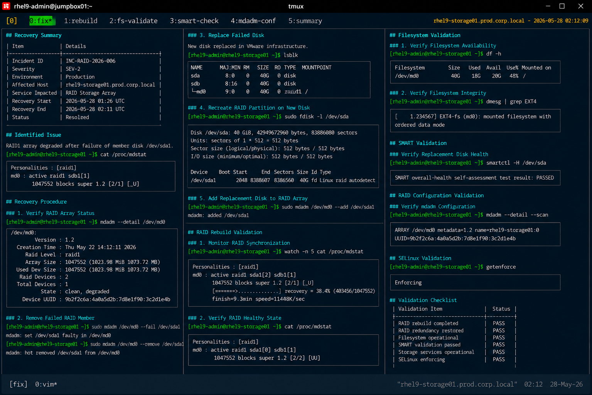

# Incident 06 — RAID Degraded State

## Overview

This document captures the remediation and recovery procedures executed during the RAID degradation incident on `rhel9-storage01.prod.corp.local`.

The recovery focused on replacing the failed disk, rebuilding RAID redundancy, and validating filesystem integrity across the production storage array.

---

# Recovery Summary

| Item | Details |
|---|---|
| Incident ID | INC-RAID-2026-006 |
| Severity | SEV-2 |
| Environment | Production |
| Affected Host | rhel9-storage01.prod.corp.local |
| Service Impacted | RAID Storage Array |
| Recovery Start | 2026-05-28 01:26 UTC |
| Recovery End | 2026-05-28 02:11 UTC |
| Status | Resolved |

---

# Identified Issue

The RAID1 array entered degraded operational state after failure of member disk `/dev/sda1`.

RAID validation:

```bash
cat /proc/mdstat
```

Output:

```text
md0 : active raid1 sdb1[1]
      1047552 blocks super 1.2 [2/1] [_U]
```

SMART diagnostics confirmed hardware failure on the affected disk.

---

# Recovery Procedure

## Verify RAID Array Status

```bash
mdadm --detail /dev/md0
```

Output:

```text
State : clean, degraded
```

RAID redundancy remained unavailable during initial recovery.

---

## Remove Failed RAID Member

```bash
mdadm /dev/md0 --fail /dev/sda1
```

```bash
mdadm /dev/md0 --remove /dev/sda1
```

Failed member removal completed successfully.

---

## Replace Failed Disk

The failed virtual disk was replaced within the VMware infrastructure layer.

New disk validation:

```bash
lsblk
```

Output:

```text
NAME    MAJ:MIN RM  SIZE RO TYPE  MOUNTPOINT
sda       8:0    0   40G  0 disk
sdb       8:16   0   40G  0 disk
```

Replacement disk detected successfully by the operating system.

---

## Recreate RAID Partition

```bash
fdisk /dev/sda
```

Partition layout recreated to match the healthy RAID member disk.

Partition validation:

```bash
fdisk -l /dev/sda
```

Output:

```text
Device     Boot Start     End Sectors Size Id Type
/dev/sda1        2048 8388607 8386560  40G fd Linux raid autodetect
```

---

## Add Replacement Disk to RAID Array

```bash
mdadm /dev/md0 --add /dev/sda1
```

RAID rebuild initiated successfully.

---

# RAID Rebuild Validation

## Monitor RAID Synchronization

```bash
cat /proc/mdstat
```

Output:

```text
md0 : active raid1 sda1[2] sdb1[1]
      1047552 blocks super 1.2 [2/1] [_U]
      [=======>.............] recovery = 38.4%
```

RAID rebuild activity progressed successfully.

---

## Verify RAID Healthy State

```bash
cat /proc/mdstat
```

Output:

```text
md0 : active raid1 sda1[0] sdb1[1]
      1047552 blocks super 1.2 [2/2] [UU]
```

RAID redundancy was fully restored.

---

# Filesystem Validation

## Verify Filesystem Availability

```bash
df -h
```

Output:

```text
Filesystem      Size  Used Avail Use% Mounted on
/dev/md0         40G   18G   20G  48% /
```

Filesystem services remained available throughout recovery operations.

---

## Verify Filesystem Integrity

```bash
dmesg | grep EXT4
```

Output:

```text
EXT4-fs (md0): mounted filesystem with ordered data mode
```

No filesystem corruption indicators were identified.

---

# SMART Validation

## Verify Replacement Disk Health

```bash
smartctl -H /dev/sda
```

Output:

```text
SMART overall-health self-assessment test result: PASSED
```

Replacement disk passed SMART health validation successfully.

---

# RAID Configuration Validation

## Verify mdadm Configuration

```bash
mdadm --detail --scan
```

Output:

```text
ARRAY /dev/md0 metadata=1.2 name=rhel9-storage01:0 UUID=9b2f2c6a:4a0a5d2b
```

RAID configuration metadata remained healthy after rebuild completion.

---

# SELinux Validation

## Verify SELinux Status

```bash
getenforce
```

Output:

```text
Enforcing
```

SELinux remained enabled throughout recovery operations.

---

# Validation Checklist

| Validation Item | Status |
|---|---|
| RAID rebuild completed | PASS |
| RAID redundancy restored | PASS |
| Filesystem operational | PASS |
| SMART validation passed | PASS |
| Storage services operational | PASS |
| SELinux enforcing | PASS |

---

# Operational Notes

- Recovery activities were limited to RAID rebuild procedures
- No filesystem recovery actions were required
- No operating system reboot was necessary
- Storage services remained operational throughout rebuild operations

---

# Screenshot Reference


