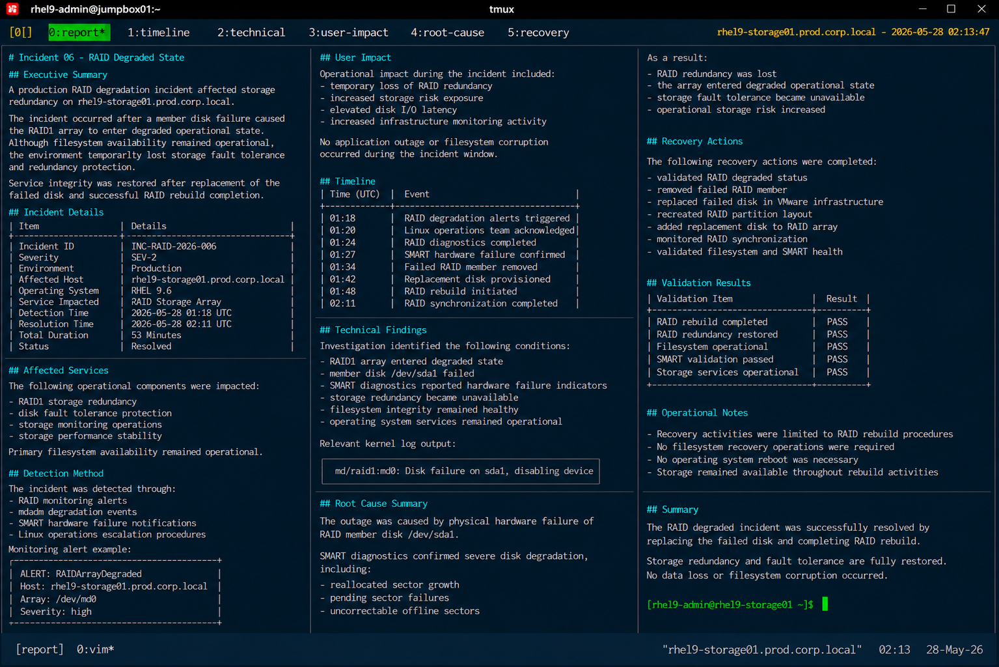

# Incident 06 — RAID Degraded State

## Executive Summary

A production RAID degradation incident affected storage redundancy on `rhel9-storage01.prod.corp.local`.

The incident occurred after a member disk failure caused the RAID1 array to enter degraded operational state. Although filesystem availability remained operational, the environment temporarily lost storage fault tolerance and redundancy protection.

Service integrity was restored after replacement of the failed disk and successful RAID rebuild completion.

---

# Incident Details

| Item | Details |
|---|---|
| Incident ID | INC-RAID-2026-006 |
| Severity | SEV-2 |
| Environment | Production |
| Affected Host | rhel9-storage01.prod.corp.local |
| Operating System | RHEL 9.6 |
| Service Impacted | RAID Storage Array |
| Detection Time | 2026-05-28 01:18 UTC |
| Resolution Time | 2026-05-28 02:11 UTC |
| Total Duration | 53 Minutes |
| Status | Resolved |

---

# Affected Services

The following operational components were impacted during the incident:

- RAID1 storage redundancy
- disk fault tolerance protection
- storage monitoring operations
- storage performance stability

Primary filesystem availability remained operational throughout the incident.

---

# Detection Method

The incident was detected through:

- RAID monitoring alerts
- mdadm degradation events
- SMART hardware failure notifications
- Linux operations escalation procedures

Monitoring alert example:

```text
ALERT: RAIDArrayDegraded
Host: rhel9-storage01.prod.corp.local
Array: /dev/md0
Severity: high
```

---

# User Impact

Operational impact during the incident included:

- temporary loss of RAID redundancy
- increased storage risk exposure
- elevated disk I/O latency
- increased infrastructure monitoring activity

No application outage or filesystem corruption occurred during the incident window.

---

# Timeline

| Time (UTC) | Event |
|---|---|
| 01:18 | RAID degradation alerts triggered |
| 01:20 | Linux operations team acknowledged incident |
| 01:24 | RAID diagnostics completed |
| 01:27 | SMART hardware failure confirmed |
| 01:34 | Failed RAID member removed |
| 01:42 | Replacement disk provisioned |
| 01:48 | RAID rebuild initiated |
| 02:11 | RAID synchronization completed |

---

# Technical Findings

Investigation identified the following conditions:

- RAID1 array entered degraded state
- member disk `/dev/sda1` failed
- SMART diagnostics reported hardware failure indicators
- storage redundancy became unavailable
- filesystem integrity remained healthy
- operating system services remained operational

Relevant kernel log output:

```text
md/raid1:md0: Disk failure on sda1, disabling device
```

---

# Root Cause Summary

The outage was caused by physical hardware failure of RAID member disk `/dev/sda1`.

SMART diagnostics confirmed severe disk degradation, including:

- reallocated sector growth
- pending sector failures
- uncorrectable offline sectors

As a result:

- RAID redundancy was lost
- the array entered degraded operational state
- storage fault tolerance became unavailable
- operational storage risk increased

---

# Recovery Actions

The following recovery actions were completed:

- validated RAID degraded status
- removed failed RAID member
- replaced failed disk in VMware infrastructure
- recreated RAID partition layout
- added replacement disk to RAID array
- monitored RAID synchronization
- validated filesystem and SMART health

---

# Validation Results

| Validation Item | Result |
|---|---|
| RAID rebuild completed | PASS |
| RAID redundancy restored | PASS |
| Filesystem operational | PASS |
| SMART validation passed | PASS |
| Storage services operational | PASS |

---

# Operational Notes

- Recovery activities were limited to RAID rebuild procedures
- No filesystem recovery operations were required
- No operating system reboot was necessary
- Storage remained available throughout rebuild activities

---

# Screenshot Reference


