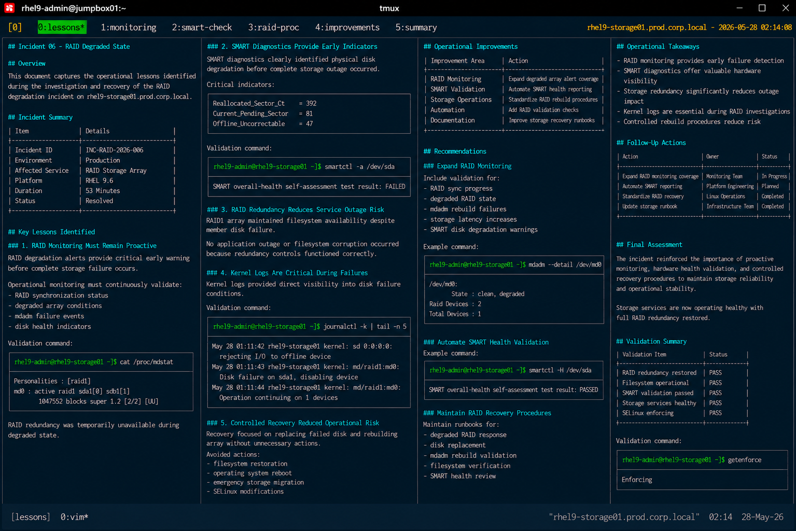

# Incident 06 — RAID Degraded State

## Overview

This document captures the operational lessons identified during the investigation and recovery of the RAID degradation incident on `rhel9-storage01.prod.corp.local`.

The objective is to improve storage monitoring, RAID maintenance procedures, and operational response workflows across the enterprise Linux infrastructure.

---

# Incident Summary

| Item | Details |
|---|---|
| Incident ID | INC-RAID-2026-006 |
| Environment | Production |
| Affected Service | RAID Storage Array |
| Platform | RHEL 9.6 |
| Duration | 53 Minutes |
| Status | Resolved |

---

# Key Lessons Identified

## RAID Monitoring Must Remain Proactive

The incident confirmed that RAID degradation alerts provide critical early warning before complete storage failure occurs.

Although the filesystem remained operational, the environment temporarily lost storage redundancy protection.

Operational monitoring must continuously validate:

- RAID synchronization status
- degraded array conditions
- mdadm failure events
- disk health indicators

Required validation command:

```bash
cat /proc/mdstat
```

---

## SMART Diagnostics Provide Early Hardware Failure Indicators

SMART diagnostics clearly identified physical disk degradation before complete storage outage occurred.

Critical indicators included:

```text
Reallocated_Sector_Ct = 392
Current_Pending_Sector = 81
Offline_Uncorrectable = 47
```

Operational procedures should routinely validate SMART health across all production storage devices.

---

## RAID Redundancy Reduces Service Outage Risk

The RAID1 array successfully maintained filesystem availability despite member disk failure.

The incident reinforced the operational value of:

- storage redundancy
- fault-tolerant design
- RAID monitoring visibility
- controlled rebuild procedures

No application outage or filesystem corruption occurred because redundancy controls functioned correctly.

---

## Kernel Logs Are Critical During Storage Failures

Kernel journald logs provided direct visibility into disk failure conditions.

Example validation:

```bash
journalctl -k
```

Relevant output:

```text
md/raid1:md0: Disk failure on sda1, disabling device
```

Operational teams should always review kernel storage events during RAID investigations.

---

## Controlled Recovery Reduced Operational Risk

Recovery activities focused strictly on replacing the failed disk and rebuilding the array.

The following unnecessary actions were intentionally avoided:

- filesystem restoration
- operating system reboot
- emergency storage migration
- SELinux modifications

Maintaining a controlled recovery scope reduced operational exposure and accelerated rebuild completion.

---

# Operational Improvements

The following operational improvements were identified:

| Improvement Area | Action |
|---|---|
| RAID Monitoring | Expand degraded array alert coverage |
| SMART Validation | Automate SMART health reporting |
| Storage Operations | Standardize RAID rebuild procedures |
| Automation | Add RAID validation checks |
| Documentation | Improve storage recovery runbooks |

---

# Recommendations

## Expand RAID Monitoring

Monitoring controls should include:

- RAID synchronization progress
- degraded RAID state alerts
- mdadm rebuild failures
- storage latency increases
- SMART disk degradation warnings

Example validation:

```bash
mdadm --detail /dev/md0
```

---

## Automate SMART Health Validation

Infrastructure automation should verify:

- SMART health status
- sector reallocation growth
- pending sector counts
- storage hardware degradation trends

Example validation:

```bash
smartctl -a /dev/sda
```

Automation-based validation reduces exposure to unexpected storage failures.

---

## Maintain RAID Recovery Procedures

Operational teams should maintain standardized runbooks for:

- degraded RAID response
- disk replacement procedures
- mdadm rebuild validation
- filesystem verification
- SMART health review

Recovery standardization improves operational consistency during storage incidents.

---

# Operational Takeaways

- RAID monitoring provides critical early failure detection
- SMART diagnostics offer valuable hardware visibility
- Storage redundancy significantly reduces outage impact
- Kernel logs are essential during RAID investigations
- Controlled rebuild procedures reduce operational risk

---

# Follow-Up Actions

| Action | Owner | Status |
|---|---|---|
| Expand RAID monitoring coverage | Monitoring Team | In Progress |
| Automate SMART reporting | Platform Engineering | Planned |
| Standardize RAID recovery workflows | Linux Operations | Completed |
| Update storage recovery runbook | Infrastructure Team | Completed |

---

# Screenshot Reference


