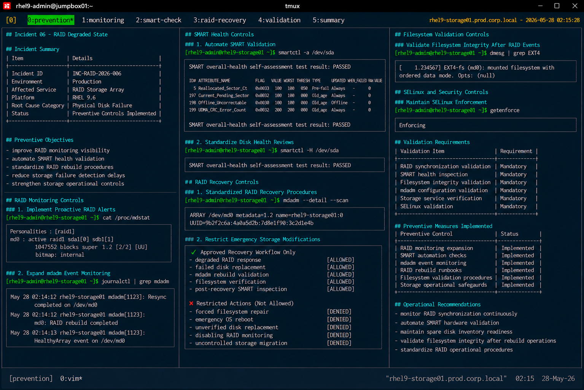

# Incident 06 — RAID Degraded State

## Overview

This document defines the preventive controls and operational safeguards implemented after the RAID degradation incident on `rhel9-storage01.prod.corp.local`.

The objective is to reduce the likelihood of future storage redundancy failures and improve operational visibility across enterprise Linux RAID infrastructure.

---

# Incident Summary

| Item | Details |
|---|---|
| Incident ID | INC-RAID-2026-006 |
| Environment | Production |
| Affected Service | RAID Storage Array |
| Platform | RHEL 9.6 |
| Root Cause Category | Physical Disk Failure |
| Status | Preventive Controls Implemented |

---

# Preventive Objectives

The following preventive objectives were established after the incident:

- improve RAID monitoring visibility
- automate SMART health validation
- standardize RAID rebuild procedures
- reduce storage failure detection delays
- strengthen storage operational controls

---

# RAID Monitoring Controls

## Implement Proactive RAID Alerts

Monitoring systems were updated to improve degraded array visibility.

Configured monitoring coverage includes:

- degraded RAID state detection
- RAID rebuild progress tracking
- mdadm synchronization failures
- member disk failure alerts
- storage latency escalation

Required validation command:

```bash
cat /proc/mdstat
```

Monitoring alerts now trigger immediately when RAID redundancy becomes unavailable.

---

## Expand mdadm Event Monitoring

Operational monitoring now validates:

- mdadm degradation events
- rebuild failures
- synchronization interruptions
- disk member removal events

Example validation:

```bash
journalctl | grep mdadm
```

Operational teams receive automated escalation notifications for RAID state changes.

---

# SMART Health Controls

## Automate SMART Validation

Infrastructure automation now validates:

- SMART health status
- reallocated sector growth
- pending sector counts
- uncorrectable sector events
- predictive hardware failures

Example validation command:

```bash
smartctl -a /dev/sda
```

Automation-based validation reduces exposure to unexpected disk failures.

---

## Standardize Disk Health Reviews

Operational procedures require scheduled SMART review activities for:

- production storage arrays
- database servers
- backup infrastructure
- virtualized storage platforms

Expected validation result:

```text
SMART overall-health self-assessment test result: PASSED
```

---

# RAID Recovery Controls

## Maintain Standardized RAID Recovery Procedures

The Linux operations team implemented standardized runbooks for:

- degraded RAID response
- failed disk replacement
- mdadm rebuild validation
- filesystem verification
- post-recovery SMART inspection

Operational procedures are maintained within the enterprise support knowledge base.

---

## Restrict Emergency Storage Modifications

The following actions are prohibited during standard RAID recovery unless formally approved:

- forced filesystem repair without validation
- emergency operating system reboot
- unverified disk replacement
- disabling RAID monitoring
- uncontrolled storage migration

Recovery activities must remain limited to validated operational procedures.

---

# Filesystem Validation Controls

## Validate Filesystem Integrity After RAID Events

Operational procedures now require filesystem validation after RAID degradation incidents.

Example validation:

```bash
dmesg | grep EXT4
```

Filesystem validation must confirm:

- successful filesystem mount status
- absence of corruption indicators
- stable storage device availability

---

# SELinux and Security Controls

## Maintain SELinux Enforcement

SELinux enforcement remains mandatory during all RAID recovery activities.

Validation command:

```bash
getenforce
```

Expected result:

```text
Enforcing
```

SELinux must not be disabled during storage maintenance procedures unless formally approved.

---

# Validation Requirements

The following validation checklist must be completed after RAID maintenance activities:

| Validation Item | Requirement |
|---|---|
| RAID synchronization validation | Mandatory |
| SMART health inspection | Mandatory |
| Filesystem integrity validation | Mandatory |
| mdadm configuration validation | Mandatory |
| Storage service verification | Mandatory |
| SELinux validation | Mandatory |

---

# Preventive Measures Implemented

| Preventive Control | Status |
|---|---|
| RAID monitoring expansion | Implemented |
| SMART automation checks | Implemented |
| mdadm event monitoring | Implemented |
| RAID rebuild runbooks | Implemented |
| Filesystem validation procedures | Implemented |
| Storage operational safeguards | Implemented |

---

# Operational Recommendations

- monitor RAID synchronization continuously
- automate SMART hardware validation
- maintain spare disk inventory readiness
- validate filesystem integrity after rebuild operations
- standardize RAID operational procedures

---

# Screenshot Reference


