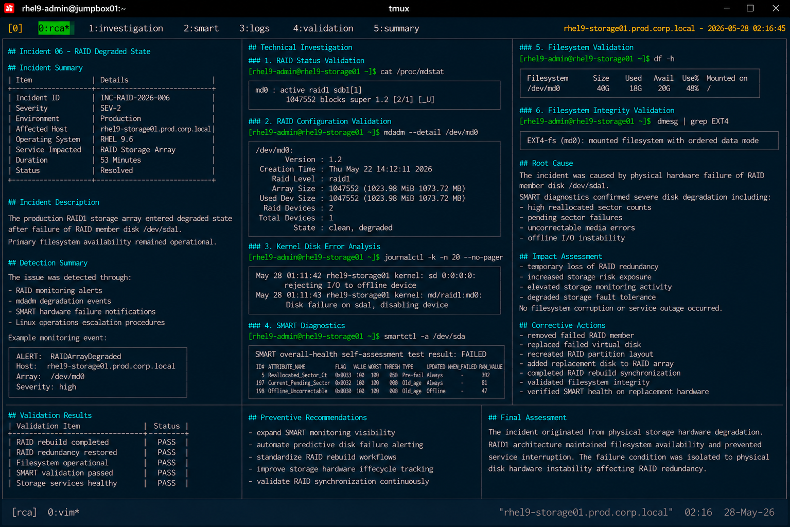

# Incident 06 — RAID Degraded State

## Overview

This document provides the root cause analysis (RCA) for the RAID degradation incident affecting `rhel9-storage01.prod.corp.local`.

The analysis identifies the technical failure condition, contributing operational factors, impact scope, and corrective actions implemented to restore full RAID redundancy and storage stability.

---

# Incident Summary

| Item | Details |
|---|---|
| Incident ID | INC-RAID-2026-006 |
| Severity | SEV-2 |
| Environment | Production |
| Affected Host | rhel9-storage01.prod.corp.local |
| Operating System | RHEL 9.6 |
| Service Impacted | RAID Storage Array |
| Duration | 53 Minutes |
| Status | Resolved |

---

# Incident Description

The production RAID1 storage array entered degraded operational state after failure of RAID member disk `/dev/sda1`.

The incident affected:

- RAID redundancy
- storage fault tolerance
- storage monitoring operations
- disk reliability status

Primary filesystem availability remained operational because the RAID1 array continued servicing storage operations using the surviving member disk.

---

# Detection Summary

The issue was detected through:

- RAID monitoring alerts
- mdadm degradation events
- SMART hardware failure notifications
- Linux operations escalation procedures

Example monitoring event:

```text
ALERT: RAIDArrayDegraded
Host: rhel9-storage01.prod.corp.local
Array: /dev/md0
Severity: high
```

---

# Technical Investigation

## RAID Status Validation

The RAID array entered degraded state after member disk failure.

```bash
cat /proc/mdstat
```

Output:

```text
md0 : active raid1 sdb1[1]
      1047552 blocks super 1.2 [2/1] [_U]
```

The array continued operating with only one active RAID member.

---

## RAID Configuration Validation

Detailed RAID diagnostics confirmed degraded operational status.

```bash
mdadm --detail /dev/md0
```

Output:

```text
State : clean, degraded
Raid Devices : 2
Total Devices : 1
```

RAID redundancy protection became unavailable during the incident.

---

## Kernel Disk Error Analysis

Kernel logs identified hardware disk failure activity.

```bash
journalctl -k -n 20 --no-pager
```

Output:

```text
May 28 01:11:42 rhel9-storage01 kernel: sd 0:0:0:0: rejecting I/O to offline device
May 28 01:11:43 rhel9-storage01 kernel: md/raid1:md0: Disk failure on sda1, disabling device
```

Kernel diagnostics confirmed the failed RAID member was removed automatically from active operations.

---

## SMART Diagnostics

SMART validation identified critical physical disk degradation indicators.

```bash
smartctl -a /dev/sda
```

Output:

```text
SMART overall-health self-assessment test result: FAILED
Reallocated_Sector_Ct = 392
Current_Pending_Sector = 81
Offline_Uncorrectable = 47
```

The affected disk reported severe hardware instability and media degradation.

---

## Filesystem Validation

Filesystem services remained operational during degraded RAID conditions.

```bash
df -h
```

Output:

```text
Filesystem      Size  Used Avail Use% Mounted on
/dev/md0         40G   18G   20G  48% /
```

No filesystem availability outage occurred during the incident lifecycle.

---

## Filesystem Integrity Validation

Filesystem integrity checks identified no corruption indicators.

```bash
dmesg | grep EXT4
```

Output:

```text
EXT4-fs (md0): mounted filesystem with ordered data mode
```

Filesystem consistency remained healthy throughout degraded operations.

---

# Root Cause

The incident was caused by physical hardware failure of RAID member disk `/dev/sda1`.

SMART diagnostics confirmed severe disk degradation, including:

- high reallocated sector counts
- pending sector failures
- uncorrectable media errors
- offline I/O instability

As a result:

- RAID redundancy became unavailable
- the RAID1 array entered degraded operational state
- storage fault tolerance was temporarily lost
- operational storage risk increased

---

# Contributing Factors

The following operational conditions contributed to the incident:

| Contributing Factor | Impact |
|---|---|
| Physical disk degradation | Triggered RAID member failure |
| Increased disk media errors | Caused unstable I/O operations |
| Limited proactive SMART alerting | Reduced early hardware visibility |
| Delayed predictive replacement planning | Increased degradation exposure |

---

# Impact Assessment

The incident caused the following operational impact:

- temporary loss of RAID redundancy
- increased storage risk exposure
- elevated storage monitoring activity
- degraded storage fault tolerance

No filesystem corruption, operating system outage, or application downtime occurred during the incident.

---

# Corrective Actions

The following corrective actions were completed:

- removed failed RAID member
- replaced failed virtual disk
- recreated RAID partition layout
- added replacement disk to RAID array
- completed RAID rebuild synchronization
- validated filesystem integrity
- verified SMART health on replacement hardware

Replacement disk validation:

```text
SMART overall-health self-assessment test result: PASSED
```

---

# Validation Results

| Validation Item | Status |
|---|---|
| RAID rebuild completed | PASS |
| RAID redundancy restored | PASS |
| Filesystem operational | PASS |
| SMART validation passed | PASS |
| Storage services healthy | PASS |

---

# Preventive Recommendations

The following preventive measures were identified during RCA review:

- expand SMART monitoring visibility
- automate predictive disk failure alerting
- standardize RAID rebuild workflows
- improve storage hardware lifecycle tracking
- validate RAID synchronization continuously

---

# Final Assessment

The incident originated from physical storage hardware degradation rather than operating system instability or filesystem corruption.

The RAID1 architecture successfully maintained filesystem availability and prevented service interruption despite member disk failure.

The failure condition was isolated to physical disk hardware instability affecting RAID redundancy and storage fault tolerance.

---

# Screenshot Reference


