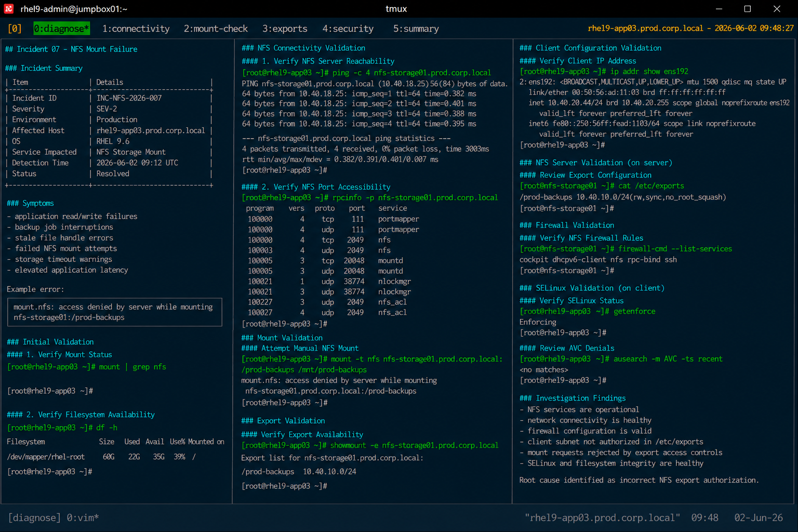

# Incident 07 — NFS Mount Failure

## Overview

This document captures the diagnostic investigation performed during an NFS mount failure incident affecting `rhel9-app03.prod.corp.local`.

The incident resulted in application instability and backup operation failures after the production NFS export became inaccessible from the application server.

---

# Incident Summary

| Item | Details |
|---|---|
| Incident ID | INC-NFS-2026-007 |
| Severity | SEV-2 |
| Environment | Production |
| Affected Host | rhel9-app03.prod.corp.local |
| Operating System | RHEL 9.6 |
| Service Impacted | NFS Storage Mount |
| Detection Time | 2026-06-02 09:12 UTC |
| Status | Resolved |

---

# Symptoms

Observed symptoms during the incident:

- application read/write failures
- backup job interruptions
- stale file handle errors
- failed NFS mount attempts
- storage timeout warnings
- elevated application latency

Example application error:

```text
mount.nfs: access denied by server while mounting nfs-storage01:/prod-backups
```

---

# Detection

The issue was identified through:

- backup monitoring alerts
- application storage alarms
- failed NFS mount validation
- Linux operations escalation

Monitoring alert example:

```text
ALERT: NFSMountFailure
Host: rhel9-app03.prod.corp.local
MountPoint: /mnt/prod-backups
Severity: high
```

---

# Initial Validation

## Verify Mount Status

```bash
mount | grep nfs
```

Output:

```text
<no output>
```

The NFS export was not mounted successfully.

---

## Verify Filesystem Availability

```bash
df -h
```

Output:

```text
Filesystem      Size  Used Avail Use% Mounted on
/dev/mapper/rhel-root   60G   22G   35G  39% /
```

The expected NFS filesystem was unavailable.

---

# NFS Connectivity Validation

## Verify NFS Server Reachability

```bash
ping -c 4 nfs-storage01.prod.corp.local
```

Output:

```text
64 bytes from 10.40.18.25: icmp_seq=1 ttl=64 time=0.382 ms
64 bytes from 10.40.18.25: icmp_seq=2 ttl=64 time=0.401 ms
```

Basic network connectivity remained operational.

---

## Verify NFS Port Accessibility

```bash
rpcinfo -p nfs-storage01.prod.corp.local
```

Output:

```text
program vers proto   port
100003    4   tcp   2049  nfs
100005    3   tcp  20048 mountd
```

NFS services were reachable from the client host.

---

# Mount Validation

## Attempt Manual NFS Mount

```bash
mount -t nfs nfs-storage01.prod.corp.local:/prod-backups /mnt/prod-backups
```

Output:

```text
mount.nfs: access denied by server while mounting nfs-storage01.prod.corp.local:/prod-backups
```

The server denied client mount access.

---

# Export Validation

## Verify Export Availability

```bash
showmount -e nfs-storage01.prod.corp.local
```

Output:

```text
Export list for nfs-storage01.prod.corp.local:
/prod-backups 10.40.10.0/24
```

The export existed but client authorization required additional validation.

---

# Client Configuration Validation

## Verify Client IP Address

```bash
ip addr show ens192
```

Output:

```text
inet 10.40.20.44/24 brd 10.40.20.255 scope global ens192
```

The client host subnet differed from the authorized export network range.

---

# NFS Server Validation

## Review Export Configuration

```bash
cat /etc/exports
```

Output:

```text
/prod-backups 10.40.10.0/24(rw,sync,no_root_squash)
```

The export policy restricted access to a different production subnet.

---

# Firewall Validation

## Verify NFS Firewall Rules

```bash
firewall-cmd --list-services
```

Output:

```text
cockpit dhcpv6-client nfs rpc-bind ssh
```

Firewall services remained properly configured.

---

# SELinux Validation

## Verify SELinux Status

```bash
getenforce
```

Output:

```text
Enforcing
```

SELinux remained enabled throughout the incident.

---

## Review AVC Denials

```bash
ausearch -m AVC -ts recent
```

Output:

```text
<no matches>
```

No SELinux denials related to NFS operations were identified.

---

# Investigation Findings

The investigation identified incorrect NFS export authorization as the primary contributor to the outage.

Key findings:

- NFS services remained operational
- network connectivity remained healthy
- firewall configuration remained valid
- client subnet was not authorized within `/etc/exports`
- mount requests were rejected by export access controls
- SELinux and filesystem integrity remained healthy

The outage was isolated to incorrect NFS export network authorization configuration.

---

# Operational Impact

- failed backup operations
- application storage access interruptions
- elevated application latency
- increased operational response activity

No filesystem corruption or operating system instability occurred during the incident.

---

# Screenshot Reference


