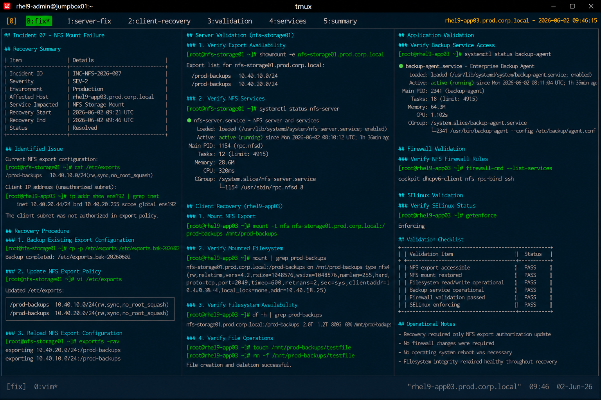

# Incident 07 — NFS Mount Failure

## Overview

This document captures the remediation and recovery procedures executed during the NFS mount failure incident on `rhel9-app03.prod.corp.local`.

The recovery focused on correcting NFS export authorization, restoring client mount access, and validating application storage functionality.

---

# Recovery Summary

| Item | Details |
|---|---|
| Incident ID | INC-NFS-2026-007 |
| Severity | SEV-2 |
| Environment | Production |
| Affected Host | rhel9-app03.prod.corp.local |
| Service Impacted | NFS Storage Mount |
| Recovery Start | 2026-06-02 09:21 UTC |
| Recovery End | 2026-06-02 09:46 UTC |
| Status | Resolved |

---

# Identified Issue

The NFS export policy restricted client access to an unauthorized subnet.

Export validation:

```bash
cat /etc/exports
```

Output:

```text
/prod-backups 10.40.10.0/24(rw,sync,no_root_squash)
```

Client IP validation:

```bash
ip addr show ens192
```

Output:

```text
inet 10.40.20.44/24 brd 10.40.20.255 scope global ens192
```

The client host subnet was excluded from the authorized export network range.

---

# Recovery Procedure

## Backup Existing Export Configuration

```bash
cp -p /etc/exports /etc/exports.bak-20260602
```

Configuration backup completed successfully.

---

## Update NFS Export Policy

Updated `/etc/exports` configuration:

```bash
vi /etc/exports
```

Updated configuration:

```text
/prod-backups 10.40.10.0/24(rw,sync,no_root_squash)
/prod-backups 10.40.20.0/24(rw,sync,no_root_squash)
```

The application subnet was added to authorized export access controls.

---

## Reload NFS Export Configuration

```bash
exportfs -rav
```

Output:

```text
exporting 10.40.20.0/24:/prod-backups
exporting 10.40.10.0/24:/prod-backups
```

NFS export configuration reloaded successfully.

---

# NFS Service Validation

## Verify Export Availability

```bash
showmount -e nfs-storage01.prod.corp.local
```

Output:

```text
Export list for nfs-storage01.prod.corp.local:
/prod-backups 10.40.10.0/24
/prod-backups 10.40.20.0/24
```

The updated export authorization was visible successfully.

---

## Verify NFS Services

```bash
systemctl status nfs-server
```

Output:

```text
● nfs-server.service - NFS server and services
     Loaded: loaded (/usr/lib/systemd/system/nfs-server.service; enabled)
     Active: active (running)
```

NFS services remained operational after configuration changes.

---

# Client Recovery

## Mount NFS Export

```bash
mount -t nfs nfs-storage01.prod.corp.local:/prod-backups /mnt/prod-backups
```

Mount operation completed successfully.

---

## Verify Mounted Filesystem

```bash
mount | grep prod-backups
```

Output:

```text
nfs-storage01.prod.corp.local:/prod-backups on /mnt/prod-backups type nfs4
```

NFS mount restoration completed successfully.

---

# Filesystem Validation

## Verify Filesystem Availability

```bash
df -h | grep prod-backups
```

Output:

```text
nfs-storage01.prod.corp.local:/prod-backups   2.0T  1.2T  800G  60% /mnt/prod-backups
```

Filesystem accessibility returned to normal operational state.

---

## Verify File Operations

```bash
touch /mnt/prod-backups/testfile
```

```bash
rm -f /mnt/prod-backups/testfile
```

Read/write operations completed successfully.

---

# Application Validation

## Verify Backup Service Access

```bash
systemctl status backup-agent
```

Output:

```text
● backup-agent.service - Enterprise Backup Agent
     Loaded: loaded (/usr/lib/systemd/system/backup-agent.service; enabled)
     Active: active (running)
```

Backup operations recovered successfully.

---

# Firewall Validation

## Verify NFS Firewall Rules

```bash
firewall-cmd --list-services
```

Output:

```text
cockpit dhcpv6-client nfs rpc-bind ssh
```

Firewall configuration remained healthy throughout recovery operations.

---

# SELinux Validation

## Verify SELinux Status

```bash
getenforce
```

Output:

```text
Enforcing
```

SELinux remained enabled throughout recovery operations.

---

# Validation Checklist

| Validation Item | Status |
|---|---|
| NFS export accessible | PASS |
| NFS mount restored | PASS |
| Filesystem read/write operational | PASS |
| Backup service operational | PASS |
| Firewall validation passed | PASS |
| SELinux enforcing | PASS |

---

# Operational Notes

- Recovery activities were limited to NFS export authorization updates
- No firewall modifications were required
- No operating system reboot was necessary
- Filesystem integrity remained healthy throughout recovery

---

# Screenshot Reference


