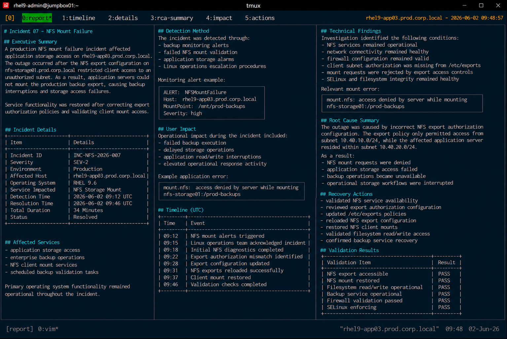

# Incident 07 — NFS Mount Failure

## Executive Summary

A production NFS mount failure incident affected application storage access on `rhel9-app03.prod.corp.local`.

The outage occurred after the NFS export configuration on `nfs-storage01.prod.corp.local` restricted client access to an unauthorized subnet. As a result, application servers could not mount the production backup export, causing backup interruptions and storage access failures.

Service functionality was restored after correcting export authorization policies and validating client mount access.

---

# Incident Details

| Item | Details |
|---|---|
| Incident ID | INC-NFS-2026-007 |
| Severity | SEV-2 |
| Environment | Production |
| Affected Host | rhel9-app03.prod.corp.local |
| Operating System | RHEL 9.6 |
| Service Impacted | NFS Storage Mount |
| Detection Time | 2026-06-02 09:12 UTC |
| Resolution Time | 2026-06-02 09:46 UTC |
| Total Duration | 34 Minutes |
| Status | Resolved |

---

# Affected Services

The following operational services were impacted during the incident:

- application storage access
- enterprise backup operations
- NFS client mount services
- scheduled backup validation tasks

Primary operating system functionality remained operational throughout the incident.

---

# Detection Method

The incident was detected through:

- backup monitoring alerts
- failed NFS mount validation
- application storage alarms
- Linux operations escalation procedures

Monitoring alert example:

```text
ALERT: NFSMountFailure
Host: rhel9-app03.prod.corp.local
MountPoint: /mnt/prod-backups
Severity: high
```

---

# User Impact

Operational impact during the incident included:

- failed backup execution
- delayed storage operations
- application read/write interruptions
- elevated operational response activity

Example application error:

```text
mount.nfs: access denied by server while mounting nfs-storage01:/prod-backups
```

---

# Timeline

| Time (UTC) | Event |
|---|---|
| 09:12 | NFS mount alerts triggered |
| 09:15 | Linux operations team acknowledged incident |
| 09:18 | Initial NFS diagnostics completed |
| 09:22 | Export authorization mismatch identified |
| 09:28 | Export configuration updated |
| 09:31 | NFS exports reloaded successfully |
| 09:37 | Client mount restored |
| 09:46 | Validation checks completed |

---

# Technical Findings

Investigation identified the following conditions:

- NFS services remained operational
- network connectivity remained healthy
- firewall configuration remained valid
- client subnet authorization was missing from `/etc/exports`
- mount requests were rejected by export access controls
- SELinux and filesystem integrity remained healthy

Relevant mount error:

```text
mount.nfs: access denied by server while mounting nfs-storage01:/prod-backups
```

---

# Root Cause Summary

The outage was caused by incorrect NFS export authorization configuration.

The export policy only permitted access from subnet `10.40.10.0/24`, while the affected application server resided within subnet `10.40.20.0/24`.

As a result:

- NFS mount requests were denied
- application storage access failed
- backup operations became unavailable
- operational storage workflows were interrupted

---

# Recovery Actions

The following recovery actions were completed:

- validated NFS service availability
- reviewed export authorization configuration
- updated `/etc/exports` policies
- reloaded NFS export configuration
- restored NFS client mounts
- validated filesystem read/write access
- confirmed backup service recovery

---

# Validation Results

| Validation Item | Result |
|---|---|
| NFS export accessible | PASS |
| NFS mount restored | PASS |
| Filesystem read/write operational | PASS |
| Backup service operational | PASS |
| Firewall validation passed | PASS |
| SELinux enforcing | PASS |

---

# Operational Notes

- Recovery activities were limited to export authorization updates
- No firewall modifications were required
- No operating system reboot was necessary
- Filesystem integrity remained healthy throughout recovery

---

# Screenshot Reference


