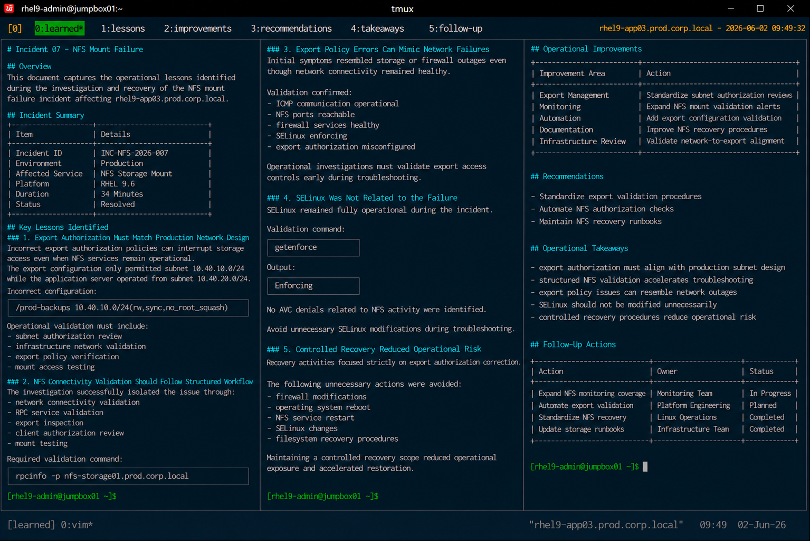

# Incident 07 — NFS Mount Failure

## Overview

This document captures the operational lessons identified during the investigation and recovery of the NFS mount failure incident affecting `rhel9-app03.prod.corp.local`.

The objective is to improve NFS export management, storage authorization controls, and operational response procedures across the enterprise Linux infrastructure.

---

# Incident Summary

| Item | Details |
|---|---|
| Incident ID | INC-NFS-2026-007 |
| Environment | Production |
| Affected Service | NFS Storage Mount |
| Platform | RHEL 9.6 |
| Duration | 34 Minutes |
| Status | Resolved |

---

# Key Lessons Identified

## Export Authorization Must Match Production Network Design

The incident confirmed that incorrect export authorization policies can interrupt storage access even when NFS services remain operational.

The export configuration only permitted subnet `10.40.10.0/24` while the application server operated from subnet `10.40.20.0/24`.

Incorrect configuration:

```text
/prod-backups 10.40.10.0/24(rw,sync,no_root_squash)
```

Operational validation must include:

- subnet authorization review
- infrastructure network validation
- export policy verification
- mount access testing

---

## NFS Connectivity Validation Should Follow Structured Workflow

The incident demonstrated the importance of validating NFS components in operational sequence.

The investigation successfully isolated the issue through:

- network connectivity validation
- RPC service validation
- export inspection
- client authorization review
- mount testing

Required validation command:

```bash
rpcinfo -p nfs-storage01.prod.corp.local
```

---

## Export Policy Errors Can Mimic Network Failures

Initial symptoms resembled storage or firewall outages even though network connectivity remained healthy.

Validation confirmed:

- ICMP communication operational
- NFS ports reachable
- firewall services healthy
- SELinux enforcing
- export authorization misconfigured

Operational investigations must validate export access controls early during troubleshooting.

---

## SELinux Was Not Related to the Failure

SELinux remained fully operational during the incident lifecycle.

Validation command:

```bash
getenforce
```

Output:

```text
Enforcing
```

No AVC denials related to NFS activity were identified.

This reinforced the importance of avoiding unnecessary SELinux modifications during troubleshooting.

---

## Controlled Recovery Reduced Operational Risk

Recovery activities focused strictly on export authorization correction.

The following unnecessary actions were intentionally avoided:

- firewall modifications
- operating system reboot
- NFS service restart
- SELinux changes
- filesystem recovery procedures

Maintaining a controlled recovery scope reduced operational exposure and accelerated restoration.

---

# Operational Improvements

The following operational improvements were identified:

| Improvement Area | Action |
|---|---|
| Export Management | Standardize subnet authorization reviews |
| Monitoring | Expand NFS mount validation alerts |
| Automation | Add export configuration validation |
| Documentation | Improve NFS recovery procedures |
| Infrastructure Review | Validate network-to-export alignment |

---

# Recommendations

## Standardize Export Validation Procedures

Operational teams should validate:

- export subnet authorization
- mount accessibility
- application storage paths
- backup service dependencies
- client network assignments

Example validation:

```bash
showmount -e nfs-storage01.prod.corp.local
```

---

## Automate NFS Authorization Checks

Infrastructure automation should verify:

- export policy consistency
- subnet authorization mismatches
- failed mount attempts
- stale export configurations
- storage dependency validation

Automation-based validation reduces operational exposure to export configuration drift.

---

## Maintain NFS Recovery Runbooks

Operational procedures should maintain standardized workflows for:

- export policy review
- client mount diagnostics
- RPC validation
- storage access testing
- post-recovery filesystem verification

Recovery standardization improves operational consistency during storage incidents.

---

# Operational Takeaways

- export authorization must align with production subnet design
- structured NFS validation accelerates troubleshooting
- export policy issues can resemble network outages
- SELinux should not be modified unnecessarily
- controlled recovery procedures reduce operational risk

---

# Follow-Up Actions

| Action | Owner | Status |
|---|---|---|
| Expand NFS monitoring coverage | Monitoring Team | In Progress |
| Automate export validation | Platform Engineering | Planned |
| Standardize NFS recovery procedures | Linux Operations | Completed |
| Update storage runbooks | Infrastructure Team | Completed |

---

# Screenshot Reference


