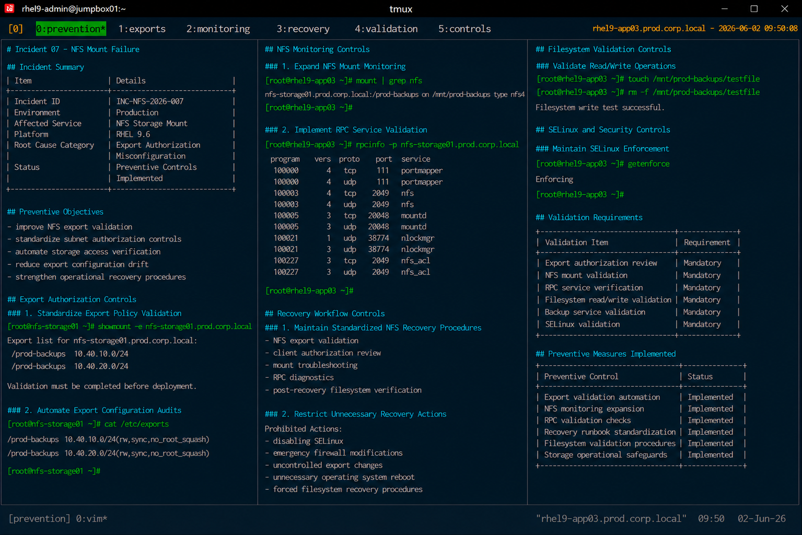

# Incident 07 — NFS Mount Failure

## Overview

This document defines the preventive controls and operational safeguards implemented after the NFS mount failure incident affecting `rhel9-app03.prod.corp.local`.

The objective is to reduce the likelihood of future NFS authorization failures and improve storage access visibility across the enterprise Linux infrastructure.

---

# Incident Summary

| Item | Details |
|---|---|
| Incident ID | INC-NFS-2026-007 |
| Environment | Production |
| Affected Service | NFS Storage Mount |
| Platform | RHEL 9.6 |
| Root Cause Category | Export Authorization Misconfiguration |
| Status | Preventive Controls Implemented |

---

# Preventive Objectives

The following preventive objectives were established after the incident:

- improve NFS export validation
- standardize subnet authorization controls
- automate storage access verification
- reduce export configuration drift
- strengthen operational recovery procedures

---

# Export Authorization Controls

## Standardize Export Policy Validation

Operational procedures now require validation of:

- authorized client subnets
- production network alignment
- application storage dependencies
- backup infrastructure access
- export access consistency

Example validation command:

```bash
showmount -e nfs-storage01.prod.corp.local
```

Export validation must be completed before production deployment approval.

---

## Automate Export Configuration Audits

Infrastructure automation now validates:

- subnet authorization mismatches
- stale export entries
- unauthorized network exclusions
- failed NFS mount attempts
- export configuration drift

Example validation:

```bash
cat /etc/exports
```

Automation-based checks reduce operational exposure to export misconfiguration.

---

# NFS Monitoring Controls

## Expand NFS Mount Monitoring

Monitoring coverage was expanded for:

- failed NFS mount attempts
- stale file handle events
- export authorization failures
- backup storage interruptions
- application storage latency

Example validation command:

```bash
mount | grep nfs
```

Operational alerts now trigger immediately when NFS mounts become unavailable.

---

## Implement RPC Service Validation

Operational monitoring now validates:

- NFS RPC availability
- mountd service status
- NFS protocol responsiveness
- export visibility
- client mount accessibility

Example validation:

```bash
rpcinfo -p nfs-storage01.prod.corp.local
```

---

# Recovery Workflow Controls

## Maintain Standardized NFS Recovery Procedures

The Linux operations team implemented standardized runbooks for:

- NFS export validation
- client authorization review
- mount troubleshooting
- RPC diagnostics
- post-recovery filesystem verification

Operational procedures are maintained within the enterprise support knowledge base.

---

## Restrict Unnecessary Recovery Actions

The following actions are prohibited during standard NFS recovery unless formally approved:

- disabling SELinux
- emergency firewall modifications
- uncontrolled export changes
- unnecessary operating system reboot
- forced filesystem recovery procedures

Recovery activities must remain limited to validated operational procedures.

---

# Filesystem Validation Controls

## Validate Read/Write Operations After Recovery

Operational procedures now require validation of:

- mount accessibility
- filesystem write operations
- application storage access
- backup service functionality
- stale file handle conditions

Example validation commands:

```bash
touch /mnt/prod-backups/testfile
```

```bash
rm -f /mnt/prod-backups/testfile
```

---

# SELinux and Security Controls

## Maintain SELinux Enforcement

SELinux enforcement remains mandatory during all NFS recovery operations.

Validation command:

```bash
getenforce
```

Expected result:

```text
Enforcing
```

SELinux must not be disabled during storage troubleshooting unless formally approved.

---

# Validation Requirements

The following validation checklist must be completed after NFS maintenance activities:

| Validation Item | Requirement |
|---|---|
| Export authorization review | Mandatory |
| NFS mount validation | Mandatory |
| RPC service verification | Mandatory |
| Filesystem read/write validation | Mandatory |
| Backup service validation | Mandatory |
| SELinux validation | Mandatory |

---

# Preventive Measures Implemented

| Preventive Control | Status |
|---|---|
| Export validation automation | Implemented |
| NFS monitoring expansion | Implemented |
| RPC validation checks | Implemented |
| Recovery runbook standardization | Implemented |
| Filesystem validation procedures | Implemented |
| Storage operational safeguards | Implemented |

---

# Operational Recommendations

- validate export authorization before deployment changes
- automate subnet authorization reviews
- monitor NFS mount health continuously
- validate backup storage dependencies regularly
- standardize NFS operational procedures

---

# Screenshot Reference


