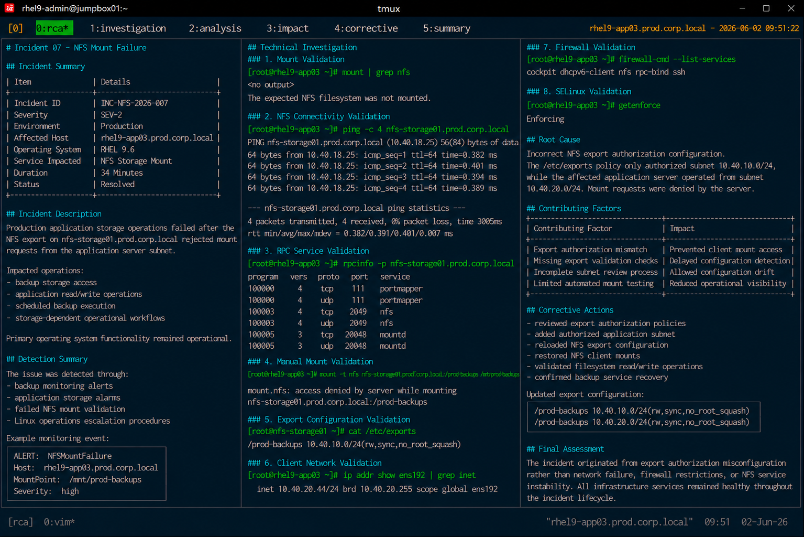

# Incident 07 — NFS Mount Failure

## Overview

This document provides the root cause analysis (RCA) for the NFS mount failure incident affecting `rhel9-app03.prod.corp.local`.

The analysis identifies the technical failure condition, contributing operational factors, impact scope, and corrective actions implemented to restore production storage access.

---

# Incident Summary

| Item | Details |
|---|---|
| Incident ID | INC-NFS-2026-007 |
| Severity | SEV-2 |
| Environment | Production |
| Affected Host | rhel9-app03.prod.corp.local |
| Operating System | RHEL 9.6 |
| Service Impacted | NFS Storage Mount |
| Duration | 34 Minutes |
| Status | Resolved |

---

# Incident Description

Production application storage operations failed after the NFS export on `nfs-storage01.prod.corp.local` rejected mount requests from the application server subnet.

The incident affected:

- backup storage access
- application read/write operations
- scheduled backup execution
- storage-dependent operational workflows

Primary operating system functionality remained operational during the incident lifecycle.

---

# Detection Summary

The issue was detected through:

- backup monitoring alerts
- application storage alarms
- failed NFS mount validation
- Linux operations escalation procedures

Example monitoring event:

```text
ALERT: NFSMountFailure
Host: rhel9-app03.prod.corp.local
MountPoint: /mnt/prod-backups
Severity: high
```

---

# Technical Investigation

## Mount Validation

The NFS export was unavailable from the client host.

```bash
mount | grep nfs
```

Output:

```text
<no output>
```

The expected NFS filesystem was not mounted successfully.

---

## NFS Connectivity Validation

Basic network communication remained operational.

```bash
ping -c 4 nfs-storage01.prod.corp.local
```

Output:

```text
64 bytes from 10.40.18.25: icmp_seq=1 ttl=64 time=0.382 ms
64 bytes from 10.40.18.25: icmp_seq=2 ttl=64 time=0.401 ms
```

No packet loss or network instability was identified.

---

## RPC Service Validation

NFS RPC services remained reachable from the client host.

```bash
rpcinfo -p nfs-storage01.prod.corp.local
```

Output:

```text
program vers proto   port
100003    4   tcp   2049  nfs
100005    3   tcp  20048 mountd
```

NFS infrastructure services remained healthy during the incident.

---

## Manual Mount Validation

Manual mount attempts failed due to export authorization rejection.

```bash
mount -t nfs nfs-storage01.prod.corp.local:/prod-backups /mnt/prod-backups
```

Output:

```text
mount.nfs: access denied by server while mounting nfs-storage01.prod.corp.local:/prod-backups
```

The NFS server denied client mount access requests.

---

## Export Configuration Validation

The export policy restricted access to a different production subnet.

```bash
cat /etc/exports
```

Output:

```text
/prod-backups 10.40.10.0/24(rw,sync,no_root_squash)
```

The application subnet was excluded from authorized export access.

---

## Client Network Validation

The affected client host operated from a different subnet.

```bash
ip addr show ens192
```

Output:

```text
inet 10.40.20.44/24 brd 10.40.20.255 scope global ens192
```

The client subnet did not match the authorized export network range.

---

## Firewall Validation

Firewall configuration remained operational throughout the incident.

```bash
firewall-cmd --list-services
```

Output:

```text
cockpit dhcpv6-client nfs rpc-bind ssh
```

No firewall restrictions affected NFS communication.

---

## SELinux Validation

SELinux remained enabled during the incident lifecycle.

```bash
getenforce
```

Output:

```text
Enforcing
```

No AVC denials related to NFS operations were identified.

---

# Root Cause

The incident was caused by incorrect NFS export authorization configuration.

The `/etc/exports` policy only authorized subnet `10.40.10.0/24`, while the affected application server operated from subnet `10.40.20.0/24`.

As a result:

- mount requests were denied
- backup storage access failed
- application storage operations became unavailable
- storage-dependent workflows were interrupted

---

# Contributing Factors

The following operational conditions contributed to the incident:

| Contributing Factor | Impact |
|---|---|
| Export authorization mismatch | Prevented client mount access |
| Missing export validation checks | Delayed configuration detection |
| Incomplete subnet review process | Allowed configuration drift |
| Limited automated mount testing | Reduced operational visibility |

---

# Impact Assessment

The incident caused the following operational impact:

- failed backup operations
- application storage interruptions
- elevated operational response activity
- temporary NFS mount unavailability

No filesystem corruption, operating system instability, or network outage occurred during the incident.

---

# Corrective Actions

The following corrective actions were completed:

- reviewed export authorization policies
- added authorized application subnet
- reloaded NFS export configuration
- restored NFS client mounts
- validated filesystem read/write operations
- confirmed backup service recovery

Updated export configuration:

```text
/prod-backups 10.40.10.0/24(rw,sync,no_root_squash)
/prod-backups 10.40.20.0/24(rw,sync,no_root_squash)
```

---

# Validation Results

| Validation Item | Status |
|---|---|
| NFS export accessible | PASS |
| NFS mount restored | PASS |
| Filesystem read/write operational | PASS |
| Backup services operational | PASS |
| Firewall validation passed | PASS |
| SELinux enforcing | PASS |

---

# Preventive Recommendations

The following preventive measures were identified during RCA review:

- standardize export authorization reviews
- automate subnet validation checks
- expand NFS monitoring coverage
- validate storage dependencies proactively
- maintain standardized NFS recovery procedures

---

# Final Assessment

The incident originated from export authorization misconfiguration rather than network failure, firewall restrictions, or NFS service instability.

The operating system, NFS infrastructure services, firewall policies, and SELinux controls remained healthy throughout the incident lifecycle.

The failure condition was isolated to incorrect subnet authorization within the NFS export policy configuration.

---

# Screenshot Reference


