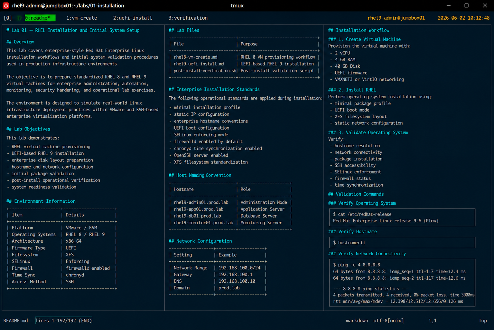

# Lab 01 — RHEL Installation and Initial System Setup

## Overview

This lab covers enterprise-style Red Hat Enterprise Linux installation workflows and initial system validation procedures used in production infrastructure environments.

The objective is to prepare standardized RHEL 8 and RHEL 9 virtual machines for enterprise administration, automation, monitoring, security hardening, and operational lab exercises.

The environment is designed to simulate real-world Linux infrastructure deployment practices within VMware and KVM-based enterprise virtualization platforms.

---

# Lab Objectives

This lab demonstrates:

- RHEL virtual machine provisioning
- UEFI-based RHEL 9 installation
- enterprise disk layout preparation
- hostname and network configuration
- initial package validation
- post-install operational verification
- system readiness validation

---

# Environment Information

| Item | Details |
|---|---|
| Platform | VMware / KVM |
| Operating Systems | RHEL 8 / RHEL 9 |
| Architecture | x86_64 |
| Firmware Type | UEFI |
| Filesystem | XFS |
| SELinux | Enforcing |
| Firewall | firewalld enabled |
| Time Sync | chronyd |
| Access Method | SSH |

---

# Lab Files

| File | Purpose |
|---|---|
| `rhel8-vm-create.md` | RHEL 8 VM provisioning workflow |
| `rhel9-uefi-install.md` | UEFI-based RHEL 9 installation |
| `post-install-verification.sh` | Post-install validation script |

---

# Enterprise Installation Standards

The following operational standards are applied during installation:

- minimal installation profile
- static IP configuration
- enterprise hostname conventions
- UEFI boot configuration
- SELinux enforcing mode
- firewalld enabled by default
- chronyd time synchronization enabled
- OpenSSH server enabled
- XFS filesystem standardization

---

# Host Naming Convention

| Hostname | Role |
|---|---|
| rhel9-admin01.prod.lab | Administration Node |
| rhel9-app01.prod.lab | Application Server |
| rhel9-db01.prod.lab | Database Server |
| rhel9-monitor01.prod.lab | Monitoring Server |

---

# Network Configuration

| Setting | Example |
|---|---|
| Network Range | 192.168.100.0/24 |
| Gateway | 192.168.100.1 |
| DNS | 192.168.100.10 |
| Domain | prod.lab |

---

# Installation Workflow

## 1. Create Virtual Machine

Provision the virtual machine with:

- 2 vCPU
- 4 GB RAM
- 40 GB Disk
- UEFI firmware
- VMXNET3 or VirtIO networking

---

## 2. Install RHEL

Perform operating system installation using:

- minimal package profile
- UEFI boot mode
- XFS filesystem layout
- static network configuration

---

## 3. Validate Operating System

Verify:

- hostname resolution
- network connectivity
- package installation
- SSH accessibility
- SELinux enforcement
- firewall status
- time synchronization

---

# Validation Commands

## Verify Operating System

```bash
cat /etc/redhat-release
```

Expected output:

```text
Red Hat Enterprise Linux release 9.6 (Plow)
```

---

## Verify Hostname

```bash
hostnamectl
```

---

## Verify Network Connectivity

```bash
ping -c 4 8.8.8.8
```

---

## Verify SELinux Status

```bash
getenforce
```

Expected output:

```text
Enforcing
```

---

## Verify Firewall Status

```bash
systemctl status firewalld
```

---

## Verify SSH Service

```bash
systemctl status sshd
```

---

# Operational Notes

- All systems are configured using enterprise operational baselines
- Minimal installation profiles reduce attack surface exposure
- SELinux remains enabled throughout all lab exercises
- UEFI boot mode is standardized across all systems
- XFS is used as the default enterprise filesystem

---

# Expected Outcome

After completing this lab:

- RHEL virtual machines are operational
- enterprise network configuration is validated
- SSH administration access is available
- systems are ready for advanced Linux administration labs
- baseline enterprise operational standards are applied

---

# Screenshot Reference


