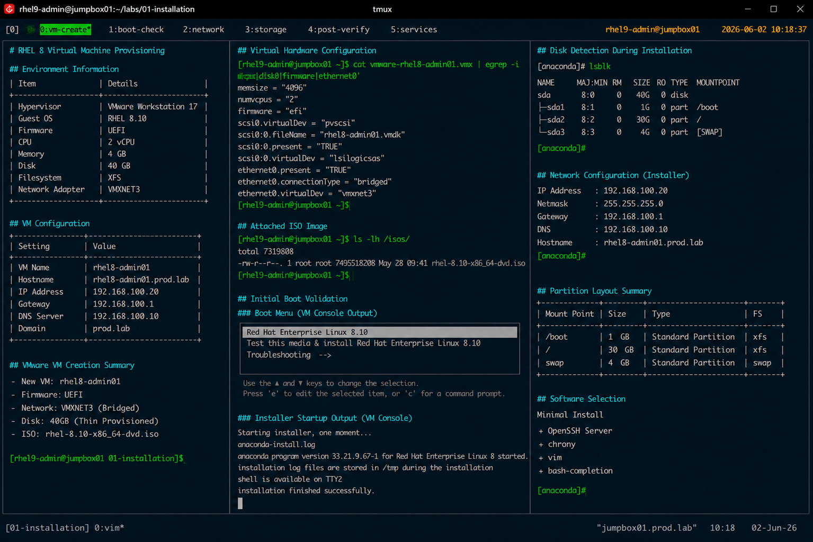

# RHEL 8 Virtual Machine Provisioning

## Overview

This document covers enterprise-style RHEL 8 virtual machine provisioning procedures used for Linux administration and infrastructure operations labs.

The workflow simulates production virtualization deployment standards within VMware and KVM-based enterprise environments.

---

# Objective

Provision a standardized RHEL 8 virtual machine with:

- enterprise baseline configuration
- UEFI firmware
- static networking
- XFS filesystem layout
- OpenSSH access
- SELinux enforcement
- firewalld enabled

---

# Environment Information

| Item | Details |
|---|---|
| Hypervisor | VMware Workstation / ESXi |
| Guest OS | RHEL 8 |
| Firmware | UEFI |
| CPU | 2 vCPU |
| Memory | 4 GB |
| Disk | 40 GB |
| Filesystem | XFS |
| Network Adapter | VMXNET3 |

---

# VM Configuration

## Virtual Machine Specifications

| Setting | Value |
|---|---|
| VM Name | rhel8-admin01 |
| Hostname | rhel8-admin01.prod.lab |
| IP Address | 192.168.100.20 |
| Gateway | 192.168.100.1 |
| DNS Server | 192.168.100.10 |
| Domain | prod.lab |

---

# VMware VM Creation

## Create New Virtual Machine

Provision a new virtual machine using:

- custom configuration
- UEFI firmware
- VMXNET3 network adapter
- SCSI virtual disk
- bridged or NAT networking

---

## Attach Installation ISO

Attach the official RHEL 8 installation ISO image.

Example:

```text
rhel-8.10-x86_64-dvd.iso
```

---

## Configure Virtual Hardware

Recommended allocation:

```text
vCPU: 2
RAM: 4096 MB
Disk: 40 GB Thin Provisioned
Firmware: UEFI
```

---

# Initial Boot Validation

## Power On Virtual Machine

Validate successful VM boot sequence.

Expected boot stages:

- VMware BIOS/UEFI initialization
- GRUB menu
- RHEL installer startup

---

## Verify Virtual Disk Detection

During installer initialization:

```bash
lsblk
```

Expected output:

```text
sda      8:0    0   40G  0 disk
```

---

# Network Configuration

## Configure Static IP Address

Example configuration:

```text
IP Address : 192.168.100.20
Netmask    : 255.255.255.0
Gateway    : 192.168.100.1
DNS        : 192.168.100.10
```

---

## Verify Network Adapter

```bash
ip addr
```

Expected output:

```text
ens160
```

---

# Storage Layout

## Recommended Partition Structure

| Mount Point | Size |
|---|---|
| /boot | 1 GB |
| / | 30 GB |
| swap | 4 GB |

Filesystem type:

```text
XFS
```

---

# Package Selection

## Installation Profile

Use the following software selection:

```text
Minimal Install
```

Additional packages:

- OpenSSH Server
- chrony
- vim
- bash-completion

---

# Post-Provision Validation

## Verify Operating System

```bash
cat /etc/redhat-release
```

Expected output:

```text
Red Hat Enterprise Linux release 8.10 (Ootpa)
```

---

## Verify Hostname

```bash
hostnamectl
```

Expected output:

```text
Static hostname: rhel8-admin01.prod.lab
```

---

## Verify Network Connectivity

```bash
ping -c 4 8.8.8.8
```

---

## Verify SELinux Status

```bash
getenforce
```

Expected output:

```text
Enforcing
```

---

## Verify Firewall Status

```bash
systemctl status firewalld
```

Expected output:

```text
active (running)
```

---

## Verify SSH Service

```bash
systemctl status sshd
```

Expected output:

```text
active (running)
```

---

# Operational Notes

- Minimal installation reduces unnecessary package exposure
- UEFI firmware aligns with enterprise virtualization standards
- XFS remains the standard enterprise filesystem
- SELinux remains enabled throughout provisioning
- SSH access is required for all future administration labs

---

# Expected Outcome

After completing this workflow:

- the RHEL 8 VM is operational
- enterprise networking is configured
- SSH administration access is available
- security baselines are applied
- the system is ready for operational labs

---

# Screenshot Reference


