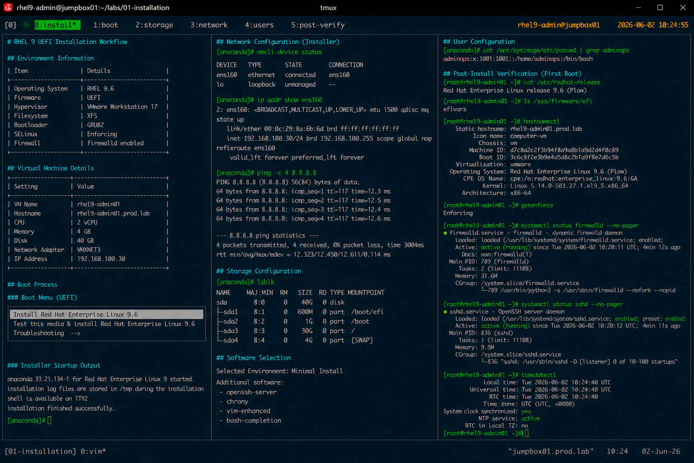

# RHEL 9 UEFI Installation Workflow

## Overview

This document covers enterprise-style RHEL 9 installation procedures using UEFI firmware configuration within VMware and KVM virtualization environments.

The workflow follows operational deployment standards commonly used for enterprise Linux infrastructure provisioning.

---

# Objective

Install and configure RHEL 9 using:

- UEFI boot mode
- XFS filesystem layout
- static network configuration
- enterprise host naming
- SELinux enforcement
- firewalld service enablement
- OpenSSH administration access

---

# Environment Information

| Item | Details |
|---|---|
| Operating System | RHEL 9.6 |
| Firmware | UEFI |
| Hypervisor | VMware / KVM |
| Filesystem | XFS |
| Bootloader | GRUB2 |
| SELinux | Enforcing |
| Firewall | firewalld enabled |

---

# Installation Configuration

## Virtual Machine Details

| Setting | Value |
|---|---|
| VM Name | rhel9-admin01 |
| Hostname | rhel9-admin01.prod.lab |
| CPU | 2 vCPU |
| Memory | 4 GB |
| Disk | 40 GB |
| Network Adapter | VMXNET3 |
| IP Address | 192.168.100.30 |

---

# Boot Process

## Attach RHEL 9 ISO

Example installation media:

```text
rhel-9.6-x86_64-dvd.iso
```

---

## Boot Using UEFI Firmware

During VM startup verify:

- UEFI firmware initialization
- GRUB2 boot menu
- installer media detection

Example boot menu entry:

```text
Install Red Hat Enterprise Linux 9.6
```

---

# Installer Configuration

## Configure Installation Source

Installation source:

```text
Local ISO Media
```

---

## Configure Keyboard and Language

Example:

```text
Language : English (United States)
Keyboard : US
```

---

## Configure Network Settings

Example static configuration:

```text
IP Address : 192.168.100.30
Netmask    : 255.255.255.0
Gateway    : 192.168.100.1
DNS        : 192.168.100.10
Hostname   : rhel9-admin01.prod.lab
```

---

## Verify Network Connectivity

Within installer shell:

```bash
ping -c 4 8.8.8.8
```

Expected output:

```text
4 packets transmitted, 4 received
```

---

# Storage Configuration

## Configure Disk Layout

Recommended layout:

| Mount Point | Size |
|---|---|
| /boot/efi | 600 MB |
| /boot | 1 GB |
| / | 30 GB |
| swap | 4 GB |

Filesystem:

```text
XFS
```

---

## Verify Disk Detection

```bash
lsblk
```

Expected output:

```text
sda      8:0    0   40G  0 disk
```

---

# Software Selection

## Installation Profile

Use the following software profile:

```text
Minimal Install
```

Additional packages:

- OpenSSH Server
- chrony
- vim-enhanced
- bash-completion

---

# User Configuration

## Configure Root Password

Set enterprise-compliant root password policy.

Example:

```text
Minimum Length : 12 Characters
```

---

## Create Administrative User

Example account:

```text
Username : adminops
Groups   : wheel
```

---

# Post-Install Validation

## Verify Operating System

```bash
cat /etc/redhat-release
```

Expected output:

```text
Red Hat Enterprise Linux release 9.6 (Plow)
```

---

## Verify UEFI Boot Mode

```bash
ls /sys/firmware/efi
```

Expected output:

```text
efivars
```

---

## Verify Hostname

```bash
hostnamectl
```

Expected output:

```text
Static hostname: rhel9-admin01.prod.lab
```

---

## Verify SELinux Status

```bash
getenforce
```

Expected output:

```text
Enforcing
```

---

## Verify Firewall Status

```bash
systemctl status firewalld
```

Expected output:

```text
active (running)
```

---

## Verify SSH Service

```bash
systemctl status sshd
```

Expected output:

```text
active (running)
```

---

## Verify Time Synchronization

```bash
timedatectl
```

Expected output:

```text
System clock synchronized: yes
```

---

# Operational Notes

- UEFI firmware is standardized across enterprise deployments
- XFS remains the default enterprise filesystem
- SELinux remains enabled during all installation phases
- Minimal package profiles reduce attack surface exposure
- SSH administration access is required for all future labs

---

# Expected Outcome

After completing this workflow:

- RHEL 9 installation is operational
- UEFI boot configuration is validated
- enterprise networking is configured
- administrative access is available
- baseline operational standards are applied

---

# Screenshot Reference


