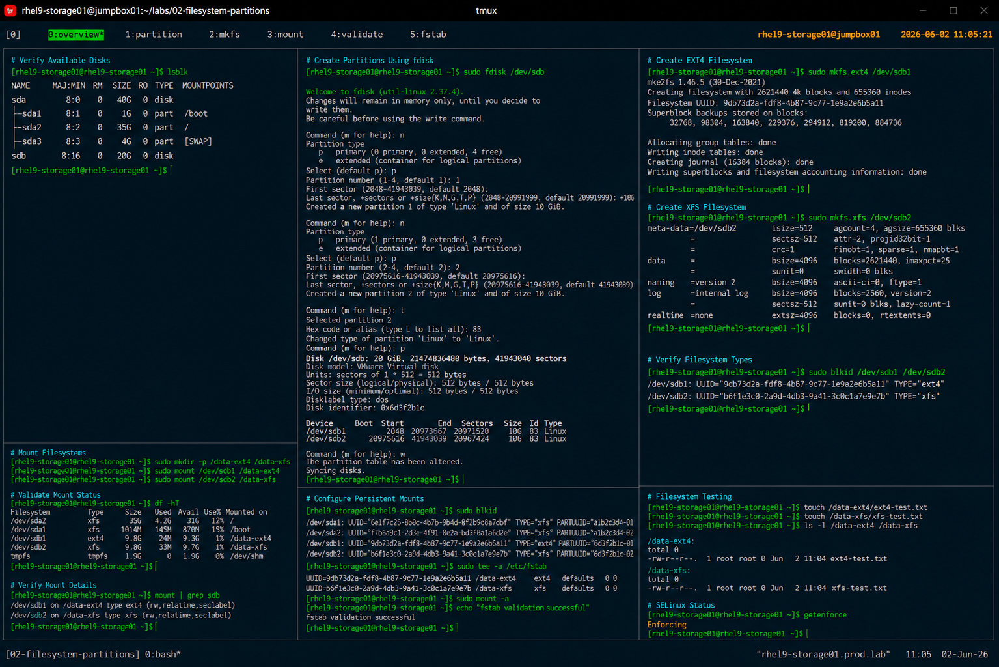

# Creating EXT4 and XFS Filesystems

## Overview

This lab demonstrates enterprise Linux disk partitioning and filesystem creation procedures using EXT4 and XFS filesystems on RHEL 9 systems.

The workflow simulates production storage provisioning operations commonly performed during server deployment, application storage preparation, and infrastructure expansion activities.

---

# Objective

This exercise covers:

- disk detection
- partition creation
- EXT4 filesystem creation
- XFS filesystem creation
- filesystem mounting
- persistent mount configuration
- storage validation procedures

---

# Environment Information

| Item | Details |
|---|---|
| Operating System | RHEL 9.6 |
| Hostname | rhel9-storage01.prod.lab |
| Filesystem Types | EXT4 / XFS |
| Disk Device | /dev/sdb |
| Access Method | SSH |
| SELinux | Enforcing |

---

# Storage Layout

| Partition | Filesystem | Mount Point |
|---|---|---|
| /dev/sdb1 | ext4 | /data-ext4 |
| /dev/sdb2 | xfs | /data-xfs |

---

# Initial Disk Validation

## Verify Available Disks

```bash
lsblk
```

Expected output:

```text
sda      8:0    0   40G  0 disk
├─sda1   8:1    0    1G  0 part /boot
├─sda2   8:2    0   35G  0 part /
└─sda3   8:3    0    4G  0 part [SWAP]

sdb      8:16   0   20G  0 disk
```

---

# Partition Creation

## Create Partitions Using fdisk

Launch partition utility:

```bash
fdisk /dev/sdb
```

Create:

- `/dev/sdb1` → 10 GB
- `/dev/sdb2` → remaining space

---

## Verify Partition Layout

```bash
lsblk
```

Expected output:

```text
sdb      8:16   0   20G  0 disk
├─sdb1   8:17   0   10G  0 part
└─sdb2   8:18   0   10G  0 part
```

---

# EXT4 Filesystem Creation

## Create EXT4 Filesystem

```bash
mkfs.ext4 /dev/sdb1
```

Expected output:

```text
Creating filesystem with 2621440 4k blocks
Filesystem UUID: 9db73d2a-fdf8
```

---

## Verify EXT4 Filesystem

```bash
blkid /dev/sdb1
```

Expected output:

```text
TYPE="ext4"
```

---

# XFS Filesystem Creation

## Create XFS Filesystem

```bash
mkfs.xfs /dev/sdb2
```

Expected output:

```text
meta-data=/dev/sdb2
data     = bsize=4096 blocks=
```

---

## Verify XFS Filesystem

```bash
blkid /dev/sdb2
```

Expected output:

```text
TYPE="xfs"
```

---

# Mount Point Preparation

## Create Mount Directories

```bash
mkdir -p /data-ext4
mkdir -p /data-xfs
```

---

# Mount Filesystems

## Mount EXT4 Filesystem

```bash
mount /dev/sdb1 /data-ext4
```

---

## Mount XFS Filesystem

```bash
mount /dev/sdb2 /data-xfs
```

---

# Verify Mounted Filesystems

## Validate Mount Status

```bash
df -hT
```

Expected output:

```text
/dev/sdb1   ext4   9.8G
/dev/sdb2   xfs    9.8G
```

---

## Verify Filesystem Types

```bash
mount | grep sdb
```

Expected output:

```text
/dev/sdb1 on /data-ext4 type ext4
/dev/sdb2 on /data-xfs type xfs
```

---

# Persistent Mount Configuration

## Retrieve UUID Information

```bash
blkid
```

Example output:

```text
/dev/sdb1: UUID="a1b2c3d4" TYPE="ext4"
/dev/sdb2: UUID="e5f6g7h8" TYPE="xfs"
```

---

## Update /etc/fstab

```bash
vi /etc/fstab
```

Example configuration:

```text
UUID=a1b2c3d4 /data-ext4 ext4 defaults 0 0
UUID=e5f6g7h8 /data-xfs  xfs  defaults 0 0
```

---

## Validate fstab Configuration

```bash
mount -a
```

No output indicates successful validation.

---

# Filesystem Testing

## Create Test Files

```bash
touch /data-ext4/ext4-test.txt
touch /data-xfs/xfs-test.txt
```

---

## Verify File Operations

```bash
ls -l /data-ext4
ls -l /data-xfs
```

---

# SELinux Validation

## Verify SELinux Status

```bash
getenforce
```

Expected output:

```text
Enforcing
```

---

# Operational Notes

- XFS remains the enterprise default filesystem on RHEL 9
- EXT4 remains useful for compatibility-based workloads
- UUID-based mounts reduce device naming dependency risks
- Persistent mount validation is required after all storage changes
- SELinux remains enabled during all storage operations

---

# Expected Outcome

After completing this lab:

- EXT4 filesystem is operational
- XFS filesystem is operational
- persistent mounts are configured
- storage validation is completed
- enterprise filesystem standards are applied

---

# Screenshot Reference


