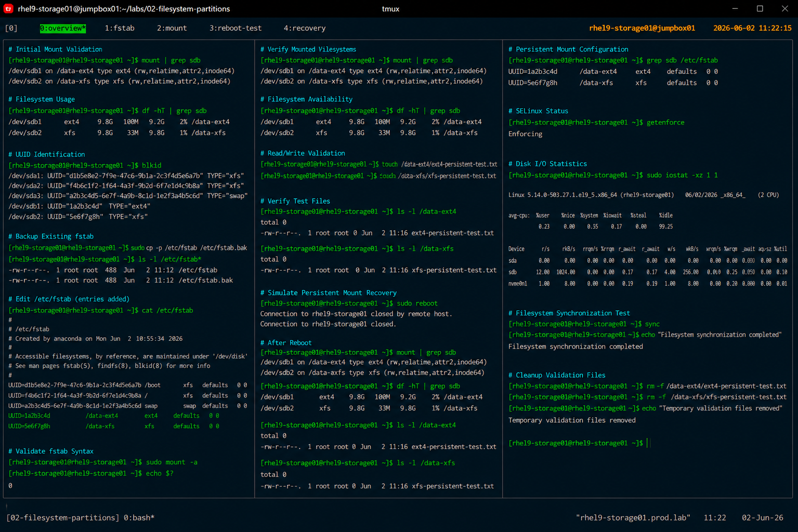

# Persistent Filesystem Mount Configuration

## Overview

This lab demonstrates enterprise Linux persistent mount configuration procedures using `/etc/fstab` on RHEL 9 systems.

The workflow simulates production storage administration tasks commonly performed during infrastructure deployment, storage expansion, and application filesystem provisioning.

---

# Objective

This exercise covers:

- filesystem UUID identification
- `/etc/fstab` configuration
- persistent filesystem mounting
- mount validation procedures
- storage recovery validation
- enterprise mount management practices

---

# Environment Information

| Item | Details |
|---|---|
| Operating System | RHEL 9.6 |
| Hostname | rhel9-storage01.prod.lab |
| Storage Devices | /dev/sdb1 /dev/sdb2 |
| Filesystems | EXT4 / XFS |
| SELinux | Enforcing |
| Access Method | SSH |

---

# Storage Layout

| Device | Filesystem | Mount Point |
|---|---|---|
| /dev/sdb1 | ext4 | /data-ext4 |
| /dev/sdb2 | xfs | /data-xfs |

---

# Initial Validation

## Verify Existing Mounts

```bash
mount | grep sdb
```

Expected output:

```text
/dev/sdb1 on /data-ext4 type ext4
/dev/sdb2 on /data-xfs type xfs
```

---

## Verify Filesystem Usage

```bash
df -hT
```

Expected output:

```text
/dev/sdb1   ext4   9.8G
/dev/sdb2   xfs    9.8G
```

---

# UUID Identification

## Retrieve Filesystem UUIDs

```bash
blkid
```

Example output:

```text
/dev/sdb1: UUID="1a2b3c4d" TYPE="ext4"
/dev/sdb2: UUID="5e6f7g8h" TYPE="xfs"
```

UUID-based mounting reduces dependency on device naming order.

---

# Backup Existing fstab

## Create Configuration Backup

```bash
cp -p /etc/fstab /etc/fstab.bak
```

Validation:

```bash
ls -l /etc/fstab*
```

---

# Configure Persistent Mounts

## Edit /etc/fstab

```bash
vi /etc/fstab
```

Add the following entries:

```text
UUID=1a2b3c4d /data-ext4 ext4 defaults 0 0
UUID=5e6f7g8h /data-xfs  xfs  defaults 0 0
```

---

# Validate fstab Syntax

## Verify Configuration

```bash
mount -a
```

Expected behavior:

- no errors returned
- filesystems mounted successfully

---

## Verify Mounted Filesystems

```bash
mount | grep sdb
```

Expected output:

```text
/dev/sdb1 on /data-ext4 type ext4
/dev/sdb2 on /data-xfs type xfs
```

---

# Filesystem Validation

## Verify Filesystem Availability

```bash
df -hT | grep sdb
```

Expected output:

```text
/dev/sdb1   ext4   9.8G
/dev/sdb2   xfs    9.8G
```

---

## Validate Read/Write Operations

```bash
touch /data-ext4/ext4-persistent-test.txt
touch /data-xfs/xfs-persistent-test.txt
```

---

## Verify Test Files

```bash
ls -l /data-ext4
ls -l /data-xfs
```

---

# Reboot Validation

## Simulate Persistent Mount Recovery

```bash
reboot
```

After reboot:

```bash
mount | grep sdb
```

Expected output:

```text
/dev/sdb1 on /data-ext4 type ext4
/dev/sdb2 on /data-xfs type xfs
```

Persistent mount recovery validated successfully.

---

# Error Recovery Procedure

## Recover from Invalid fstab Entries

Boot into rescue mode if required and restore backup:

```bash
cp -p /etc/fstab.bak /etc/fstab
```

Validation:

```bash
mount -a
```

---

# SELinux Validation

## Verify SELinux Status

```bash
getenforce
```

Expected output:

```text
Enforcing
```

SELinux remains enabled throughout all storage operations.

---

# Operational Notes

- UUID-based mounting improves storage reliability
- `/etc/fstab` syntax validation is mandatory before reboot
- backup of critical configuration files is required
- XFS remains the default enterprise filesystem
- persistent mount validation is required after storage modifications

---

# Expected Outcome

After completing this lab:

- persistent filesystem mounts are configured
- EXT4 and XFS filesystems mount automatically
- storage validation procedures are completed
- reboot recovery is validated
- enterprise storage standards are applied

---

# Screenshot Reference


