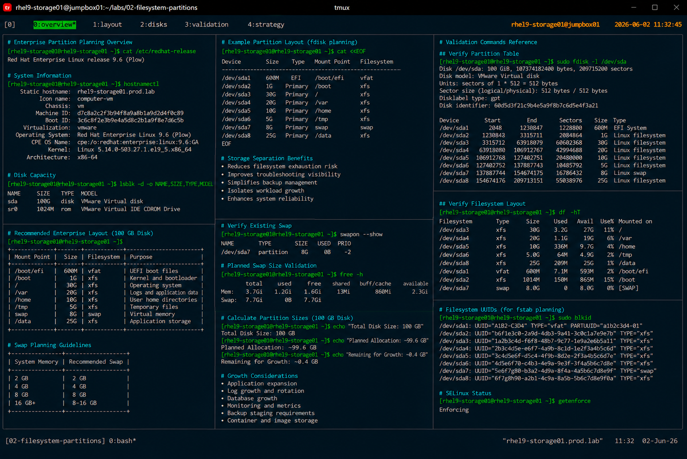

# Enterprise Partition Planning

## Overview

This lab demonstrates enterprise Linux partition planning procedures used during infrastructure deployment and storage architecture design on RHEL systems.

The workflow focuses on designing scalable, maintainable, and operationally safe partition layouts for enterprise workloads.

---

# Objective

This exercise covers:

- storage requirement analysis
- filesystem sizing strategy
- partition layout planning
- swap allocation standards
- mount point separation
- enterprise filesystem recommendations
- operational storage best practices

---

# Environment Information

| Item | Details |
|---|---|
| Operating System | RHEL 9.6 |
| Platform | VMware / KVM |
| Filesystem | XFS |
| Storage Type | Virtual Disk |
| Disk Size | 100 GB |
| SELinux | Enforcing |

---

# Enterprise Storage Planning Goals

Enterprise partition planning should provide:

- operational flexibility
- storage scalability
- filesystem isolation
- simplified maintenance
- improved recovery capability
- workload separation
- predictable growth management

---

# Recommended Enterprise Layout

## Standard Server Layout

| Mount Point | Recommended Size | Purpose |
|---|---|---|
| /boot/efi | 600 MB | UEFI boot files |
| /boot | 1 GB | Kernel and bootloader |
| / | 30 GB | Operating system |
| /var | 20 GB | Logs and application data |
| /home | 10 GB | User home directories |
| /tmp | 5 GB | Temporary files |
| swap | 8 GB | Virtual memory |
| /data | Remaining Space | Application storage |

---

# Storage Planning Strategy

## Separate Critical Filesystems

Recommended separation:

- `/var`
- `/tmp`
- `/home`
- application data directories

Benefits:

- reduces filesystem exhaustion risk
- improves troubleshooting visibility
- simplifies backup management
- isolates workload growth

---

## Use XFS for Enterprise Deployments

RHEL 9 standard recommendation:

```text
XFS
```

Advantages:

- scalability
- journaling reliability
- enterprise support
- performance stability

---

# Swap Planning

## Swap Allocation Guidelines

| System Memory | Recommended Swap |
|---|---|
| 2 GB | 2 GB |
| 4 GB | 4 GB |
| 8 GB | 8 GB |
| 16 GB+ | 8–16 GB |

---

## Verify Existing Swap

```bash
swapon --show
```

Expected output:

```text
/dev/sda3 partition 4G
```

---

# Disk Capacity Planning

## Verify Available Storage

```bash
lsblk
```

Example output:

```text
sda      8:0    0  100G  0 disk
```

---

## Estimate Filesystem Growth

Planning considerations:

- log growth
- application expansion
- backup staging
- monitoring data
- container storage
- database growth

---

# Partition Layout Example

## Example fdisk Planning

```text
/dev/sda1   600M   EFI System
/dev/sda2     1G   /boot
/dev/sda3    30G   /
/dev/sda4    20G   /var
/dev/sda5    10G   /home
/dev/sda6     5G   /tmp
/dev/sda7     8G   swap
/dev/sda8    25G   /data
```

---

# Validation Procedures

## Verify Partition Table

```bash
fdisk -l
```

---

## Verify Filesystem Layout

```bash
df -hT
```

---

## Verify Mount Configuration

```bash
mount
```

---

## Verify Filesystem UUIDs

```bash
blkid
```

---

# Operational Recommendations

## Maintain Dedicated Log Storage

Separate `/var` storage reduces risk of:

- root filesystem exhaustion
- logging failures
- package manager failures
- service instability

---

## Avoid Oversized Root Filesystems

Large root filesystems reduce flexibility during:

- backup operations
- recovery procedures
- storage troubleshooting
- capacity expansion

---

## Plan for Future Growth

Storage planning should include:

- future application expansion
- monitoring requirements
- backup storage
- security logging
- operational tooling

---

# SELinux Validation

## Verify SELinux Status

```bash
getenforce
```

Expected output:

```text
Enforcing
```

SELinux remains enabled during all storage planning operations.

---

# Operational Notes

- XFS remains the enterprise standard filesystem
- filesystem separation improves operational safety
- swap allocation depends on workload requirements
- UUID-based mounting improves reliability
- enterprise partition planning should prioritize scalability

---

# Expected Outcome

After completing this lab:

- enterprise partition strategy is understood
- storage planning principles are validated
- filesystem separation practices are applied
- swap planning standards are reviewed
- operational storage design improves

---

# Screenshot Reference


