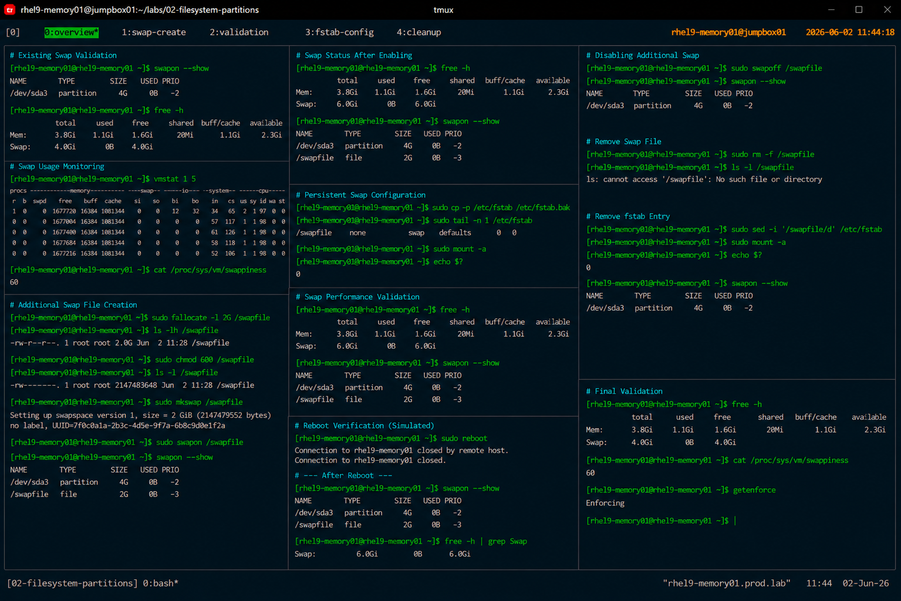

# Swap Space Management

## Overview

This lab demonstrates enterprise Linux swap management procedures on RHEL 9 systems.

The workflow simulates production memory management operations commonly performed during system tuning, workload optimization, and infrastructure capacity planning activities.

---

# Objective

This exercise covers:

- swap space validation
- swap usage monitoring
- creating additional swap space
- enabling and disabling swap
- persistent swap configuration
- swap performance validation
- enterprise swap management practices

---

# Environment Information

| Item | Details |
|---|---|
| Operating System | RHEL 9.6 |
| Hostname | rhel9-memory01.prod.lab |
| Filesystem | XFS |
| Swap Device | /dev/sda3 |
| Additional Swap | /swapfile |
| SELinux | Enforcing |

---

# Existing Swap Validation

## Verify Active Swap

```bash
swapon --show
```

Expected output:

```text
NAME       TYPE      SIZE USED PRIO
/dev/sda3  partition   4G   0B   -2
```

---

## Verify Memory Utilization

```bash
free -h
```

Expected output:

```text
Mem:   4.0Gi
Swap:  4.0Gi
```

---

# Swap Usage Monitoring

## Verify Current Memory Usage

```bash
vmstat 1 5
```

Expected output:

```text
procs -----------memory----------
```

---

## Verify System Swappiness

```bash
cat /proc/sys/vm/swappiness
```

Expected output:

```text
60
```

---

# Creating Additional Swap File

## Allocate Swap File

Create a 2 GB swap file:

```bash
fallocate -l 2G /swapfile
```

---

## Verify Swap File

```bash
ls -lh /swapfile
```

Expected output:

```text
-rw-r--r-- 1 root root 2.0G
```

---

# Secure Swap File Permissions

## Restrict Access

```bash
chmod 600 /swapfile
```

Validation:

```bash
ls -l /swapfile
```

Expected output:

```text
-rw------- 1 root root
```

---

# Initialize Swap File

## Create Swap Signature

```bash
mkswap /swapfile
```

Expected output:

```text
Setting up swapspace version 1
```

---

# Enable Additional Swap

## Activate Swap File

```bash
swapon /swapfile
```

---

## Verify Active Swap Devices

```bash
swapon --show
```

Expected output:

```text
/dev/sda3   partition 4G
/swapfile   file      2G
```

---

# Persistent Swap Configuration

## Backup Existing fstab

```bash
cp -p /etc/fstab /etc/fstab.bak
```

---

## Configure Persistent Swap

Edit `/etc/fstab`:

```bash
vi /etc/fstab
```

Add:

```text
/swapfile none swap defaults 0 0
```

---

## Validate fstab Configuration

```bash
mount -a
```

No output indicates successful validation.

---

# Swap Performance Validation

## Verify Memory and Swap Status

```bash
free -h
```

Expected output:

```text
Swap:  6.0Gi
```

---

## Verify Swap Priority

```bash
swapon --show
```

Expected output:

```text
PRIO
-2
```

---

# Disabling Swap

## Disable Additional Swap File

```bash
swapoff /swapfile
```

---

## Verify Swap Removal

```bash
swapon --show
```

Expected output:

```text
/dev/sda3
```

---

# Remove Swap File

## Delete Swap File

```bash
rm -f /swapfile
```

---

## Remove fstab Entry

Edit `/etc/fstab` and remove:

```text
/swapfile none swap defaults 0 0
```

---

# SELinux Validation

## Verify SELinux Status

```bash
getenforce
```

Expected output:

```text
Enforcing
```

SELinux remains enabled throughout swap management operations.

---

# Operational Recommendations

## Use Swap for Stability

Swap helps prevent:

- out-of-memory conditions
- unexpected service termination
- kernel memory pressure events
- workload instability

---

## Avoid Excessive Swapping

Heavy swap usage may indicate:

- insufficient memory allocation
- workload imbalance
- memory leaks
- application tuning issues

---

## Monitor Swappiness Carefully

Recommended enterprise tuning:

| Workload Type | Suggested Swappiness |
|---|---|
| General Server | 60 |
| Database Server | 10–20 |
| Virtualization Host | 30–40 |

---

# Operational Notes

- swap files provide flexible memory expansion
- persistent swap validation is required after reboot
- swap permissions must remain restricted
- enterprise tuning depends on workload type
- swap should not replace adequate physical memory

---

# Expected Outcome

After completing this lab:

- swap space management is understood
- additional swap space is configured
- persistent swap configuration is validated
- swap monitoring procedures are reviewed
- enterprise memory management practices are applied

---

# Screenshot Reference


