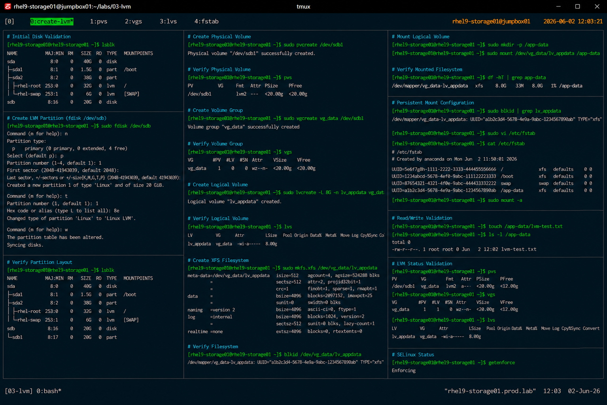

# LVM Creation and Configuration

## Overview

This lab demonstrates enterprise Linux Logical Volume Manager (LVM) provisioning procedures on RHEL 9 systems.

The workflow simulates production storage management operations commonly used for scalable application storage, database provisioning, virtualization platforms, and enterprise infrastructure deployments.

---

# Objective

This exercise covers:

- physical volume creation
- volume group creation
- logical volume creation
- filesystem creation
- mounting logical volumes
- persistent mount configuration
- storage validation procedures

---

# Environment Information

| Item | Details |
|---|---|
| Operating System | RHEL 9.6 |
| Hostname | rhel9-storage01.prod.lab |
| Storage Device | /dev/sdb |
| Filesystem | XFS |
| SELinux | Enforcing |
| Access Method | SSH |

---

# LVM Architecture

| Component | Purpose |
|---|---|
| Physical Volume (PV) | Underlying storage device |
| Volume Group (VG) | Storage pool |
| Logical Volume (LV) | Virtual filesystem volume |

---

# Planned Configuration

| Component | Name |
|---|---|
| Physical Volume | /dev/sdb1 |
| Volume Group | vg_data |
| Logical Volume | lv_appdata |
| Mount Point | /app-data |
| Filesystem | XFS |

---

# Initial Disk Validation

## Verify Available Storage

```bash
lsblk
```

Expected output:

```text
sda      8:0    0   40G  0 disk
sdb      8:16   0   20G  0 disk
```

---

# Partition Preparation

## Create LVM Partition

Launch partition utility:

```bash
fdisk /dev/sdb
```

Partition requirements:

- create primary partition
- allocate full disk size
- set partition type to `8e` (Linux LVM)

---

## Verify Partition Layout

```bash
lsblk
```

Expected output:

```text
sdb      8:16   0   20G  0 disk
└─sdb1   8:17   0   20G  0 part
```

---

# Physical Volume Creation

## Create Physical Volume

```bash
pvcreate /dev/sdb1
```

Expected output:

```text
Physical volume "/dev/sdb1" successfully created.
```

---

## Verify Physical Volume

```bash
pvs
```

Expected output:

```text
PV         VG   Fmt  Attr PSize   PFree
/dev/sdb1       lvm2 ---  <20.00g <20.00g
```

---

# Volume Group Creation

## Create Volume Group

```bash
vgcreate vg_data /dev/sdb1
```

Expected output:

```text
Volume group "vg_data" successfully created
```

---

## Verify Volume Group

```bash
vgs
```

Expected output:

```text
VG       #PV #LV #SN Attr   VSize   VFree
vg_data    1   0   0 wz--n- <20.00g <20.00g
```

---

# Logical Volume Creation

## Create Logical Volume

```bash
lvcreate -L 8G -n lv_appdata vg_data
```

Expected output:

```text
Logical volume "lv_appdata" created.
```

---

## Verify Logical Volume

```bash
lvs
```

Expected output:

```text
LV          VG       Attr       LSize
lv_appdata  vg_data  -wi-a----- 8.00g
```

---

# Filesystem Creation

## Create XFS Filesystem

```bash
mkfs.xfs /dev/vg_data/lv_appdata
```

Expected output:

```text
meta-data=/dev/vg_data/lv_appdata
```

---

## Verify Filesystem

```bash
blkid /dev/vg_data/lv_appdata
```

Expected output:

```text
TYPE="xfs"
```

---

# Mount Configuration

## Create Mount Point

```bash
mkdir -p /app-data
```

---

## Mount Logical Volume

```bash
mount /dev/vg_data/lv_appdata /app-data
```

---

## Verify Mounted Filesystem

```bash
df -hT | grep app-data
```

Expected output:

```text
/dev/mapper/vg_data-lv_appdata xfs 8.0G
```

---

# Persistent Mount Configuration

## Retrieve UUID Information

```bash
blkid
```

Example output:

```text
UUID="a1b2c3d4"
```

---

## Configure /etc/fstab

```bash
vi /etc/fstab
```

Add:

```text
UUID=a1b2c3d4 /app-data xfs defaults 0 0
```

---

## Validate fstab Configuration

```bash
mount -a
```

No output indicates successful validation.

---

# Filesystem Validation

## Verify Read/Write Operations

```bash
touch /app-data/lvm-test.txt
```

---

## Verify File Creation

```bash
ls -l /app-data
```

Expected output:

```text
lvm-test.txt
```

---

# LVM Status Validation

## Verify Physical Volumes

```bash
pvs
```

---

## Verify Volume Groups

```bash
vgs
```

---

## Verify Logical Volumes

```bash
lvs
```

---

# SELinux Validation

## Verify SELinux Status

```bash
getenforce
```

Expected output:

```text
Enforcing
```

SELinux remains enabled throughout all LVM operations.

---

# Operational Recommendations

## Use LVM for Flexible Storage Management

LVM provides:

- online storage expansion
- simplified storage pooling
- flexible filesystem allocation
- enterprise scalability

---

## Separate Application Storage

Dedicated logical volumes improve:

- operational isolation
- backup management
- filesystem troubleshooting
- capacity planning

---

## Use XFS for Enterprise Deployments

RHEL enterprise recommendation:

```text
XFS
```

Advantages:

- scalability
- journaling reliability
- stable performance
- enterprise support

---

# Operational Notes

- LVM enables dynamic storage scalability
- UUID-based mounts improve reliability
- filesystem validation is required after provisioning
- XFS remains the enterprise default filesystem
- persistent mounts must be validated before reboot

---

# Expected Outcome

After completing this lab:

- physical volumes are operational
- volume groups are configured
- logical volumes are mounted
- persistent storage configuration is validated
- enterprise LVM standards are applied

---

# Screenshot Reference


