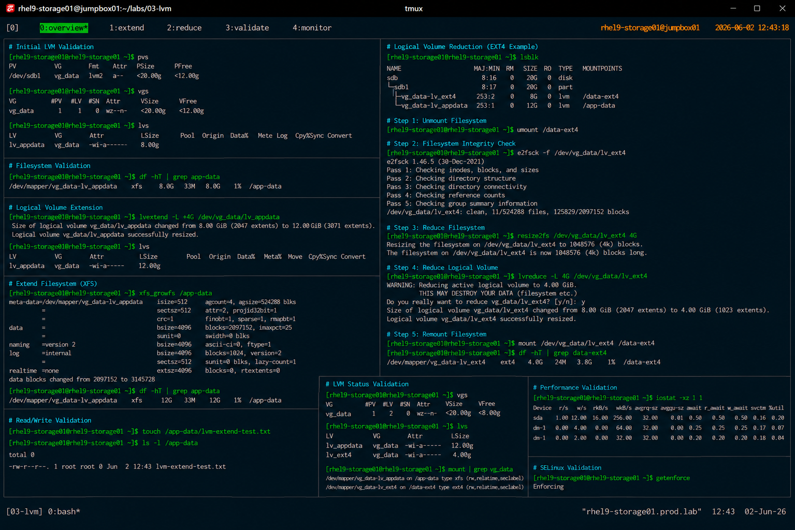

# LVM Extension and Reduction

## Overview

This lab demonstrates enterprise Linux Logical Volume Manager (LVM) extension and reduction procedures on RHEL 9 systems.

The workflow simulates production storage scaling operations used for application growth, database expansion, capacity management, and filesystem maintenance activities.

---

# Objective

This exercise covers:

- logical volume extension
- filesystem growth
- logical volume reduction
- filesystem integrity validation
- online storage expansion
- enterprise LVM operational practices

---

# Environment Information

| Item | Details |
|---|---|
| Operating System | RHEL 9.6 |
| Hostname | rhel9-storage01.prod.lab |
| Volume Group | vg_data |
| Logical Volume | lv_appdata |
| Filesystem | XFS / EXT4 |
| SELinux | Enforcing |

---

# Initial LVM Validation

## Verify Physical Volumes

```bash
pvs
```

---

## Verify Volume Groups

```bash
vgs
```

Expected output:

```text
VG       #PV #LV #SN Attr   VSize   VFree
vg_data    1   1   0 wz--n- <20.00g <12.00g
```

---

## Verify Logical Volumes

```bash
lvs
```

Expected output:

```text
LV          VG       Attr       LSize
lv_appdata  vg_data  -wi-a----- 8.00g
```

---

# Filesystem Validation

## Verify Mounted Filesystem

```bash
df -hT | grep app-data
```

Expected output:

```text
/dev/mapper/vg_data-lv_appdata xfs 8.0G
```

---

# Logical Volume Extension

## Extend Logical Volume

Increase logical volume by 4 GB:

```bash
lvextend -L +4G /dev/vg_data/lv_appdata
```

Expected output:

```text
Size of logical volume vg_data/lv_appdata changed
```

---

## Verify Extended Logical Volume

```bash
lvs
```

Expected output:

```text
LV          VG       Attr       LSize
lv_appdata  vg_data  -wi-a----- 12.00g
```

---

# Extend Filesystem

## Extend XFS Filesystem

```bash
xfs_growfs /app-data
```

Expected output:

```text
data blocks changed
```

---

## Verify Filesystem Expansion

```bash
df -hT | grep app-data
```

Expected output:

```text
/dev/mapper/vg_data-lv_appdata xfs 12G
```

---

# Read/Write Validation

## Create Validation File

```bash
touch /app-data/lvm-extend-test.txt
```

---

## Verify File Creation

```bash
ls -l /app-data
```

Expected output:

```text
lvm-extend-test.txt
```

---

# Logical Volume Reduction

## Important Operational Warning

XFS filesystems cannot be reduced safely.

Logical volume reduction should only be performed with EXT4 filesystems after unmounting the filesystem.

---

# EXT4 Reduction Workflow Example

## Unmount Filesystem

```bash
umount /data-ext4
```

---

## Filesystem Integrity Check

```bash
e2fsck -f /dev/vg_data/lv_ext4
```

Expected output:

```text
clean
```

---

## Reduce Filesystem

```bash
resize2fs /dev/vg_data/lv_ext4 4G
```

---

## Reduce Logical Volume

```bash
lvreduce -L 4G /dev/vg_data/lv_ext4
```

Expected output:

```text
Logical volume successfully resized
```

---

## Remount Filesystem

```bash
mount /dev/vg_data/lv_ext4 /data-ext4
```

---

## Verify Reduced Filesystem

```bash
df -hT | grep data-ext4
```

Expected output:

```text
/dev/mapper/vg_data-lv_ext4 ext4 4.0G
```

---

# LVM Validation

## Verify Volume Group Capacity

```bash
vgs
```

---

## Verify Logical Volume Status

```bash
lvs
```

---

## Verify Mount Status

```bash
mount | grep vg_data
```

---

# Performance Validation

## Verify Disk Statistics

```bash
iostat -xz 1 1
```

---

# SELinux Validation

## Verify SELinux Status

```bash
getenforce
```

Expected output:

```text
Enforcing
```

SELinux remains enabled throughout all LVM operations.

---

# Operational Recommendations

## Prefer Online Expansion

XFS allows online expansion without unmounting:

```text
xfs_growfs
```

This reduces operational downtime during storage growth activities.

---

## Avoid Unnecessary Reduction

Filesystem reduction introduces operational risk.

Best practice:

- allocate sufficient storage initially
- prefer expansion workflows
- validate backups before reduction

---

## Validate Filesystem Integrity

Before reduction:

```bash
e2fsck -f
```

Filesystem integrity checks are mandatory for EXT4 reduction operations.

---

# Operational Notes

- XFS supports online expansion only
- EXT4 supports controlled reduction
- logical volume extension is low risk
- filesystem reduction requires maintenance planning
- enterprise storage changes require validation after modification

---

# Expected Outcome

After completing this lab:

- logical volume extension is operational
- filesystem expansion is validated
- EXT4 reduction workflow is understood
- LVM operational best practices are reviewed
- enterprise storage scaling procedures are applied

---

# Screenshot Reference


