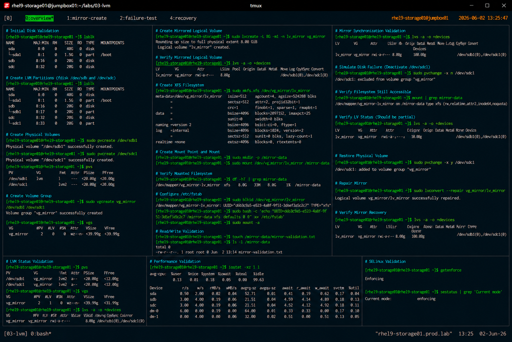

# LVM Mirroring and Redundancy

## Overview

This lab demonstrates enterprise Linux LVM mirroring procedures on RHEL 9 systems.

The workflow simulates production storage redundancy operations used to improve data availability, reduce single-disk failure risks, and support enterprise storage resilience strategies.

---

# Objective

This exercise covers:

- preparing mirrored storage devices
- physical volume creation
- mirrored logical volume creation
- filesystem configuration
- mirror validation
- disk failure simulation
- enterprise redundancy practices

---

# Environment Information

| Item | Details |
|---|---|
| Operating System | RHEL 9.6 |
| Hostname | rhel9-storage01.prod.lab |
| Disk Devices | /dev/sdb /dev/sdc |
| Filesystem | XFS |
| SELinux | Enforcing |
| Access Method | SSH |

---

# Planned Storage Layout

| Component | Name |
|---|---|
| Physical Volume 1 | /dev/sdb1 |
| Physical Volume 2 | /dev/sdc1 |
| Volume Group | vg_mirror |
| Logical Volume | lv_mirror |
| Mount Point | /mirror-data |

---

# Initial Disk Validation

## Verify Available Storage Devices

```bash
lsblk
```

Expected output:

```text
sdb      8:16   0   20G  0 disk
sdc      8:32   0   20G  0 disk
```

---

# Partition Preparation

## Create LVM Partitions

Prepare both disks using:

```bash
fdisk /dev/sdb
fdisk /dev/sdc
```

Requirements:

- create primary partition
- allocate full disk size
- set partition type to `8e` (Linux LVM)

---

## Verify Partition Layout

```bash
lsblk
```

Expected output:

```text
sdb1
sdc1
```

---

# Physical Volume Creation

## Create Physical Volumes

```bash
pvcreate /dev/sdb1
pvcreate /dev/sdc1
```

Expected output:

```text
Physical volume "/dev/sdb1" successfully created
Physical volume "/dev/sdc1" successfully created
```

---

## Verify Physical Volumes

```bash
pvs
```

Expected output:

```text
PV         VG        Fmt  Attr PSize
/dev/sdb1  vg_mirror lvm2 a--  <20.00g
/dev/sdc1  vg_mirror lvm2 a--  <20.00g
```

---

# Volume Group Creation

## Create Volume Group

```bash
vgcreate vg_mirror /dev/sdb1 /dev/sdc1
```

Expected output:

```text
Volume group "vg_mirror" successfully created
```

---

## Verify Volume Group

```bash
vgs
```

Expected output:

```text
VG         #PV #LV #SN Attr   VSize
vg_mirror    2   0   0 wz--n- <39.99g
```

---

# Mirrored Logical Volume Creation

## Create Mirrored Logical Volume

```bash
lvcreate -L 8G -m1 -n lv_mirror vg_mirror
```

Explanation:

| Option | Purpose |
|---|---|
| `-L 8G` | Logical volume size |
| `-m1` | One mirror copy |
| `-n` | Logical volume name |

---

## Verify Mirrored Logical Volume

```bash
lvs -a -o +devices
```

Expected output:

```text
lv_mirror rwi-a-r---
```

---

# Filesystem Creation

## Create XFS Filesystem

```bash
mkfs.xfs /dev/vg_mirror/lv_mirror
```

---

## Verify Filesystem

```bash
blkid /dev/vg_mirror/lv_mirror
```

Expected output:

```text
TYPE="xfs"
```

---

# Mount Configuration

## Create Mount Point

```bash
mkdir -p /mirror-data
```

---

## Mount Mirrored Volume

```bash
mount /dev/vg_mirror/lv_mirror /mirror-data
```

---

## Verify Mounted Filesystem

```bash
df -hT | grep mirror-data
```

Expected output:

```text
/dev/mapper/vg_mirror-lv_mirror xfs
```

---

# Persistent Mount Configuration

## Retrieve UUID

```bash
blkid
```

---

## Configure /etc/fstab

```bash
vi /etc/fstab
```

Add:

```text
UUID=<uuid> /mirror-data xfs defaults 0 0
```

---

## Validate fstab Configuration

```bash
mount -a
```

No output indicates successful validation.

---

# Read/Write Validation

## Create Validation File

```bash
touch /mirror-data/mirror-validation.txt
```

---

## Verify File Creation

```bash
ls -l /mirror-data
```

Expected output:

```text
mirror-validation.txt
```

---

# Mirror Status Validation

## Verify Mirror Synchronization

```bash
lvs -a -o +devices
```

Expected output:

```text
Copy%Sync 100.00
```

---

# Disk Failure Simulation

## Simulate Disk Failure

Deactivate one physical volume:

```bash
pvchange -x n /dev/sdc1
```

---

## Verify Logical Volume Accessibility

```bash
mount | grep mirror-data
```

Filesystem should remain operational.

---

## Verify LVM Status

```bash
lvs -a -o +devices
```

Expected output:

```text
partial
```

---

# Recovery Validation

## Restore Physical Volume

```bash
pvchange -x y /dev/sdc1
```

---

## Resynchronize Mirror

```bash
lvconvert --repair vg_mirror/lv_mirror
```

---

## Verify Mirror Recovery

```bash
lvs -a -o +devices
```

Expected output:

```text
Copy%Sync 100.00
```

---

# Performance Validation

## Verify Disk Statistics

```bash
iostat -xz 1 1
```

---

# SELinux Validation

## Verify SELinux Status

```bash
getenforce
```

Expected output:

```text
Enforcing
```

SELinux remains enabled throughout all storage operations.

---

# Operational Recommendations

## Use Mirroring for Critical Workloads

Mirrored logical volumes improve:

- data availability
- storage redundancy
- operational resilience
- fault tolerance

---

## Monitor Mirror Synchronization

Enterprise monitoring should validate:

- mirror synchronization status
- degraded mirror conditions
- physical volume health
- disk I/O errors

---

## Validate Recovery Procedures

Regular recovery testing improves:

- operational readiness
- incident response speed
- storage recovery reliability
- enterprise resilience

---

# Operational Notes

- mirrored LVM improves storage redundancy
- mirroring requires additional storage capacity
- degraded mirrors must be repaired quickly
- enterprise monitoring should track mirror health
- filesystem validation is required after recovery

---

# Expected Outcome

After completing this lab:

- mirrored logical volumes are operational
- storage redundancy is validated
- disk failure simulation is completed
- recovery procedures are verified
- enterprise storage resilience practices are applied

---

# Screenshot Reference


