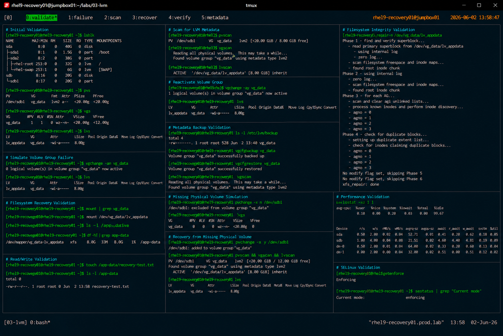

# LVM Recovery Procedures

## Overview

This lab demonstrates enterprise Linux Logical Volume Manager (LVM) recovery procedures on RHEL 9 systems.

The workflow simulates production storage incident response operations involving damaged physical volumes, inactive volume groups, missing logical volumes, and metadata recovery scenarios.

---

# Objective

This exercise covers:

- LVM metadata validation
- inactive volume recovery
- missing physical volume handling
- volume group restoration
- logical volume activation
- filesystem validation
- enterprise recovery best practices

---

# Environment Information

| Item | Details |
|---|---|
| Operating System | RHEL 9.6 |
| Hostname | rhel9-recovery01.prod.lab |
| Volume Group | vg_data |
| Logical Volume | lv_appdata |
| Filesystem | XFS |
| SELinux | Enforcing |

---

# Recovery Scenario

The environment simulates:

- inaccessible logical volumes
- inactive volume groups
- damaged metadata conditions
- missing physical volume events
- filesystem recovery validation

---

# Initial Validation

## Verify Block Devices

```bash
lsblk
```

Expected output:

```text
sdb1
```

---

## Verify Physical Volumes

```bash
pvs
```

Expected output:

```text
PV         VG       Fmt  Attr PSize
/dev/sdb1  vg_data  lvm2 a--
```

---

## Verify Volume Groups

```bash
vgs
```

Expected output:

```text
VG       #PV #LV #SN Attr
vg_data    1   1   0 wz--n-
```

---

## Verify Logical Volumes

```bash
lvs
```

Expected output:

```text
lv_appdata
```

---

# Simulate Volume Group Failure

## Deactivate Volume Group

```bash
vgchange -an vg_data
```

Expected output:

```text
0 logical volume(s) in volume group "vg_data" now active
```

---

## Verify Inactive Logical Volumes

```bash
lvs
```

Expected output:

```text
inactive
```

---

# Recovery Workflow

## Scan for LVM Metadata

```bash
pvscan
vgscan
lvscan
```

Expected output:

```text
ACTIVE
```

---

## Reactivate Volume Group

```bash
vgchange -ay vg_data
```

Expected output:

```text
1 logical volume(s) in volume group "vg_data" now active
```

---

## Verify Logical Volume Activation

```bash
lvs
```

Expected output:

```text
lv_appdata
```

---

# Filesystem Recovery Validation

## Verify Mounted Filesystems

```bash
mount | grep vg_data
```

---

## Mount Logical Volume

```bash
mount /dev/vg_data/lv_appdata /app-data
```

---

## Verify Mounted Filesystem

```bash
df -hT | grep app-data
```

Expected output:

```text
/dev/mapper/vg_data-lv_appdata xfs
```

---

# Read/Write Validation

## Create Validation File

```bash
touch /app-data/recovery-test.txt
```

---

## Verify File Creation

```bash
ls -l /app-data
```

Expected output:

```text
recovery-test.txt
```

---

# Metadata Backup Validation

## Verify LVM Backup Files

```bash
ls -l /etc/lvm/backup
```

Expected output:

```text
vg_data
```

---

## Backup Current Metadata

```bash
vgcfgbackup vg_data
```

Expected output:

```text
Volume group "vg_data" successfully backed up
```

---

# Metadata Restore Procedure

## Restore LVM Metadata

Example recovery command:

```bash
vgcfgrestore vg_data
```

---

## Verify Restored Configuration

```bash
vgscan
```

Expected output:

```text
Found volume group "vg_data"
```

---

# Missing Physical Volume Simulation

## Simulate Missing Device

```bash
pvchange -x n /dev/sdb1
```

---

## Verify Degraded Volume Group

```bash
vgs
```

Expected output:

```text
partial
```

---

# Recovery from Missing Physical Volume

## Re-enable Physical Volume

```bash
pvchange -x y /dev/sdb1
```

---

## Rescan LVM Devices

```bash
pvscan
vgscan
lvscan
```

---

## Verify Recovery Status

```bash
lvs
```

Expected output:

```text
available
```

---

# Filesystem Integrity Validation

## Verify XFS Filesystem

```bash
xfs_repair -n /dev/vg_data/lv_appdata
```

Expected output:

```text
No modify flag set
```

---

# Performance Validation

## Verify Disk Statistics

```bash
iostat -xz 1 1
```

---

# SELinux Validation

## Verify SELinux Status

```bash
getenforce
```

Expected output:

```text
Enforcing
```

SELinux remains enabled throughout all recovery procedures.

---

# Operational Recommendations

## Maintain LVM Metadata Backups

Critical LVM metadata backups should be validated regularly:

```bash
vgcfgbackup
```

This improves recovery speed during storage incidents.

---

## Validate Storage Health Regularly

Enterprise monitoring should validate:

- physical volume status
- logical volume availability
- volume group integrity
- disk I/O health
- filesystem accessibility

---

## Test Recovery Procedures

Routine recovery testing improves:

- operational readiness
- incident response reliability
- storage recovery confidence
- infrastructure resilience

---

# Operational Notes

- LVM metadata recovery is critical for enterprise storage
- volume groups can be reactivated without reboot
- filesystem validation is required after recovery
- metadata backups reduce operational recovery time
- enterprise monitoring should track LVM health continuously

---

# Expected Outcome

After completing this lab:

- LVM recovery procedures are validated
- inactive volume groups are restored
- logical volume activation is operational
- metadata recovery workflows are understood
- enterprise storage recovery practices are applied

---

# Screenshot Reference


