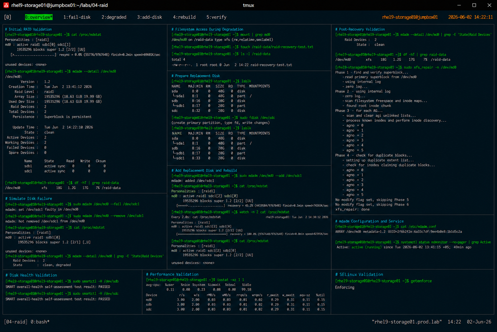

# RAID Recovery Procedures

## Overview

This lab demonstrates enterprise Linux software RAID recovery procedures using `mdadm` on RHEL 9 systems.

The workflow simulates production storage incident response operations involving degraded RAID arrays, failed disks, array rebuilding, and filesystem validation.

---

# Objective

This exercise covers:

- RAID health validation
- degraded array detection
- failed disk recovery
- RAID rebuild operations
- filesystem validation
- persistent RAID configuration
- enterprise recovery best practices

---

# Environment Information

| Item | Details |
|---|---|
| Operating System | RHEL 9.6 |
| Hostname | rhel9-storage01.prod.lab |
| RAID Type | RAID1 |
| RAID Device | /dev/md0 |
| Filesystem | XFS |
| RAID Utility | mdadm |
| SELinux | Enforcing |

---

# RAID Layout

| Device | Purpose |
|---|---|
| /dev/sdb1 | RAID Member Disk |
| /dev/sdc1 | RAID Member Disk |
| /dev/md0 | RAID Array |
| /raid-data | Mount Point |

---

# Initial RAID Validation

## Verify RAID Status

```bash
cat /proc/mdstat
```

Expected output:

```text
md0 : active raid1 sdb1[0] sdc1[1]
```

---

## Verify RAID Details

```bash
mdadm --detail /dev/md0
```

Expected output:

```text
State : clean
```

---

## Verify Mounted Filesystem

```bash
df -hT | grep raid-data
```

Expected output:

```text
/dev/md0 xfs
```

---

# Simulate RAID Disk Failure

## Mark Disk as Failed

```bash
mdadm /dev/md0 --fail /dev/sdc1
```

Expected output:

```text
set /dev/sdc1 faulty in /dev/md0
```

---

## Remove Failed Disk

```bash
mdadm /dev/md0 --remove /dev/sdc1
```

Expected output:

```text
hot removed /dev/sdc1
```

---

# Verify Degraded RAID Status

## Validate RAID Health

```bash
cat /proc/mdstat
```

Expected output:

```text
[U_]
```

The RAID array is operating in degraded mode.

---

## Verify RAID Details

```bash
mdadm --detail /dev/md0
```

Expected output:

```text
State : clean, degraded
```

---

# Filesystem Validation During Failure

## Verify Mounted Filesystem

```bash
mount | grep md0
```

Filesystem should remain operational during RAID1 degradation.

---

## Verify Read/Write Access

```bash
touch /raid-data/raid-recovery-test.txt
```

---

## Validate File Creation

```bash
ls -l /raid-data
```

Expected output:

```text
raid-recovery-test.txt
```

---

# Replacement Disk Preparation

## Verify Replacement Disk

```bash
lsblk
```

Expected output:

```text
sdc
```

---

## Create RAID Partition

```bash
fdisk /dev/sdc
```

Partition requirements:

- create primary partition
- allocate full disk size
- set partition type to `fd` (Linux RAID autodetect)

---

## Verify Partition Layout

```bash
lsblk
```

Expected output:

```text
sdc1
```

---

# Rebuild RAID Array

## Add Replacement Disk

```bash
mdadm /dev/md0 --add /dev/sdc1
```

Expected output:

```text
added /dev/sdc1
```

---

## Monitor RAID Rebuild

```bash
watch cat /proc/mdstat
```

Expected output:

```text
recovery = 45.2%
```

---

## Verify RAID Synchronization

```bash
cat /proc/mdstat
```

Expected output:

```text
[UU]
```

RAID rebuild completed successfully.

---

# Post-Recovery Validation

## Verify RAID Details

```bash
mdadm --detail /dev/md0
```

Expected output:

```text
State : clean
```

---

## Verify Mounted Filesystem

```bash
df -hT | grep raid-data
```

Expected output:

```text
/dev/md0 xfs
```

---

## Verify Filesystem Integrity

```bash
xfs_repair -n /dev/md0
```

Expected output:

```text
No modify flag set
```

---

# Persistent RAID Configuration

## Verify mdadm Configuration

```bash
cat /etc/mdadm.conf
```

Expected output:

```text
ARRAY /dev/md0
```

---

## Update RAID Metadata

```bash
mdadm --detail --scan >> /etc/mdadm.conf
```

---

# RAID Monitoring Validation

## Verify mdmonitor Service

```bash
systemctl status mdmonitor
```

Expected output:

```text
active (running)
```

---

# Disk Health Validation

## Verify SMART Status

```bash
smartctl -H /dev/sdb
smartctl -H /dev/sdc
```

Expected output:

```text
PASSED
```

---

# Performance Validation

## Verify RAID I/O Statistics

```bash
iostat -xz 1 1
```

---

# SELinux Validation

## Verify SELinux Status

```bash
getenforce
```

Expected output:

```text
Enforcing
```

SELinux remains enabled throughout all recovery operations.

---

# Operational Recommendations

## Monitor RAID Health Continuously

Enterprise monitoring should validate:

- degraded RAID conditions
- rebuild progress
- disk SMART health
- filesystem accessibility
- RAID synchronization status

---

## Replace Failed Disks Quickly

Operating degraded RAID arrays increases risk of:

- complete storage failure
- data unavailability
- filesystem corruption
- operational downtime

---

## Validate Recovery Procedures Regularly

Routine RAID recovery testing improves:

- operational readiness
- incident response speed
- infrastructure resilience
- storage recovery reliability

---

# Operational Notes

- RAID1 provides redundancy during disk failures
- degraded arrays remain operational temporarily
- RAID rebuild operations consume disk I/O resources
- SMART monitoring improves failure detection
- filesystem validation is required after rebuild completion

---

# Expected Outcome

After completing this lab:

- RAID degradation handling is validated
- failed disk replacement is operational
- RAID rebuild procedures are understood
- filesystem recovery validation is completed
- enterprise storage recovery practices are applied

---

# Screenshot Reference


