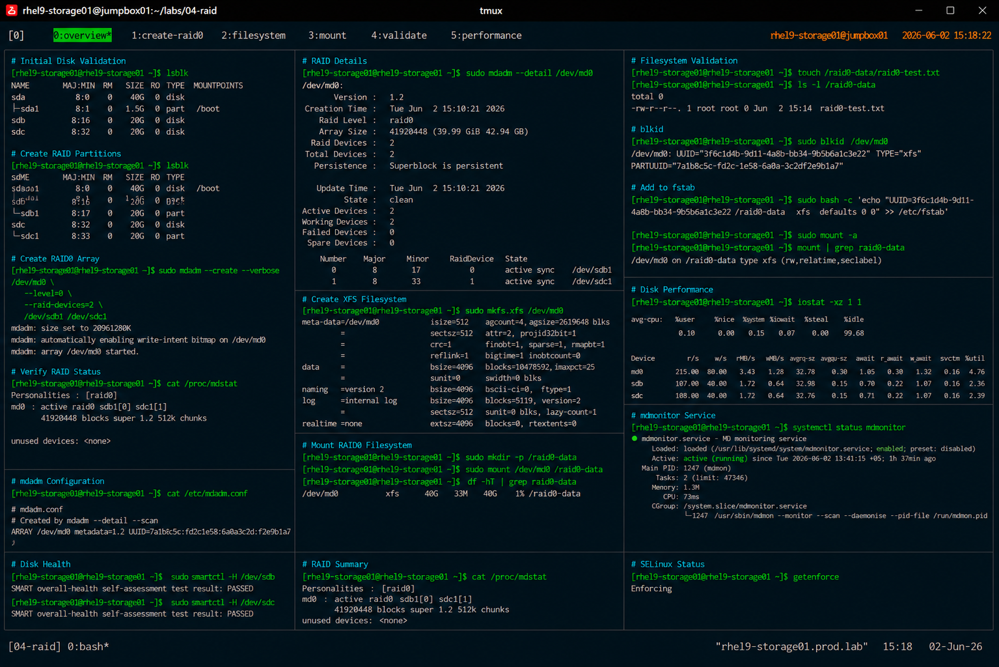

# RAID0 Striping Configuration

## Overview

This lab demonstrates enterprise Linux RAID0 striping configuration using `mdadm` on RHEL 9 systems.

The workflow simulates high-performance storage provisioning scenarios commonly used for temporary data processing, high-throughput workloads, and non-critical performance-focused storage environments.

---

# Objective

This exercise covers:

- RAID0 array creation
- disk striping concepts
- filesystem creation
- persistent RAID configuration
- storage validation procedures
- performance verification
- enterprise RAID operational practices

---

# Environment Information

| Item | Details |
|---|---|
| Operating System | RHEL 9.6 |
| Hostname | rhel9-storage01.prod.lab |
| RAID Type | RAID0 |
| RAID Device | /dev/md0 |
| RAID Utility | mdadm |
| Filesystem | XFS |
| SELinux | Enforcing |

---

# RAID0 Overview

RAID0 provides:

- high storage performance
- data striping across disks
- improved read/write throughput

RAID0 does NOT provide:

- redundancy
- fault tolerance
- data recovery protection

Failure of a single disk causes total array failure.

---

# Planned RAID Layout

| Device | Purpose |
|---|---|
| /dev/sdb1 | RAID Member |
| /dev/sdc1 | RAID Member |
| /dev/md0 | RAID0 Array |
| /raid0-data | Mount Point |

---

# Initial Disk Validation

## Verify Available Storage Devices

```bash
lsblk
```

Expected output:

```text
sdb      8:16   0   20G  0 disk
sdc      8:32   0   20G  0 disk
```

---

# Partition Preparation

## Create RAID Partitions

Configure both disks:

```bash
fdisk /dev/sdb
fdisk /dev/sdc
```

Partition requirements:

- create primary partition
- allocate full disk size
- set partition type to `fd` (Linux RAID)

---

## Verify Partition Layout

```bash
lsblk
```

Expected output:

```text
sdb1
sdc1
```

---

# RAID0 Array Creation

## Create RAID0 Array

```bash
mdadm --create --verbose /dev/md0 \
--level=0 \
--raid-devices=2 \
/dev/sdb1 /dev/sdc1
```

Expected output:

```text
mdadm: array /dev/md0 started.
```

---

## Verify RAID Status

```bash
cat /proc/mdstat
```

Expected output:

```text
md0 : active raid0 sdb1[0] sdc1[1]
```

---

## Verify RAID Details

```bash
mdadm --detail /dev/md0
```

Expected output:

```text
Raid Level : raid0
```

---

# Filesystem Creation

## Create XFS Filesystem

```bash
mkfs.xfs /dev/md0
```

Expected output:

```text
meta-data=/dev/md0
```

---

## Verify Filesystem

```bash
blkid /dev/md0
```

Expected output:

```text
TYPE="xfs"
```

---

# Mount Configuration

## Create Mount Point

```bash
mkdir -p /raid0-data
```

---

## Mount RAID0 Filesystem

```bash
mount /dev/md0 /raid0-data
```

---

## Verify Mounted Filesystem

```bash
df -hT | grep raid0-data
```

Expected output:

```text
/dev/md0 xfs
```

---

# Persistent RAID Configuration

## Save RAID Metadata

```bash
mdadm --detail --scan >> /etc/mdadm.conf
```

---

## Verify mdadm Configuration

```bash
cat /etc/mdadm.conf
```

Expected output:

```text
ARRAY /dev/md0
```

---

# Persistent Filesystem Mount

## Retrieve Filesystem UUID

```bash
blkid /dev/md0
```

---

## Configure /etc/fstab

```bash
vi /etc/fstab
```

Add:

```text
UUID=<uuid> /raid0-data xfs defaults 0 0
```

---

## Validate fstab Configuration

```bash
mount -a
```

No output indicates successful validation.

---

# Filesystem Validation

## Verify Read/Write Operations

```bash
touch /raid0-data/raid0-test.txt
```

---

## Verify File Creation

```bash
ls -l /raid0-data
```

Expected output:

```text
raid0-test.txt
```

---

# RAID Performance Validation

## Verify RAID Statistics

```bash
cat /proc/mdstat
```

---

## Verify Disk Performance

```bash
iostat -xz 1 1
```

Expected output:

```text
Device utilization statistics
```

---

# RAID Monitoring Validation

## Verify mdmonitor Service

```bash
systemctl status mdmonitor
```

Expected output:

```text
active (running)
```

---

# Disk Health Validation

## Verify SMART Status

```bash
smartctl -H /dev/sdb
smartctl -H /dev/sdc
```

Expected output:

```text
PASSED
```

---

# Failure Simulation Warning

RAID0 has no redundancy.

If a single disk fails:

- all array data becomes inaccessible
- filesystem corruption occurs
- recovery is generally impossible

Example degraded scenario:

```text
Array failure expected after disk loss
```

---

# SELinux Validation

## Verify SELinux Status

```bash
getenforce
```

Expected output:

```text
Enforcing
```

SELinux remains enabled throughout all RAID operations.

---

# Operational Recommendations

## Use RAID0 Only for Non-Critical Workloads

Appropriate workloads:

- temporary data processing
- cache storage
- scratch environments
- performance testing

Avoid RAID0 for:

- databases
- production application storage
- critical infrastructure
- backup repositories

---

## Monitor Disk Health Aggressively

RAID0 failure risk increases with:

- multiple disks
- aging storage devices
- high write workloads

Enterprise monitoring should validate:

- SMART health
- disk latency
- I/O errors
- RAID device availability

---

# Operational Notes

- RAID0 improves storage throughput
- RAID0 provides zero fault tolerance
- filesystem validation is required after creation
- mdadm metadata must be persisted
- enterprise workloads generally prefer redundant RAID levels

---

# Expected Outcome

After completing this lab:

- RAID0 array is operational
- striped storage performance is validated
- persistent RAID configuration is completed
- filesystem validation procedures are verified
- enterprise RAID operational practices are reviewed

---

# Screenshot Reference


