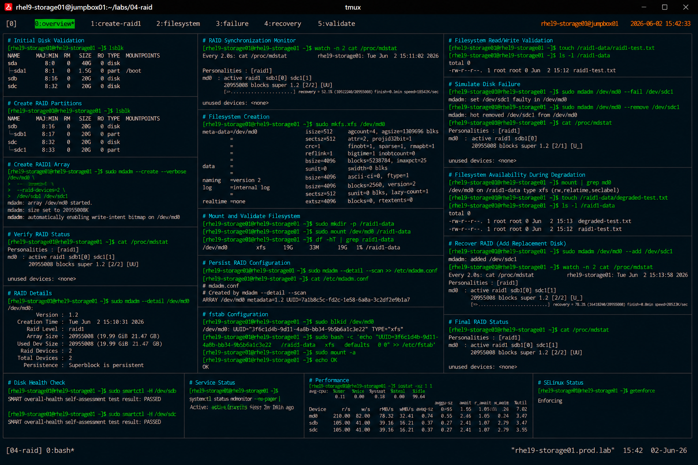

# RAID1 Mirroring Configuration

## Overview

This lab demonstrates enterprise Linux RAID1 mirroring configuration using `mdadm` on RHEL 9 systems.

The workflow simulates production storage redundancy deployments commonly used for critical infrastructure, application servers, databases, and enterprise operational systems.

---

# Objective

This exercise covers:

- RAID1 array creation
- mirrored storage configuration
- filesystem setup
- persistent RAID configuration
- degraded array validation
- RAID rebuild procedures
- enterprise redundancy practices

---

# Environment Information

| Item | Details |
|---|---|
| Operating System | RHEL 9.6 |
| Hostname | rhel9-storage01.prod.lab |
| RAID Type | RAID1 |
| RAID Device | /dev/md0 |
| RAID Utility | mdadm |
| Filesystem | XFS |
| SELinux | Enforcing |

---

# RAID1 Overview

RAID1 provides:

- disk redundancy
- fault tolerance
- improved storage resilience
- operational continuity during disk failure

RAID1 characteristics:

- identical mirrored copies
- reduced usable storage capacity
- high availability for critical workloads

---

# Planned RAID Layout

| Device | Purpose |
|---|---|
| /dev/sdb1 | RAID Member |
| /dev/sdc1 | RAID Member |
| /dev/md0 | RAID1 Array |
| /raid1-data | Mount Point |

---

# Initial Disk Validation

## Verify Available Storage Devices

```bash
lsblk
```

Expected output:

```text
sdb      8:16   0   20G  0 disk
sdc      8:32   0   20G  0 disk
```

---

# Partition Preparation

## Create RAID Partitions

Prepare both disks:

```bash
fdisk /dev/sdb
fdisk /dev/sdc
```

Partition requirements:

- create primary partition
- allocate full disk size
- set partition type to `fd` (Linux RAID)

---

## Verify Partition Layout

```bash
lsblk
```

Expected output:

```text
sdb1
sdc1
```

---

# RAID1 Array Creation

## Create RAID1 Array

```bash
mdadm --create --verbose /dev/md0 \
--level=1 \
--raid-devices=2 \
/dev/sdb1 /dev/sdc1
```

Expected output:

```text
mdadm: array /dev/md0 started.
```

---

## Verify RAID Status

```bash
cat /proc/mdstat
```

Expected output:

```text
md0 : active raid1 sdb1[0] sdc1[1]
```

---

## Verify RAID Details

```bash
mdadm --detail /dev/md0
```

Expected output:

```text
Raid Level : raid1
```

---

# RAID Synchronization Validation

## Monitor Synchronization

```bash
watch cat /proc/mdstat
```

Expected output:

```text
recovery = 52.1%
```

---

## Verify Synchronization Completion

```bash
cat /proc/mdstat
```

Expected output:

```text
[UU]
```

RAID synchronization completed successfully.

---

# Filesystem Creation

## Create XFS Filesystem

```bash
mkfs.xfs /dev/md0
```

Expected output:

```text
meta-data=/dev/md0
```

---

## Verify Filesystem

```bash
blkid /dev/md0
```

Expected output:

```text
TYPE="xfs"
```

---

# Mount Configuration

## Create Mount Point

```bash
mkdir -p /raid1-data
```

---

## Mount RAID1 Filesystem

```bash
mount /dev/md0 /raid1-data
```

---

## Verify Mounted Filesystem

```bash
df -hT | grep raid1-data
```

Expected output:

```text
/dev/md0 xfs
```

---

# Persistent RAID Configuration

## Save RAID Metadata

```bash
mdadm --detail --scan >> /etc/mdadm.conf
```

---

## Verify mdadm Configuration

```bash
cat /etc/mdadm.conf
```

Expected output:

```text
ARRAY /dev/md0
```

---

# Persistent Filesystem Mount

## Retrieve Filesystem UUID

```bash
blkid /dev/md0
```

---

## Configure /etc/fstab

```bash
vi /etc/fstab
```

Add:

```text
UUID=<uuid> /raid1-data xfs defaults 0 0
```

---

## Validate fstab Configuration

```bash
mount -a
```

No output indicates successful validation.

---

# Filesystem Validation

## Verify Read/Write Operations

```bash
touch /raid1-data/raid1-test.txt
```

---

## Verify File Creation

```bash
ls -l /raid1-data
```

Expected output:

```text
raid1-test.txt
```

---

# RAID Failure Simulation

## Mark Disk as Failed

```bash
mdadm /dev/md0 --fail /dev/sdc1
```

---

## Remove Failed Disk

```bash
mdadm /dev/md0 --remove /dev/sdc1
```

---

## Verify Degraded RAID Status

```bash
cat /proc/mdstat
```

Expected output:

```text
[U_]
```

---

## Validate Filesystem Availability

```bash
mount | grep md0
```

Filesystem remains operational during RAID1 degradation.

---

# RAID Recovery Validation

## Re-add Replacement Disk

```bash
mdadm /dev/md0 --add /dev/sdc1
```

---

## Verify RAID Rebuild

```bash
watch cat /proc/mdstat
```

Expected output:

```text
recovery = 78.3%
```

---

## Verify Final RAID Status

```bash
cat /proc/mdstat
```

Expected output:

```text
[UU]
```

---

# Disk Health Validation

## Verify SMART Status

```bash
smartctl -H /dev/sdb
smartctl -H /dev/sdc
```

Expected output:

```text
PASSED
```

---

# RAID Monitoring Validation

## Verify mdmonitor Service

```bash
systemctl status mdmonitor
```

Expected output:

```text
active (running)
```

---

# Performance Validation

## Verify RAID I/O Statistics

```bash
iostat -xz 1 1
```

---

# SELinux Validation

## Verify SELinux Status

```bash
getenforce
```

Expected output:

```text
Enforcing
```

SELinux remains enabled throughout all RAID operations.

---

# Operational Recommendations

## Use RAID1 for Critical Infrastructure

Recommended workloads:

- operating system storage
- application servers
- enterprise monitoring systems
- critical configuration repositories

---

## Replace Failed Disks Quickly

Operating in degraded mode increases risk of:

- complete array failure
- data loss
- service outages
- filesystem corruption

---

## Monitor RAID Synchronization

Enterprise monitoring should validate:

- RAID rebuild progress
- degraded conditions
- SMART health
- disk latency
- I/O errors

---

# Operational Notes

- RAID1 improves storage resilience
- RAID1 reduces usable capacity by half
- degraded arrays remain operational temporarily
- mdadm metadata should be persisted
- filesystem validation is required after rebuild completion

---

# Expected Outcome

After completing this lab:

- RAID1 mirroring is operational
- redundant storage configuration is validated
- degraded array recovery is verified
- RAID rebuild procedures are understood
- enterprise redundancy practices are applied

---

# Screenshot Reference


