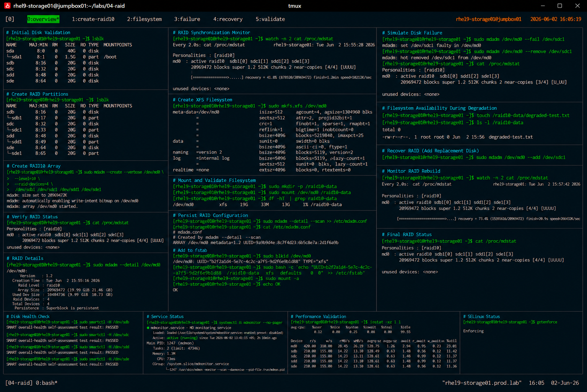

# RAID10 Configuration

## Overview

This lab demonstrates enterprise Linux RAID10 configuration using `mdadm` on RHEL 9 systems.

The workflow simulates production enterprise storage deployments that require both high performance and redundancy for mission-critical workloads.

---

# Objective

This exercise covers:

- RAID10 array creation
- mirrored striping concepts
- filesystem configuration
- persistent RAID setup
- degraded array validation
- RAID rebuild operations
- enterprise storage best practices

---

# Environment Information

| Item | Details |
|---|---|
| Operating System | RHEL 9.6 |
| Hostname | rhel9-storage01.prod.lab |
| RAID Type | RAID10 |
| RAID Device | /dev/md0 |
| RAID Utility | mdadm |
| Filesystem | XFS |
| SELinux | Enforcing |

---

# RAID10 Overview

RAID10 combines:

- RAID1 mirroring
- RAID0 striping

Benefits:

- high performance
- redundancy
- fast rebuild operations
- improved fault tolerance

Requirements:

- minimum four disks
- reduced usable capacity
- additional storage cost

---

# Planned RAID Layout

| Device | Purpose |
|---|---|
| /dev/sdb1 | RAID Member |
| /dev/sdc1 | RAID Member |
| /dev/sdd1 | RAID Member |
| /dev/sde1 | RAID Member |
| /dev/md0 | RAID10 Array |
| /raid10-data | Mount Point |

---

# Initial Disk Validation

## Verify Available Storage Devices

```bash
lsblk
```

Expected output:

```text
sdb
sdc
sdd
sde
```

---

# Partition Preparation

## Create RAID Partitions

Prepare all disks:

```bash
fdisk /dev/sdb
fdisk /dev/sdc
fdisk /dev/sdd
fdisk /dev/sde
```

Partition requirements:

- create primary partition
- allocate full disk size
- set partition type to `fd` (Linux RAID)

---

## Verify Partition Layout

```bash
lsblk
```

Expected output:

```text
sdb1
sdc1
sdd1
sde1
```

---

# RAID10 Array Creation

## Create RAID10 Array

```bash
mdadm --create --verbose /dev/md0 \
--level=10 \
--raid-devices=4 \
/dev/sdb1 /dev/sdc1 /dev/sdd1 /dev/sde1
```

Expected output:

```text
mdadm: array /dev/md0 started.
```

---

## Verify RAID Status

```bash
cat /proc/mdstat
```

Expected output:

```text
md0 : active raid10
```

---

## Verify RAID Details

```bash
mdadm --detail /dev/md0
```

Expected output:

```text
Raid Level : raid10
```

---

# RAID Synchronization Validation

## Monitor Synchronization

```bash
watch cat /proc/mdstat
```

Expected output:

```text
recovery = 41.8%
```

---

## Verify Synchronization Completion

```bash
cat /proc/mdstat
```

Expected output:

```text
[UUUU]
```

RAID10 synchronization completed successfully.

---

# Filesystem Creation

## Create XFS Filesystem

```bash
mkfs.xfs /dev/md0
```

Expected output:

```text
meta-data=/dev/md0
```

---

## Verify Filesystem

```bash
blkid /dev/md0
```

Expected output:

```text
TYPE="xfs"
```

---

# Mount Configuration

## Create Mount Point

```bash
mkdir -p /raid10-data
```

---

## Mount RAID10 Filesystem

```bash
mount /dev/md0 /raid10-data
```

---

## Verify Mounted Filesystem

```bash
df -hT | grep raid10-data
```

Expected output:

```text
/dev/md0 xfs
```

---

# Persistent RAID Configuration

## Save RAID Metadata

```bash
mdadm --detail --scan >> /etc/mdadm.conf
```

---

## Verify mdadm Configuration

```bash
cat /etc/mdadm.conf
```

Expected output:

```text
ARRAY /dev/md0
```

---

# Persistent Filesystem Mount

## Retrieve Filesystem UUID

```bash
blkid /dev/md0
```

---

## Configure /etc/fstab

```bash
vi /etc/fstab
```

Add:

```text
UUID=<uuid> /raid10-data xfs defaults 0 0
```

---

## Validate fstab Configuration

```bash
mount -a
```

No output indicates successful validation.

---

# Filesystem Validation

## Verify Read/Write Operations

```bash
touch /raid10-data/raid10-test.txt
```

---

## Verify File Creation

```bash
ls -l /raid10-data
```

Expected output:

```text
raid10-test.txt
```

---

# RAID Failure Simulation

## Simulate Single Disk Failure

```bash
mdadm /dev/md0 --fail /dev/sdc1
```

---

## Remove Failed Disk

```bash
mdadm /dev/md0 --remove /dev/sdc1
```

---

## Verify Degraded RAID Status

```bash
cat /proc/mdstat
```

Expected output:

```text
[U_UU]
```

RAID10 remains operational during single disk failure.

---

# RAID Recovery Validation

## Re-add Replacement Disk

```bash
mdadm /dev/md0 --add /dev/sdc1
```

---

## Monitor RAID Rebuild

```bash
watch cat /proc/mdstat
```

Expected output:

```text
recovery = 73.4%
```

---

## Verify Final RAID Status

```bash
cat /proc/mdstat
```

Expected output:

```text
[UUUU]
```

---

# Disk Health Validation

## Verify SMART Status

```bash
smartctl -H /dev/sdb
smartctl -H /dev/sdc
smartctl -H /dev/sdd
smartctl -H /dev/sde
```

Expected output:

```text
PASSED
```

---

# RAID Monitoring Validation

## Verify mdmonitor Service

```bash
systemctl status mdmonitor
```

Expected output:

```text
active (running)
```

---

# Performance Validation

## Verify RAID I/O Statistics

```bash
iostat -xz 1 1
```

Expected output:

```text
high throughput performance statistics
```

---

# SELinux Validation

## Verify SELinux Status

```bash
getenforce
```

Expected output:

```text
Enforcing
```

SELinux remains enabled throughout all RAID operations.

---

# Operational Recommendations

## Use RAID10 for High-Performance Critical Workloads

Recommended workloads:

- enterprise databases
- virtualization platforms
- high-I/O applications
- transactional systems
- enterprise monitoring platforms

---

## Replace Failed Disks Quickly

Although RAID10 tolerates failures, prolonged degraded operation increases risk of:

- additional disk failures
- storage outages
- rebuild complexity
- operational downtime

---

## Monitor RAID Synchronization and Health

Enterprise monitoring should validate:

- rebuild progress
- SMART disk health
- degraded RAID conditions
- disk latency
- filesystem accessibility

---

# Operational Notes

- RAID10 provides both performance and redundancy
- RAID10 requires at least four disks
- rebuild operations are faster than RAID5
- mdadm metadata should be persisted
- enterprise workloads commonly prefer RAID10 for critical systems

---

# Expected Outcome

After completing this lab:

- RAID10 array is operational
- mirrored striping configuration is validated
- degraded array recovery is verified
- enterprise RAID monitoring practices are reviewed
- high-performance redundant storage is configured

---

# Screenshot Reference


