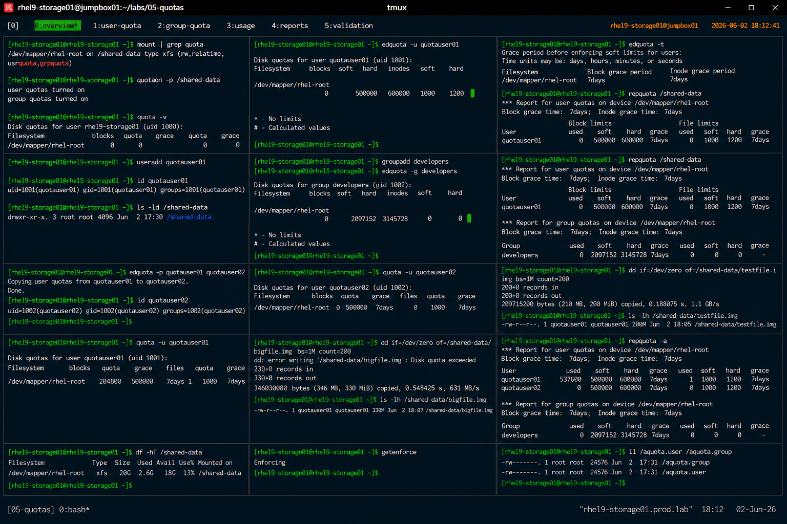

# edquota Administration Examples

## Overview

This lab demonstrates enterprise Linux quota management using the `edquota` utility on RHEL 9 systems.

The workflow simulates production filesystem quota administration activities used for multi-user environments, shared application platforms, and enterprise storage governance.

---

# Objective

This exercise covers:

- user quota management
- group quota administration
- soft and hard limits
- quota grace periods
- quota replication
- enterprise quota operational practices

---

# Environment Information

| Item | Details |
|---|---|
| Operating System | RHEL 9.6 |
| Hostname | rhel9-storage01.prod.lab |
| Filesystem | XFS |
| Mount Point | /shared-data |
| Quota Utility | edquota |
| SELinux | Enforcing |

---

# Quota Overview

The `edquota` utility provides:

- interactive quota management
- soft and hard limit configuration
- user quota administration
- group quota administration
- quota policy replication

---

# Initial Quota Validation

## Verify Mounted Filesystem

```bash
mount | grep quota
```

Expected output:

```text
/usrquota,grpquota
```

---

## Verify Quota Status

```bash
quotaon -p /shared-data
```

Expected output:

```text
user quotas enabled
group quotas enabled
```

---

# User Quota Configuration

## Create Test User

```bash
useradd quotauser01
```

---

## Configure User Quota

```bash
edquota -u quotauser01
```

Example configuration:

```text
Disk quotas for user quotauser01:
/dev/mapper/rhel-root:
blocks soft=500000 hard=600000
inodes soft=1000 hard=1200
```

---

# Soft and Hard Limit Explanation

| Limit Type | Purpose |
|---|---|
| Soft Limit | Warning threshold |
| Hard Limit | Absolute enforcement limit |

---

# Grace Period Configuration

## Configure Grace Periods

```bash
edquota -t
```

Example configuration:

```text
Block grace period before enforcing soft limits for users:
7days
```

---

## Verify Grace Periods

```bash
repquota /shared-data
```

Expected output:

```text
Block grace time: 7days
```

---

# Group Quota Configuration

## Create Group

```bash
groupadd developers
```

---

## Configure Group Quota

```bash
edquota -g developers
```

Example configuration:

```text
blocks soft=2G hard=3G
```

---

## Verify Group Quotas

```bash
repquota /shared-data
```

Expected output:

```text
developers
```

---

# Quota Replication

## Copy Quotas Between Users

```bash
edquota -p quotauser01 quotauser02
```

This copies quota settings from one user to another.

---

## Verify Replicated Quotas

```bash
quota -u quotauser02
```

Expected output:

```text
Disk quotas for user quotauser02
```

---

# Quota Usage Validation

## Generate Test File

```bash
dd if=/dev/zero of=/shared-data/testfile.img bs=1M count=200
```

---

## Verify Quota Usage

```bash
quota -u quotauser01
```

Expected output:

```text
blocks
```

---

# Quota Enforcement Validation

## Simulate Soft Limit Warning

Create additional files until soft quota limits are exceeded.

Expected output:

```text
warning: user quota exceeded
```

---

## Simulate Hard Limit Enforcement

Attempt additional writes after hard limit.

Expected output:

```text
Disk quota exceeded
```

---

# Quota Reporting Validation

## Generate Quota Report

```bash
repquota -a
```

Expected output:

```text
user quota summary
```

---

# Filesystem Validation

## Verify Mounted Filesystem

```bash
df -hT | grep shared-data
```

Expected output:

```text
xfs
```

---

# SELinux Validation

## Verify SELinux Status

```bash
getenforce
```

Expected output:

```text
Enforcing
```

SELinux remains enabled throughout all quota operations.

---

# Operational Recommendations

## Use Soft Limits for Early Warning

Soft limits provide:

- user notification
- operational flexibility
- storage planning opportunities

Hard limits should enforce strict storage governance.

---

## Apply Group Quotas for Shared Teams

Group quotas improve:

- shared storage management
- collaborative workload governance
- departmental storage allocation
- operational accountability

---

## Monitor Quota Consumption Regularly

Enterprise monitoring should validate:

- quota utilization trends
- filesystem growth
- users nearing limits
- quota enforcement events

---

# Operational Notes

- `edquota` provides interactive quota management
- soft limits allow temporary overages
- hard limits enforce strict restrictions
- quota replication simplifies administration
- enterprise environments require regular quota audits

---

# Expected Outcome

After completing this lab:

- user quotas are configured
- group quotas are operational
- grace periods are validated
- quota replication is understood
- enterprise quota administration practices are applied

---

# Screenshot Reference


