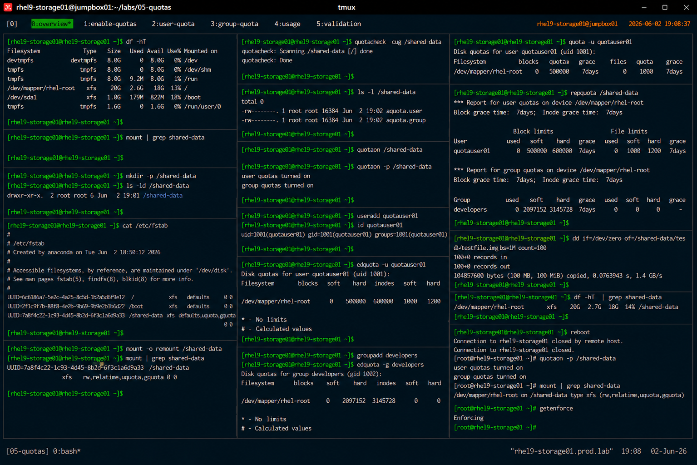

# Enable Filesystem Quotas

## Overview

This lab demonstrates enterprise Linux filesystem quota enablement on RHEL 9 systems.

The workflow simulates production storage governance procedures used for shared environments, multi-user systems, enterprise application platforms, and storage resource control.

---

# Objective

This exercise covers:

- enabling filesystem quotas
- configuring user quotas
- configuring group quotas
- quota database creation
- quota activation
- filesystem validation
- enterprise quota operational practices

---

# Environment Information

| Item | Details |
|---|---|
| Operating System | RHEL 9.6 |
| Hostname | rhel9-storage01.prod.lab |
| Filesystem | XFS |
| Mount Point | /shared-data |
| Quota Utilities | quota, quotaon, quotacheck |
| SELinux | Enforcing |

---

# Quota Overview

Filesystem quotas provide:

- storage usage control
- user storage governance
- group storage allocation
- filesystem protection against exhaustion
- enterprise capacity management

---

# Planned Configuration

| Item | Value |
|---|---|
| Mount Point | /shared-data |
| User Quotas | Enabled |
| Group Quotas | Enabled |
| Filesystem | XFS |

---

# Initial Filesystem Validation

## Verify Mounted Filesystem

```bash
df -hT
```

Expected output:

```text
/dev/mapper/rhel-root xfs
```

---

## Verify Current Mount Options

```bash
mount | grep shared-data
```

Expected output:

```text
rw,relatime
```

---

# Create Shared Filesystem Directory

## Create Mount Point

```bash
mkdir -p /shared-data
```

---

## Verify Directory Creation

```bash
ls -ld /shared-data
```

Expected output:

```text
drwxr-xr-x
```

---

# Enable Quota Mount Options

## Edit /etc/fstab

```bash
vi /etc/fstab
```

Modify the filesystem entry:

```text
UUID=<uuid> /shared-data xfs defaults,uquota,gquota 0 0
```

Explanation:

| Option | Purpose |
|---|---|
| `uquota` | Enable user quotas |
| `gquota` | Enable group quotas |

---

# Remount Filesystem

## Apply New Mount Options

```bash
mount -o remount /shared-data
```

---

## Verify Active Quota Options

```bash
mount | grep shared-data
```

Expected output:

```text
uquota,gquota
```

---

# Create Quota Database

## Run Quota Check

```bash
quotacheck -cug /shared-data
```

Explanation:

| Option | Purpose |
|---|---|
| `-c` | Create quota files |
| `-u` | User quotas |
| `-g` | Group quotas |

---

## Verify Quota Files

```bash
ls -l /shared-data
```

Expected output:

```text
aquota.user
aquota.group
```

---

# Enable Quotas

## Activate User and Group Quotas

```bash
quotaon /shared-data
```

---

## Verify Quota Status

```bash
quotaon -p /shared-data
```

Expected output:

```text
user quotas turned on
group quotas turned on
```

---

# User Quota Validation

## Create Test User

```bash
useradd quotauser01
```

---

## Verify User Information

```bash
id quotauser01
```

Expected output:

```text
uid=1001
```

---

## Configure User Quota

```bash
edquota -u quotauser01
```

Example configuration:

```text
blocks soft=500000 hard=600000
```

---

# Group Quota Validation

## Create Test Group

```bash
groupadd developers
```

---

## Configure Group Quota

```bash
edquota -g developers
```

Example configuration:

```text
blocks soft=2G hard=3G
```

---

# Quota Usage Validation

## Verify User Quotas

```bash
quota -u quotauser01
```

Expected output:

```text
Disk quotas for user quotauser01
```

---

## Generate Quota Report

```bash
repquota /shared-data
```

Expected output:

```text
user quota report
```

---

# Quota Enforcement Validation

## Generate Test File

```bash
dd if=/dev/zero of=/shared-data/testfile.img bs=1M count=100
```

---

## Verify Filesystem Usage

```bash
df -hT | grep shared-data
```

---

# Persistent Quota Validation

## Reboot Validation

```bash
reboot
```

After reboot:

```bash
quotaon -p /shared-data
```

Expected output:

```text
user quotas turned on
```

Persistent quota configuration validated successfully.

---

# Filesystem Validation

## Verify Mounted Filesystem

```bash
mount | grep shared-data
```

Expected output:

```text
uquota,gquota
```

---

# SELinux Validation

## Verify SELinux Status

```bash
getenforce
```

Expected output:

```text
Enforcing
```

SELinux remains enabled throughout all quota operations.

---

# Operational Recommendations

## Enable Quotas on Shared Filesystems

Recommended environments:

- shared application servers
- multi-user systems
- research environments
- enterprise file servers

---

## Monitor Quota Utilization Regularly

Enterprise monitoring should validate:

- filesystem growth
- quota threshold violations
- storage consumption trends
- quota enforcement events

---

## Apply Both User and Group Quotas

Combined quota enforcement improves:

- storage governance
- departmental accountability
- resource allocation fairness
- operational stability

---

# Operational Notes

- XFS supports enterprise quota management
- quotas help prevent filesystem exhaustion
- quota databases must be initialized correctly
- persistent mount options are required
- enterprise environments require continuous quota monitoring

---

# Expected Outcome

After completing this lab:

- filesystem quotas are enabled
- user and group quotas are operational
- quota databases are validated
- persistent quota configuration is verified
- enterprise storage governance practices are applied

---

# Screenshot Reference


