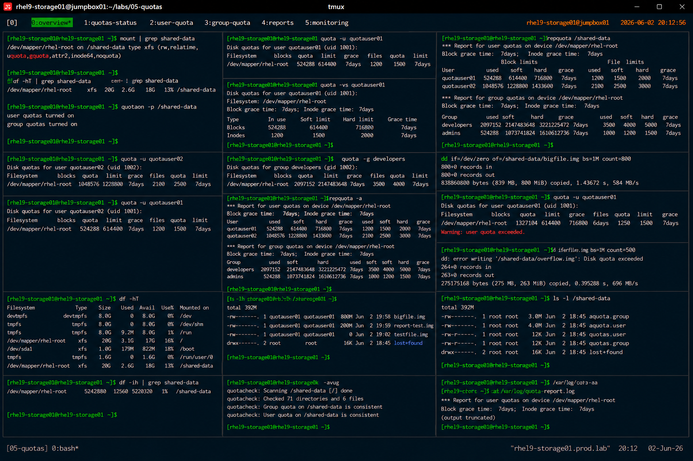

# Quota Reporting and Monitoring

## Overview

This lab demonstrates enterprise Linux quota reporting and monitoring procedures on RHEL 9 systems.

The workflow simulates production storage governance operations used for enterprise monitoring, quota auditing, capacity management, and filesystem utilization analysis.

---

# Objective

This exercise covers:

- quota reporting
- quota usage monitoring
- user quota analysis
- group quota analysis
- quota auditing
- filesystem usage validation
- enterprise storage governance practices

---

# Environment Information

| Item | Details |
|---|---|
| Operating System | RHEL 9.6 |
| Hostname | rhel9-storage01.prod.lab |
| Filesystem | XFS |
| Mount Point | /shared-data |
| Quota Utilities | quota, repquota |
| SELinux | Enforcing |

---

# Quota Reporting Overview

Quota reporting provides:

- storage usage visibility
- quota enforcement auditing
- filesystem growth monitoring
- enterprise capacity planning
- user and group accountability

---

# Initial Filesystem Validation

## Verify Mounted Filesystem

```bash
mount | grep shared-data
```

Expected output:

```text
uquota,gquota
```

---

## Verify Filesystem Usage

```bash
df -hT | grep shared-data
```

Expected output:

```text
xfs
```

---

# Verify Active Quotas

## Validate Quota Status

```bash
quotaon -p /shared-data
```

Expected output:

```text
user quotas turned on
group quotas turned on
```

---

# User Quota Reporting

## Display User Quotas

```bash
quota -u quotauser01
```

Expected output:

```text
Disk quotas for user quotauser01
```

---

## Display Detailed User Quotas

```bash
quota -vs quotauser01
```

Expected output:

```text
Block grace time
```

---

## Verify Multiple User Quotas

```bash
quota -u quotauser01
quota -u quotauser02
```

---

# Group Quota Reporting

## Display Group Quotas

```bash
quota -g developers
```

Expected output:

```text
Disk quotas for group developers
```

---

## Verify Group Quota Usage

```bash
repquota /shared-data
```

Expected output:

```text
developers
```

---

# Full Quota Report Generation

## Generate Complete Quota Report

```bash
repquota -a
```

Expected output:

```text
Report for user quotas
```

---

## Example Quota Report

```text
User       used   soft   hard
quotauser01 500M  600M   700M
```

---

# Grace Period Monitoring

## Verify Grace Periods

```bash
repquota /shared-data
```

Expected output:

```text
7days
```

---

## Validate Soft Limit Warnings

Create additional files until soft quota limits are exceeded.

Expected output:

```text
warning: user quota exceeded
```

---

# Hard Limit Validation

## Trigger Hard Limit Enforcement

Attempt additional writes after hard quota limits.

Expected output:

```text
Disk quota exceeded
```

---

# Filesystem Usage Monitoring

## Verify Disk Utilization

```bash
df -hT
```

---

## Verify Inode Utilization

```bash
df -ih
```

Expected output:

```text
IUse%
```

---

# User Activity Validation

## Generate Test Data

```bash
dd if=/dev/zero of=/shared-data/report-test.img bs=1M count=200
```

---

## Verify File Ownership

```bash
ls -lh /shared-data
```

Expected output:

```text
report-test.img
```

---

# Quota Audit Validation

## Verify Quota Database Files

```bash
ls -l /shared-data
```

Expected output:

```text
aquota.user
aquota.group
```

---

## Validate Quota Database Consistency

```bash
quotacheck -avug
```

Expected output:

```text
Scanning filesystem
```

---

# Enterprise Monitoring Validation

## Monitor Quota Utilization Trends

Example monitoring workflow:

```bash
repquota -a > /var/log/quota-report.log
```

---

## Verify Report Generation

```bash
cat /var/log/quota-report.log
```

Expected output:

```text
quota report
```

---

# SELinux Validation

## Verify SELinux Status

```bash
getenforce
```

Expected output:

```text
Enforcing
```

SELinux remains enabled throughout all quota reporting operations.

---

# Operational Recommendations

## Monitor Quota Growth Regularly

Enterprise monitoring should validate:

- users nearing limits
- filesystem growth trends
- quota enforcement events
- inode exhaustion risks

---

## Automate Quota Reporting

Recommended automation:

- scheduled quota audits
- email notifications
- centralized reporting
- filesystem growth alerts

---

## Monitor Both Blocks and Inodes

Quota governance should validate:

- storage block consumption
- inode consumption
- abnormal user activity
- storage abuse conditions

---

# Operational Notes

- `repquota` provides enterprise quota visibility
- quota monitoring improves storage governance
- quota audits help prevent filesystem exhaustion
- grace periods provide operational flexibility
- enterprise environments require continuous quota analysis

---

# Expected Outcome

After completing this lab:

- quota reporting is operational
- quota monitoring workflows are validated
- filesystem utilization auditing is understood
- quota enforcement visibility is verified
- enterprise storage governance practices are applied

---

# Screenshot Reference


