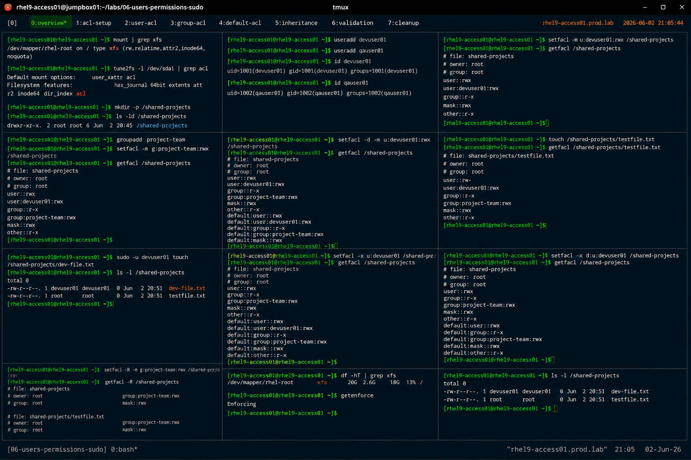

# Access Control Lists (ACL) Administration

## Overview

This lab demonstrates enterprise Linux Access Control List (ACL) management on RHEL 9 systems.

The workflow simulates production filesystem permission administration tasks used for collaborative environments, shared application storage, and granular access management.

---

# Objective

This exercise covers:

- ACL configuration
- user ACL management
- group ACL management
- default ACL configuration
- ACL inheritance
- ACL validation
- enterprise access governance practices

---

# Environment Information

| Item | Details |
|---|---|
| Operating System | RHEL 9.6 |
| Hostname | rhel9-access01.prod.lab |
| Filesystem | XFS |
| Access Utilities | setfacl, getfacl |
| SELinux | Enforcing |

---

# ACL Overview

ACLs provide:

- granular permission control
- multi-user access management
- group collaboration support
- permission inheritance
- enterprise filesystem governance

ACLs extend traditional Linux permissions beyond:

```text
owner / group / others
```

---

# Initial Filesystem Validation

## Verify Mounted Filesystem

```bash
mount | grep xfs
```

Expected output:

```text
rw,relatime
```

---

## Verify ACL Support

```bash
tune2fs -l /dev/sda1 | grep acl
```

Expected output:

```text
Default mount options: user_xattr acl
```

---

# Create Shared Directory

## Create Collaboration Directory

```bash
mkdir -p /shared-projects
```

---

## Verify Directory Creation

```bash
ls -ld /shared-projects
```

Expected output:

```text
drwxr-xr-x
```

---

# Create Test Users

## Create Project Users

```bash
useradd devuser01
useradd qauser01
```

---

## Verify User Accounts

```bash
id devuser01
id qauser01
```

Expected output:

```text
uid=1001
```

---

# Configure User ACLs

## Grant ACL Permissions

```bash
setfacl -m u:devuser01:rwx /shared-projects
```

Explanation:

| Option | Purpose |
|---|---|
| `-m` | Modify ACL |
| `u:` | User ACL |
| `rwx` | Read/write/execute |

---

## Verify User ACLs

```bash
getfacl /shared-projects
```

Expected output:

```text
user:devuser01:rwx
```

---

# Configure Group ACLs

## Create Project Group

```bash
groupadd project-team
```

---

## Assign Group ACL

```bash
setfacl -m g:project-team:rwx /shared-projects
```

---

## Verify Group ACLs

```bash
getfacl /shared-projects
```

Expected output:

```text
group:project-team:rwx
```

---

# Configure Default ACLs

## Enable ACL Inheritance

```bash
setfacl -d -m u:devuser01:rwx /shared-projects
```

---

## Verify Default ACLs

```bash
getfacl /shared-projects
```

Expected output:

```text
default:user:devuser01:rwx
```

---

# ACL Inheritance Validation

## Create Test File

```bash
touch /shared-projects/testfile.txt
```

---

## Verify Inherited ACLs

```bash
getfacl /shared-projects/testfile.txt
```

Expected output:

```text
user:devuser01:rwx
```

---

# ACL Permission Validation

## Verify Access Permissions

```bash
sudo -u devuser01 touch /shared-projects/dev-file.txt
```

---

## Validate File Ownership

```bash
ls -l /shared-projects
```

Expected output:

```text
dev-file.txt
```

---

# Remove ACL Permissions

## Remove User ACL

```bash
setfacl -x u:devuser01 /shared-projects
```

---

## Verify ACL Removal

```bash
getfacl /shared-projects
```

Expected output:

```text
user:devuser01 removed
```

---

# Remove Default ACLs

## Remove Default ACL Entry

```bash
setfacl -x d:u:devuser01 /shared-projects
```

---

## Verify Default ACL Removal

```bash
getfacl /shared-projects
```

---

# Recursive ACL Configuration

## Apply Recursive ACLs

```bash
setfacl -R -m g:project-team:rwx /shared-projects
```

---

## Verify Recursive ACLs

```bash
getfacl -R /shared-projects
```

Expected output:

```text
group:project-team:rwx
```

---

# Filesystem Validation

## Verify Filesystem Usage

```bash
df -hT
```

Expected output:

```text
xfs
```

---

# SELinux Validation

## Verify SELinux Status

```bash
getenforce
```

Expected output:

```text
Enforcing
```

SELinux remains enabled throughout all ACL operations.

---

# Operational Recommendations

## Use ACLs for Collaborative Environments

Recommended environments:

- shared development platforms
- enterprise application teams
- collaborative storage systems
- departmental file shares

---

## Prefer Groups Over Individual ACLs

Group-based ACLs improve:

- administrative scalability
- operational consistency
- simplified permission management
- enterprise governance

---

## Monitor ACL Complexity

Excessive ACL usage may increase:

- permission troubleshooting complexity
- operational overhead
- inconsistent access control

Enterprise environments should maintain standardized ACL governance.

---

# Operational Notes

- ACLs extend standard Linux permissions
- default ACLs enable inheritance
- recursive ACLs simplify large deployments
- ACL auditing improves access governance
- enterprise environments require controlled permission standards

---

# Expected Outcome

After completing this lab:

- ACL configuration is operational
- user and group ACLs are validated
- default ACL inheritance is verified
- recursive ACL management is understood
- enterprise access governance practices are applied

---

# Screenshot Reference


