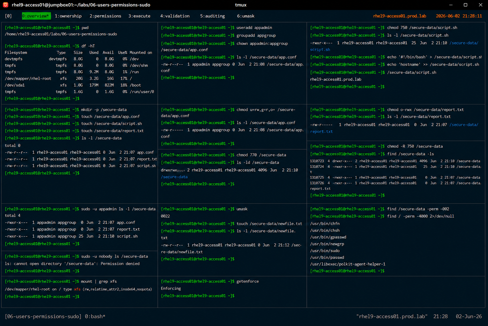

# Linux File Permissions Administration

## Overview

This lab demonstrates enterprise Linux file permission management on RHEL 9 systems.

The workflow simulates production access control administration tasks involving ownership management, standard permissions, permission auditing, and secure filesystem operations.

---

# Objective

This exercise covers:

- file ownership management
- permission modification
- symbolic and numeric modes
- directory permissions
- secure file handling
- permission validation
- enterprise access control practices

---

# Environment Information

| Item | Details |
|---|---|
| Operating System | RHEL 9.6 |
| Hostname | rhel9-access01.prod.lab |
| Filesystem | XFS |
| SELinux | Enforcing |
| Access Method | SSH |

---

# Linux Permission Model

Linux permissions use:

| Permission | Value |
|---|---|
| Read | 4 |
| Write | 2 |
| Execute | 1 |

Permission structure:

```text
owner / group / others
```

Example:

```text
-rwxr-x---
```

---

# Initial Filesystem Validation

## Verify Working Directory

```bash
pwd
```

---

## Verify Filesystem Usage

```bash
df -hT
```

Expected output:

```text
xfs
```

---

# Create Test Environment

## Create Working Directory

```bash
mkdir -p /secure-data
```

---

## Create Test Files

```bash
touch /secure-data/app.conf
touch /secure-data/script.sh
touch /secure-data/report.txt
```

---

## Verify File Creation

```bash
ls -l /secure-data
```

Expected output:

```text
app.conf
script.sh
report.txt
```

---

# Ownership Management

## Create Test User and Group

```bash
useradd appadmin
groupadd appgroup
```

---

## Change File Ownership

```bash
chown appadmin:appgroup /secure-data/app.conf
```

---

## Verify Ownership

```bash
ls -l /secure-data/app.conf
```

Expected output:

```text
appadmin appgroup
```

---

# Symbolic Permission Configuration

## Configure Read/Write Permissions

```bash
chmod u=rw,g=r,o= /secure-data/app.conf
```

---

## Verify Permissions

```bash
ls -l /secure-data/app.conf
```

Expected output:

```text
-rw-r-----
```

---

# Numeric Permission Configuration

## Configure Script Permissions

```bash
chmod 750 /secure-data/script.sh
```

Permission breakdown:

| Value | Meaning |
|---|---|
| 7 | rwx |
| 5 | r-x |
| 0 | --- |

---

## Verify Script Permissions

```bash
ls -l /secure-data/script.sh
```

Expected output:

```text
-rwxr-x---
```

---

# Directory Permission Configuration

## Configure Directory Permissions

```bash
chmod 770 /secure-data
```

---

## Verify Directory Permissions

```bash
ls -ld /secure-data
```

Expected output:

```text
drwxrwx---
```

---

# Execute Permission Validation

## Add Script Content

```bash
echo '#!/bin/bash' > /secure-data/script.sh
echo 'hostname' >> /secure-data/script.sh
```

---

## Execute Script

```bash
/secure-data/script.sh
```

Expected output:

```text
rhel9-access01.prod.lab
```

---

# Permission Restriction Validation

## Remove World Access

```bash
chmod o-rwx /secure-data/report.txt
```

---

## Verify Restricted Permissions

```bash
ls -l /secure-data/report.txt
```

Expected output:

```text
-rw-r-----
```

---

# Recursive Permission Management

## Apply Recursive Permissions

```bash
chmod -R 750 /secure-data
```

---

## Verify Recursive Changes

```bash
find /secure-data -ls
```

---

# User Access Validation

## Test User Access

```bash
sudo -u appadmin ls -l /secure-data
```

---

## Verify Access Restrictions

```bash
sudo -u nobody ls /secure-data
```

Expected output:

```text
Permission denied
```

---

# Default umask Validation

## Verify Current umask

```bash
umask
```

Expected output:

```text
0022
```

---

## Create New File

```bash
touch /secure-data/newfile.txt
```

---

## Verify Default Permissions

```bash
ls -l /secure-data/newfile.txt
```

Expected output:

```text
-rw-r--r--
```

---

# Permission Auditing

## Identify World-Writable Files

```bash
find /secure-data -perm -002
```

---

## Identify SUID Files

```bash
find / -perm -4000 2>/dev/null
```

---

# Filesystem Validation

## Verify Filesystem Status

```bash
mount | grep xfs
```

---

# SELinux Validation

## Verify SELinux Status

```bash
getenforce
```

Expected output:

```text
Enforcing
```

SELinux remains enabled throughout all permission operations.

---

# Operational Recommendations

## Follow Least Privilege Principles

Enterprise systems should provide:

- minimum required permissions
- restricted write access
- controlled execute permissions
- limited world access

---

## Avoid Excessive Recursive chmod Usage

Recursive permission changes may:

- introduce security risks
- break applications
- expose sensitive files

Always validate changes before production deployment.

---

## Audit Permissions Regularly

Enterprise monitoring should validate:

- unauthorized permission changes
- world-writable files
- excessive ownership privileges
- insecure SUID binaries

---

# Operational Notes

- Linux permissions enforce filesystem security
- numeric permissions simplify administration
- symbolic permissions improve readability
- execute permissions require careful validation
- enterprise environments require regular permission auditing

---

# Expected Outcome

After completing this lab:

- file ownership management is operational
- symbolic and numeric permissions are validated
- recursive permission management is understood
- access restriction validation is completed
- enterprise filesystem security practices are applied

---

# Screenshot Reference


