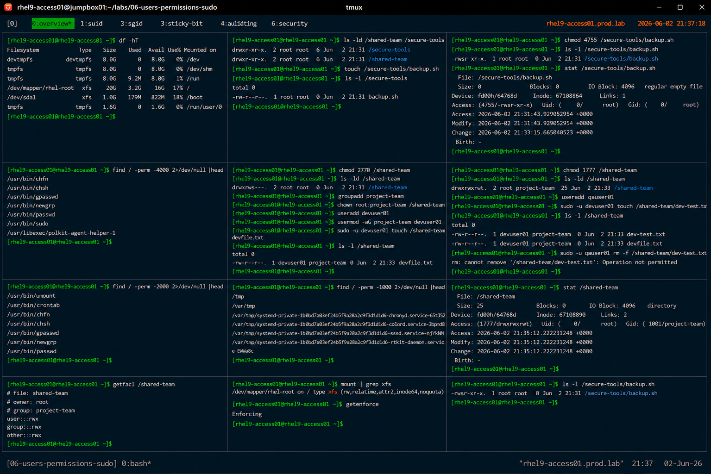

# Linux Special Permissions

## Overview

This lab demonstrates enterprise Linux special permission management on RHEL 9 systems.

The workflow simulates production security administration tasks involving SUID, SGID, sticky bit configuration, and secure shared directory management.

---

# Objective

This exercise covers:

- SUID configuration
- SGID configuration
- sticky bit management
- shared directory security
- permission auditing
- privilege escalation validation
- enterprise security best practices

---

# Environment Information

| Item | Details |
|---|---|
| Operating System | RHEL 9.6 |
| Hostname | rhel9-access01.prod.lab |
| Filesystem | XFS |
| SELinux | Enforcing |
| Access Method | SSH |

---

# Special Permissions Overview

Linux special permissions include:

| Permission | Purpose |
|---|---|
| SUID | Execute as file owner |
| SGID | Execute as group owner / inherit group |
| Sticky Bit | Restrict file deletion |

---

# Initial Filesystem Validation

## Verify Filesystem Type

```bash
df -hT
```

Expected output:

```text
xfs
```

---

## Verify Current Permissions

```bash
mount | grep xfs
```

---

# Create Test Environment

## Create Working Directories

```bash
mkdir -p /shared-team
mkdir -p /secure-tools
```

---

## Create Test Script

```bash
touch /secure-tools/backup.sh
```

---

## Verify File Creation

```bash
ls -l /secure-tools
```

Expected output:

```text
backup.sh
```

---

# SUID Configuration

## Configure SUID Permission

```bash
chmod 4755 /secure-tools/backup.sh
```

Permission breakdown:

| Value | Meaning |
|---|---|
| 4 | SUID |
| 755 | rwxr-xr-x |

---

## Verify SUID Permissions

```bash
ls -l /secure-tools/backup.sh
```

Expected output:

```text
-rwsr-xr-x
```

The `s` indicates active SUID permissions.

---

# SUID Validation

## Identify SUID Files

```bash
find / -perm -4000 2>/dev/null
```

Expected output:

```text
/usr/bin/passwd
```

---

## Verify Effective Ownership

```bash
stat /secure-tools/backup.sh
```

Expected output:

```text
Access: (4755/-rwsr-xr-x)
```

---

# SGID Configuration

## Configure SGID Directory

```bash
chmod 2770 /shared-team
```

Permission breakdown:

| Value | Meaning |
|---|---|
| 2 | SGID |
| 770 | rwxrwx--- |

---

## Verify SGID Permissions

```bash
ls -ld /shared-team
```

Expected output:

```text
drwxrws---
```

The `s` indicates active SGID permissions.

---

# SGID Inheritance Validation

## Create Project Group

```bash
groupadd project-team
```

---

## Assign Group Ownership

```bash
chown root:project-team /shared-team
```

---

## Create Test User

```bash
useradd devuser01
```

---

## Add User to Group

```bash
usermod -aG project-team devuser01
```

---

## Create Test File

```bash
sudo -u devuser01 touch /shared-team/devfile.txt
```

---

## Verify Group Inheritance

```bash
ls -l /shared-team
```

Expected output:

```text
devfile.txt
```

The file inherits the `project-team` group automatically.

---

# Sticky Bit Configuration

## Configure Sticky Bit Directory

```bash
chmod 1777 /shared-team
```

Permission breakdown:

| Value | Meaning |
|---|---|
| 1 | Sticky Bit |
| 777 | rwxrwxrwx |

---

## Verify Sticky Bit Permissions

```bash
ls -ld /shared-team
```

Expected output:

```text
drwxrwxrwt
```

The `t` indicates active sticky bit permissions.

---

# Sticky Bit Validation

## Create Additional User

```bash
useradd qauser01
```

---

## Create User-Owned File

```bash
sudo -u devuser01 touch /shared-team/dev-test.txt
```

---

## Attempt Unauthorized File Deletion

```bash
sudo -u qauser01 rm -f /shared-team/dev-test.txt
```

Expected output:

```text
Operation not permitted
```

Sticky bit protection validated successfully.

---

# Permission Auditing

## Identify SGID Files

```bash
find / -perm -2000 2>/dev/null
```

---

## Identify Sticky Bit Directories

```bash
find / -perm -1000 2>/dev/null
```

---

## Identify SUID Files

```bash
find / -perm -4000 2>/dev/null
```

---

# Security Validation

## Verify Effective Permissions

```bash
stat /shared-team
```

---

## Verify Access Control

```bash
getfacl /shared-team
```

---

# Filesystem Validation

## Verify Mounted Filesystem

```bash
mount | grep xfs
```

---

# SELinux Validation

## Verify SELinux Status

```bash
getenforce
```

Expected output:

```text
Enforcing
```

SELinux remains enabled throughout all special permission operations.

---

# Operational Recommendations

## Restrict SUID Usage

Improper SUID usage may introduce:

- privilege escalation risks
- unauthorized root access
- security vulnerabilities

Enterprise systems should audit SUID binaries regularly.

---

## Use SGID for Collaborative Directories

SGID improves:

- shared group ownership
- collaboration consistency
- operational simplicity
- filesystem governance

---

## Use Sticky Bit for Shared Writable Directories

Recommended locations:

- shared team storage
- temporary directories
- collaborative workspaces

Sticky bit prevents unauthorized deletion by other users.

---

# Operational Notes

- SUID changes execution ownership
- SGID enables group inheritance
- sticky bit protects shared directories
- permission auditing improves enterprise security
- special permissions require controlled governance

---

# Expected Outcome

After completing this lab:

- SUID configuration is operational
- SGID inheritance is validated
- sticky bit protection is verified
- permission auditing is understood
- enterprise filesystem security practices are applied

---

# Screenshot Reference


