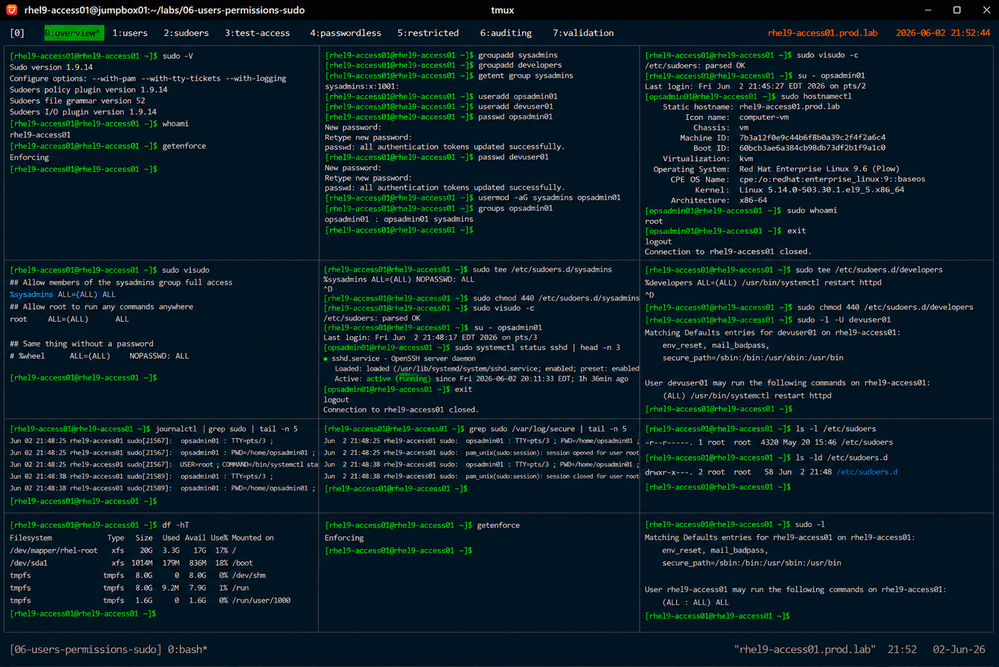

# Sudo Configuration and Administration

## Overview

This lab demonstrates enterprise Linux sudo administration on RHEL 9 systems.

The workflow simulates production privilege delegation tasks involving sudo policy management, role-based access control, secure administrative delegation, and sudo auditing.

---

# Objective

This exercise covers:

- sudo configuration
- sudoers management
- role-based privilege delegation
- passwordless sudo configuration
- command restriction
- sudo auditing
- enterprise privilege management practices

---

# Environment Information

| Item | Details |
|---|---|
| Operating System | RHEL 9.6 |
| Hostname | rhel9-access01.prod.lab |
| Sudo Utility | sudo |
| SELinux | Enforcing |
| Access Method | SSH |

---

# Sudo Overview

Sudo provides:

- controlled privilege escalation
- delegated administration
- command-level restrictions
- audit logging
- enterprise access governance

---

# Initial Validation

## Verify sudo Installation

```bash
sudo -V
```

Expected output:

```text
Sudo version
```

---

## Verify Current User

```bash
whoami
```

---

## Verify SELinux Status

```bash
getenforce
```

Expected output:

```text
Enforcing
```

---

# Create Administrative Groups

## Create Sudo Groups

```bash
groupadd sysadmins
groupadd developers
```

---

## Verify Groups

```bash
getent group sysadmins
```

Expected output:

```text
sysadmins
```

---

# Create Administrative Users

## Create Users

```bash
useradd opsadmin01
useradd devuser01
```

---

## Set User Passwords

```bash
passwd opsadmin01
passwd devuser01
```

---

## Add User to Sudo Group

```bash
usermod -aG sysadmins opsadmin01
```

---

## Verify Group Membership

```bash
groups opsadmin01
```

Expected output:

```text
sysadmins
```

---

# Configure sudoers File

## Edit sudoers Safely

```bash
visudo
```

Add:

```text
%sysadmins ALL=(ALL) ALL
```

Explanation:

| Component | Purpose |
|---|---|
| `%sysadmins` | Group entry |
| `ALL=(ALL)` | All hosts/users |
| `ALL` | All commands |

---

# Validate sudoers Syntax

## Verify Configuration

```bash
visudo -c
```

Expected output:

```text
parsed OK
```

---

# Sudo Access Validation

## Switch to Administrative User

```bash
su - opsadmin01
```

---

## Execute Administrative Command

```bash
sudo hostnamectl
```

Expected output:

```text
Static hostname: rhel9-access01.prod.lab
```

---

## Verify sudo Session

```bash
sudo whoami
```

Expected output:

```text
root
```

---

# Passwordless sudo Configuration

## Create Dedicated sudoers File

```bash
vi /etc/sudoers.d/sysadmins
```

Add:

```text
%sysadmins ALL=(ALL) NOPASSWD: ALL
```

---

## Apply Secure Permissions

```bash
chmod 440 /etc/sudoers.d/sysadmins
```

---

## Validate sudoers.d Configuration

```bash
visudo -c
```

Expected output:

```text
parsed OK
```

---

# Validate Passwordless sudo

## Execute Root Command

```bash
sudo systemctl status sshd
```

Expected output:

```text
active (running)
```

No password prompt should appear.

---

# Command Restriction Configuration

## Create Developer sudo Policy

```bash
vi /etc/sudoers.d/developers
```

Add:

```text
%developers ALL=(ALL) /usr/bin/systemctl restart httpd
```

---

## Apply Secure Permissions

```bash
chmod 440 /etc/sudoers.d/developers
```

---

## Validate Restricted Access

```bash
sudo -l -U devuser01
```

Expected output:

```text
/usr/bin/systemctl restart httpd
```

---

# Sudo Audit Validation

## Verify sudo Logs

```bash
journalctl | grep sudo
```

Expected output:

```text
COMMAND=
```

---

## Verify Authentication Logs

```bash
grep sudo /var/log/secure
```

Expected output:

```text
sudo:
```

---

# Security Validation

## Verify sudoers File Permissions

```bash
ls -l /etc/sudoers
```

Expected output:

```text
-r--r-----
```

---

## Verify sudoers.d Permissions

```bash
ls -ld /etc/sudoers.d
```

Expected output:

```text
drwxr-x---
```

---

# Filesystem Validation

## Verify Mounted Filesystems

```bash
df -hT
```

Expected output:

```text
xfs
```

---

# SELinux Validation

## Verify SELinux Enforcement

```bash
getenforce
```

Expected output:

```text
Enforcing
```

SELinux remains enabled throughout all sudo operations.

---

# Operational Recommendations

## Use Group-Based sudo Policies

Group-based sudo improves:

- administrative scalability
- operational consistency
- centralized privilege governance
- simplified access management

---

## Prefer sudoers.d Over Direct sudoers Modification

Benefits:

- modular administration
- easier auditing
- safer configuration management
- reduced syntax risk

---

## Restrict High-Risk Commands

Enterprise policies should limit:

- unrestricted shell access
- filesystem modification commands
- network configuration changes
- service management privileges

---

## Audit sudo Usage Continuously

Enterprise monitoring should validate:

- unauthorized sudo attempts
- privilege escalation activity
- unusual command execution
- administrative access trends

---

# Operational Notes

- sudo enables controlled privilege delegation
- `visudo` prevents syntax corruption
- `sudoers.d` improves configuration modularity
- audit logging improves security visibility
- enterprise environments require strict sudo governance

---

# Expected Outcome

After completing this lab:

- sudo configuration is operational
- role-based privilege delegation is validated
- passwordless sudo configuration is verified
- command restriction policies are understood
- enterprise privilege governance practices are applied

---

# Screenshot Reference


