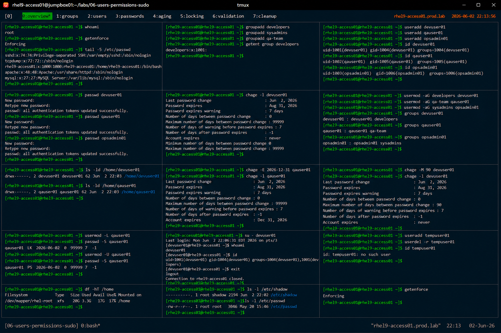

# User and Group Administration

## Overview

This lab demonstrates enterprise Linux user and group administration on RHEL 9 systems.

The workflow simulates production identity management tasks involving account provisioning, group administration, password policies, account locking, and enterprise access governance.

---

# Objective

This exercise covers:

- user account creation
- group administration
- password management
- account expiration
- account locking
- user validation
- enterprise identity management practices

---

# Environment Information

| Item | Details |
|---|---|
| Operating System | RHEL 9.6 |
| Hostname | rhel9-access01.prod.lab |
| Authentication | Local Linux Accounts |
| SELinux | Enforcing |
| Access Method | SSH |

---

# Linux User Management Overview

Linux identity management includes:

- user accounts
- primary groups
- secondary groups
- password policies
- account lifecycle management

---

# Initial Validation

## Verify Current User

```bash
whoami
```

---

## Verify SELinux Status

```bash
getenforce
```

Expected output:

```text
Enforcing
```

---

## Verify User Database

```bash
tail -5 /etc/passwd
```

---

# Group Administration

## Create Administrative Groups

```bash
groupadd developers
groupadd sysadmins
groupadd qa-team
```

---

## Verify Group Creation

```bash
getent group developers
```

Expected output:

```text
developers
```

---

# User Account Creation

## Create User Accounts

```bash
useradd devuser01
useradd qauser01
useradd opsadmin01
```

---

## Verify User Accounts

```bash
id devuser01
id qauser01
id opsadmin01
```

Expected output:

```text
uid=
```

---

# Password Management

## Configure User Passwords

```bash
passwd devuser01
passwd qauser01
passwd opsadmin01
```

Expected output:

```text
password updated successfully
```

---

## Verify Password Aging Policy

```bash
chage -l devuser01
```

Expected output:

```text
Maximum number of days between password change
```

---

# Group Membership Management

## Add Users to Groups

```bash
usermod -aG developers devuser01
usermod -aG qa-team qauser01
usermod -aG sysadmins opsadmin01
```

---

## Verify Group Membership

```bash
groups devuser01
groups qauser01
groups opsadmin01
```

Expected output:

```text
developers
```

---

# Home Directory Validation

## Verify Home Directories

```bash
ls -ld /home/devuser01
ls -ld /home/qauser01
```

Expected output:

```text
drwx------
```

---

# Account Expiration Management

## Configure Account Expiration

```bash
chage -E 2026-12-31 qauser01
```

---

## Verify Expiration Policy

```bash
chage -l qauser01
```

Expected output:

```text
Account expires
```

---

# Password Expiration Policy

## Configure Password Expiration

```bash
chage -M 90 devuser01
```

---

## Verify Password Expiration

```bash
chage -l devuser01
```

Expected output:

```text
Maximum number of days between password change : 90
```

---

# Account Locking

## Lock User Account

```bash
usermod -L qauser01
```

---

## Verify Locked Account

```bash
passwd -S qauser01
```

Expected output:

```text
L
```

---

# Account Unlocking

## Unlock User Account

```bash
usermod -U qauser01
```

---

## Verify Account Status

```bash
passwd -S qauser01
```

Expected output:

```text
PS
```

---

# User Access Validation

## Switch to User Account

```bash
su - devuser01
```

---

## Verify User Identity

```bash
whoami
id
```

Expected output:

```text
devuser01
```

---

# Account Deletion

## Create Temporary User

```bash
useradd tempuser01
```

---

## Remove User Account

```bash
userdel -r tempuser01
```

---

## Verify User Removal

```bash
id tempuser01
```

Expected output:

```text
no such user
```

---

# Filesystem Validation

## Verify Home Directory Usage

```bash
df -hT /home
```

Expected output:

```text
xfs
```

---

# Security Validation

## Verify Shadow File Permissions

```bash
ls -l /etc/shadow
```

Expected output:

```text
----------
```

---

## Verify passwd File Permissions

```bash
ls -l /etc/passwd
```

Expected output:

```text
-rw-r--r--
```

---

# SELinux Validation

## Verify SELinux Enforcement

```bash
getenforce
```

Expected output:

```text
Enforcing
```

SELinux remains enabled throughout all identity management operations.

---

# Operational Recommendations

## Use Group-Based Access Control

Enterprise environments should prefer:

- group-based authorization
- centralized access management
- minimal direct user permissions
- standardized role assignments

---

## Enforce Password Policies

Enterprise password policies should include:

- password expiration
- account lockout controls
- password complexity
- inactive account cleanup

---

## Audit User Accounts Regularly

Enterprise monitoring should validate:

- inactive accounts
- unauthorized users
- excessive group membership
- expired accounts
- privileged user access

---

## Remove Unused Accounts Promptly

Unused accounts increase:

- security exposure
- unauthorized access risks
- audit complexity

Lifecycle management improves enterprise security posture.

---

# Operational Notes

- Linux identity management controls user access
- groups simplify enterprise authorization
- password aging improves security governance
- account locking prevents unauthorized access
- enterprise environments require continuous identity auditing

---

# Expected Outcome

After completing this lab:

- user account administration is operational
- group management is validated
- password policies are configured
- account lifecycle management is understood
- enterprise identity governance practices are applied

---

# Screenshot Reference


