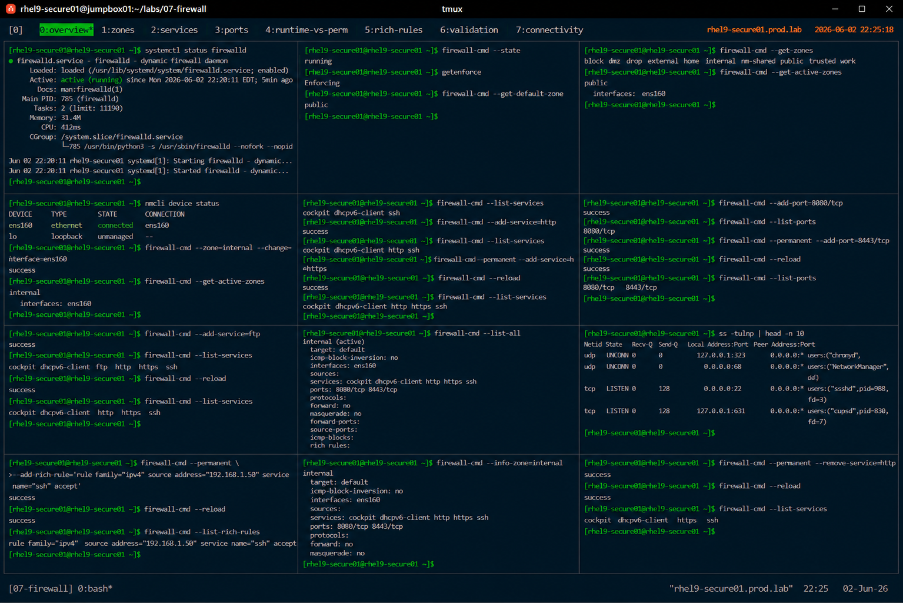

# firewalld Basics and Zone Management

## Overview

This lab demonstrates enterprise Linux firewall administration using `firewalld` on RHEL 9 systems.

The workflow simulates production network security operations involving zone management, service filtering, runtime and permanent rules, and enterprise firewall validation.

---

# Objective

This exercise covers:

- firewalld service management
- firewall zone configuration
- service-based filtering
- port management
- runtime and permanent rules
- firewall validation
- enterprise network security practices

---

# Environment Information

| Item | Details |
|---|---|
| Operating System | RHEL 9.6 |
| Hostname | rhel9-secure01.prod.lab |
| Firewall Service | firewalld |
| Firewall Backend | nftables |
| SELinux | Enforcing |

---

# firewalld Overview

firewalld provides:

- dynamic firewall management
- network zone segmentation
- service-based filtering
- runtime rule management
- enterprise network security controls

---

# Initial Firewall Validation

## Verify firewalld Status

```bash
systemctl status firewalld
```

Expected output:

```text
active (running)
```

---

## Verify Firewall State

```bash
firewall-cmd --state
```

Expected output:

```text
running
```

---

## Verify SELinux Status

```bash
getenforce
```

Expected output:

```text
Enforcing
```

---

# Zone Management

## List Available Zones

```bash
firewall-cmd --get-zones
```

Expected output:

```text
public dmz internal trusted
```

---

## Verify Active Zones

```bash
firewall-cmd --get-active-zones
```

Expected output:

```text
public
```

---

## Verify Default Zone

```bash
firewall-cmd --get-default-zone
```

Expected output:

```text
public
```

---

# Interface Assignment

## Verify Network Interfaces

```bash
nmcli device status
```

Expected output:

```text
ens160
```

---

## Assign Interface to Zone

```bash
firewall-cmd --zone=internal --change-interface=ens160
```

---

## Verify Zone Assignment

```bash
firewall-cmd --get-active-zones
```

Expected output:

```text
internal
```

---

# Service Management

## List Allowed Services

```bash
firewall-cmd --list-services
```

Expected output:

```text
cockpit dhcpv6-client ssh
```

---

## Add HTTP Service

```bash
firewall-cmd --add-service=http
```

---

## Verify HTTP Service

```bash
firewall-cmd --list-services
```

Expected output:

```text
http
```

---

## Add HTTPS Service Permanently

```bash
firewall-cmd --permanent --add-service=https
```

---

## Reload Firewall Configuration

```bash
firewall-cmd --reload
```

Expected output:

```text
success
```

---

## Verify Permanent Services

```bash
firewall-cmd --list-services
```

Expected output:

```text
https
```

---

# Port Management

## Open Application Port

```bash
firewall-cmd --add-port=8080/tcp
```

---

## Verify Open Ports

```bash
firewall-cmd --list-ports
```

Expected output:

```text
8080/tcp
```

---

## Configure Persistent Port Rule

```bash
firewall-cmd --permanent --add-port=8443/tcp
```

---

## Reload Firewall

```bash
firewall-cmd --reload
```

---

## Verify Persistent Ports

```bash
firewall-cmd --list-ports
```

Expected output:

```text
8443/tcp
```

---

# Runtime vs Permanent Rules

## Add Runtime Rule

```bash
firewall-cmd --add-service=ftp
```

---

## Verify Runtime Rules

```bash
firewall-cmd --list-services
```

Expected output:

```text
ftp
```

---

## Reload Firewall

```bash
firewall-cmd --reload
```

---

## Verify Runtime Rule Removal

```bash
firewall-cmd --list-services
```

Expected output:

```text
ftp removed
```

Runtime rules are removed after reload unless configured permanently.

---

# Firewall Validation

## Verify Listening Ports

```bash
ss -tulnp
```

Expected output:

```text
LISTEN
```

---

## Verify Active Rules

```bash
firewall-cmd --list-all
```

Expected output:

```text
services:
ports:
```

---

# Network Connectivity Validation

## Test SSH Connectivity

```bash
ssh localhost
```

---

## Test HTTP Connectivity

```bash
curl http://localhost
```

Expected output:

```text
HTTP response
```

---

# Rich Rule Validation

## Add Source Restriction Rule

```bash
firewall-cmd --permanent \
--add-rich-rule='rule family="ipv4" source address="192.168.1.50" service name="ssh" accept'
```

---

## Reload Firewall

```bash
firewall-cmd --reload
```

---

## Verify Rich Rules

```bash
firewall-cmd --list-rich-rules
```

Expected output:

```text
source address="192.168.1.50"
```

---

# Firewall Persistence Validation

## Reboot Validation

```bash
reboot
```

After reboot:

```bash
firewall-cmd --list-all
```

Expected output:

```text
services:
ports:
```

Persistent rules remain active after reboot.

---

# Security Validation

## Verify Open Network Services

```bash
ss -tulnp
```

---

## Verify Firewall Backend

```bash
firewall-cmd --info-zone=public
```

Expected output:

```text
target: default
```

---

# Operational Recommendations

## Use Zones for Network Segmentation

Recommended zones:

| Zone | Purpose |
|---|---|
| public | Untrusted networks |
| internal | Trusted enterprise networks |
| dmz | Public-facing services |

---

## Prefer Services Over Manual Ports

Service-based rules improve:

- readability
- operational consistency
- audit simplicity
- configuration management

---

## Limit Exposed Services

Enterprise systems should minimize:

- unnecessary open ports
- unused services
- unrestricted inbound traffic
- broad network exposure

---

## Audit Firewall Rules Regularly

Enterprise monitoring should validate:

- unauthorized rule changes
- unexpected open ports
- zone assignments
- exposed management services

---

# Operational Notes

- firewalld provides dynamic firewall management
- runtime rules are temporary
- permanent rules survive reloads and reboots
- zones improve network segmentation
- enterprise environments require continuous firewall auditing

---

# Expected Outcome

After completing this lab:

- firewalld administration is operational
- firewall zones are configured
- runtime and permanent rules are validated
- service and port filtering is verified
- enterprise firewall governance practices are applied

---

# Screenshot Reference


