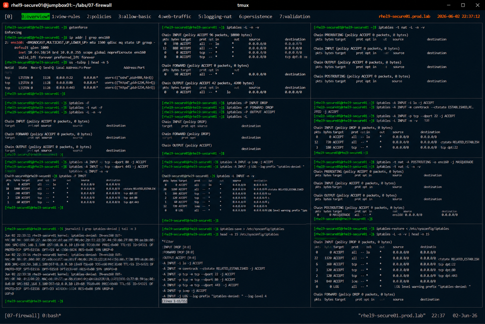

# iptables Legacy Firewall Administration

## Overview

This lab demonstrates legacy `iptables` firewall administration on RHEL 9 systems.

The workflow simulates enterprise firewall troubleshooting and compatibility scenarios involving manual packet filtering, chain management, NAT validation, and legacy firewall auditing.

---

# Objective

This exercise covers:

- iptables rule management
- INPUT/OUTPUT/FORWARD chains
- port filtering
- packet inspection
- NAT validation
- rule persistence
- enterprise firewall troubleshooting practices

---

# Environment Information

| Item | Details |
|---|---|
| Operating System | RHEL 9.6 |
| Hostname | rhel9-secure01.prod.lab |
| Firewall Utility | iptables |
| Firewall Backend | nftables compatibility |
| SELinux | Enforcing |

---

# iptables Overview

iptables provides:

- packet filtering
- stateful firewall inspection
- custom rule chains
- NAT handling
- low-level network filtering

Although `firewalld` is preferred on modern RHEL systems, iptables knowledge remains important for:

- legacy systems
- troubleshooting
- migration scenarios
- enterprise compatibility operations

---

# Initial Firewall Validation

## Verify SELinux Status

```bash
getenforce
```

Expected output:

```text
Enforcing
```

---

## Verify Active Network Interfaces

```bash
ip addr
```

Expected output:

```text
ens160
```

---

## Verify Listening Services

```bash
ss -tulnp
```

Expected output:

```text
LISTEN
```

---

# View Existing iptables Rules

## List Active Rules

```bash
iptables -L -n -v
```

Expected output:

```text
Chain INPUT
Chain FORWARD
Chain OUTPUT
```

---

## View NAT Table

```bash
iptables -t nat -L -n -v
```

Expected output:

```text
Chain PREROUTING
```

---

# Flush Existing Rules

## Remove Existing Rules

```bash
iptables -F
```

---

## Flush NAT Rules

```bash
iptables -t nat -F
```

---

## Verify Empty Ruleset

```bash
iptables -L -n -v
```

Expected output:

```text
0 references
```

---

# Default Policy Configuration

## Configure INPUT Policy

```bash
iptables -P INPUT DROP
```

---

## Configure FORWARD Policy

```bash
iptables -P FORWARD DROP
```

---

## Configure OUTPUT Policy

```bash
iptables -P OUTPUT ACCEPT
```

---

## Verify Policies

```bash
iptables -L
```

Expected output:

```text
policy DROP
```

---

# Allow Loopback Traffic

## Permit Localhost Communication

```bash
iptables -A INPUT -i lo -j ACCEPT
```

---

## Verify Loopback Rule

```bash
iptables -L INPUT -n -v
```

Expected output:

```text
ACCEPT all -- lo
```

---

# Allow Established Connections

## Permit Stateful Traffic

```bash
iptables -A INPUT \
-m conntrack --ctstate ESTABLISHED,RELATED \
-j ACCEPT
```

---

## Verify Stateful Rule

```bash
iptables -L INPUT -n -v
```

Expected output:

```text
ESTABLISHED,RELATED
```

---

# SSH Access Configuration

## Allow SSH Access

```bash
iptables -A INPUT -p tcp --dport 22 -j ACCEPT
```

---

## Verify SSH Rule

```bash
iptables -L INPUT -n -v
```

Expected output:

```text
tcp dpt:22
```

---

# HTTP and HTTPS Configuration

## Allow HTTP Access

```bash
iptables -A INPUT -p tcp --dport 80 -j ACCEPT
```

---

## Allow HTTPS Access

```bash
iptables -A INPUT -p tcp --dport 443 -j ACCEPT
```

---

## Verify Web Rules

```bash
iptables -L INPUT -n -v
```

Expected output:

```text
tcp dpt:80
tcp dpt:443
```

---

# ICMP Validation

## Allow Ping Requests

```bash
iptables -A INPUT -p icmp -j ACCEPT
```

---

## Verify ICMP Rule

```bash
iptables -L INPUT -n -v
```

Expected output:

```text
icmp
```

---

# Logging Configuration

## Add Firewall Logging Rule

```bash
iptables -A INPUT -j LOG --log-prefix "iptables-denied: "
```

---

## Verify Logging Rule

```bash
iptables -L INPUT -n -v
```

Expected output:

```text
LOG
```

---

# NAT Validation

## Configure Source NAT

```bash
iptables -t nat -A POSTROUTING \
-o ens160 -j MASQUERADE
```

---

## Verify NAT Rule

```bash
iptables -t nat -L -n -v
```

Expected output:

```text
MASQUERADE
```

---

# Connectivity Validation

## Verify SSH Connectivity

```bash
ssh localhost
```

---

## Verify HTTP Connectivity

```bash
curl http://localhost
```

---

## Verify ICMP Connectivity

```bash
ping -c 2 localhost
```

Expected output:

```text
2 packets transmitted
```

---

# Logging Validation

## View Firewall Logs

```bash
journalctl | grep iptables-denied
```

Expected output:

```text
iptables-denied
```

---

# Rule Persistence

## Save iptables Rules

```bash
iptables-save > /etc/sysconfig/iptables
```

---

## Verify Saved Rules

```bash
cat /etc/sysconfig/iptables
```

Expected output:

```text
-A INPUT
```

---

# Rule Restoration

## Restore Saved Rules

```bash
iptables-restore < /etc/sysconfig/iptables
```

---

## Verify Restored Rules

```bash
iptables -L -n -v
```

Expected output:

```text
Chain INPUT
```

---

# Security Validation

## Verify Open Ports

```bash
ss -tulnp
```

---

## Verify Packet Counters

```bash
iptables -L -v
```

Expected output:

```text
pkts bytes
```

---

# Operational Recommendations

## Prefer firewalld for Modern Systems

Use iptables primarily for:

- legacy compatibility
- troubleshooting
- low-level firewall debugging
- migration support

---

## Use Default DROP Policies

Enterprise firewalls should default to:

```text
deny all unless explicitly allowed
```

This reduces attack surface exposure.

---

## Enable Firewall Logging

Logging improves:

- intrusion visibility
- security auditing
- incident investigation
- firewall troubleshooting

---

## Audit Firewall Rules Regularly

Enterprise monitoring should validate:

- unauthorized firewall changes
- unexpected open ports
- inactive firewall policies
- excessive ACCEPT rules

---

# Operational Notes

- iptables provides low-level packet filtering
- stateful inspection improves connection tracking
- NAT rules require careful validation
- logging improves security visibility
- enterprise environments require continuous firewall auditing

---

# Expected Outcome

After completing this lab:

- iptables administration is operational
- chain-based filtering is validated
- NAT configuration is verified
- firewall logging is operational
- enterprise packet filtering practices are applied

---

# Screenshot Reference


