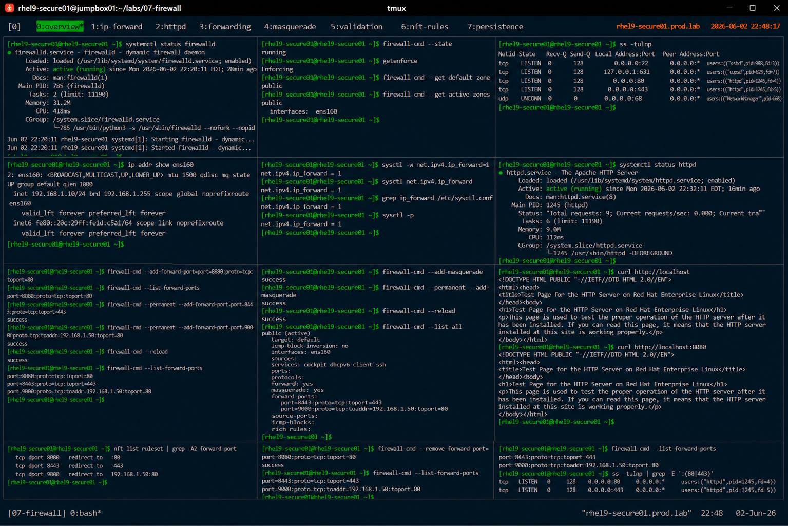

# Firewall Port Forwarding Configuration

## Overview

This lab demonstrates enterprise Linux firewall port forwarding using `firewalld` on RHEL 9 systems.

The workflow simulates production network traffic redirection scenarios involving application publishing, reverse proxy access, NAT forwarding, and secure service exposure.

---

# Objective

This exercise covers:

- port forwarding configuration
- NAT redirection
- runtime and permanent forwarding rules
- service publishing
- forwarding validation
- firewall auditing
- enterprise network security practices

---

# Environment Information

| Item | Details |
|---|---|
| Operating System | RHEL 9.6 |
| Hostname | rhel9-secure01.prod.lab |
| Firewall Service | firewalld |
| Backend | nftables |
| SELinux | Enforcing |

---

# Port Forwarding Overview

Port forwarding provides:

- service redirection
- NAT-based traffic handling
- reverse proxy workflows
- controlled application exposure
- enterprise network segmentation

---

# Initial Firewall Validation

## Verify firewalld Status

```bash
systemctl status firewalld
```

Expected output:

```text
active (running)
```

---

## Verify Firewall State

```bash
firewall-cmd --state
```

Expected output:

```text
running
```

---

## Verify SELinux Status

```bash
getenforce
```

Expected output:

```text
Enforcing
```

---

# Initial Network Validation

## Verify Listening Services

```bash
ss -tulnp
```

Expected output:

```text
LISTEN
```

---

## Verify Active Interfaces

```bash
ip addr
```

Expected output:

```text
ens160
```

---

# Enable IP Forwarding

## Enable Runtime IP Forwarding

```bash
sysctl -w net.ipv4.ip_forward=1
```

Expected output:

```text
net.ipv4.ip_forward = 1
```

---

## Verify Runtime Setting

```bash
sysctl net.ipv4.ip_forward
```

Expected output:

```text
1
```

---

## Configure Persistent IP Forwarding

```bash
vi /etc/sysctl.conf
```

Add:

```text
net.ipv4.ip_forward = 1
```

---

## Apply Persistent Configuration

```bash
sysctl -p
```

---

# Application Service Validation

## Start Web Service

```bash
systemctl start httpd
```

---

## Verify HTTP Service

```bash
systemctl status httpd
```

Expected output:

```text
active (running)
```

---

## Verify HTTP Listening Port

```bash
ss -tulnp | grep httpd
```

Expected output:

```text
:80
```

---

# Configure Basic Port Forwarding

## Forward Port 8080 to Port 80

```bash
firewall-cmd \
--add-forward-port=port=8080:proto=tcp:toport=80
```

---

## Verify Forward Rule

```bash
firewall-cmd --list-forward-ports
```

Expected output:

```text
port=8080:proto=tcp:toport=80
```

---

# Configure Permanent Forwarding

## Create Persistent Forward Rule

```bash
firewall-cmd --permanent \
--add-forward-port=port=8443:proto=tcp:toport=443
```

---

## Reload Firewall Configuration

```bash
firewall-cmd --reload
```

Expected output:

```text
success
```

---

## Verify Persistent Rule

```bash
firewall-cmd --list-forward-ports
```

Expected output:

```text
port=8443:proto=tcp:toport=443
```

---

# Configure Forwarding to Another Host

## Forward Traffic to Internal Server

```bash
firewall-cmd --permanent \
--add-forward-port=port=9000:proto=tcp:toaddr=192.168.1.50:toport=80
```

---

## Reload Firewall

```bash
firewall-cmd --reload
```

---

## Verify Remote Forward Rule

```bash
firewall-cmd --list-forward-ports
```

Expected output:

```text
toaddr=192.168.1.50
```

---

# Masquerading Configuration

## Enable NAT Masquerading

```bash
firewall-cmd --add-masquerade
```

---

## Configure Permanent Masquerading

```bash
firewall-cmd --permanent --add-masquerade
```

---

## Reload Firewall

```bash
firewall-cmd --reload
```

---

## Verify Masquerading

```bash
firewall-cmd --list-all
```

Expected output:

```text
masquerade: yes
```

---

# Connectivity Validation

## Verify Local HTTP Access

```bash
curl http://localhost
```

Expected output:

```text
HTTP response
```

---

## Verify Forwarded Port Access

```bash
curl http://localhost:8080
```

Expected output:

```text
HTTP response
```

---

## Verify HTTPS Forwarding

```bash
curl -k https://localhost:8443
```

---

# Firewall Auditing

## Verify Active Rules

```bash
firewall-cmd --list-all
```

---

## Verify Forward Ports

```bash
firewall-cmd --list-forward-ports
```

---

## Verify NAT Rules

```bash
nft list ruleset
```

Expected output:

```text
forward-port
```

---

# Remove Forwarding Rule

## Remove Runtime Rule

```bash
firewall-cmd \
--remove-forward-port=port=8080:proto=tcp:toport=80
```

---

## Verify Rule Removal

```bash
firewall-cmd --list-forward-ports
```

Expected output:

```text
8080 removed
```

---

# Persistence Validation

## Reboot Validation

```bash
reboot
```

After reboot:

```bash
firewall-cmd --list-forward-ports
```

Expected output:

```text
8443
9000
```

Permanent forwarding rules remain active after reboot.

---

# Security Validation

## Verify Listening Ports

```bash
ss -tulnp
```

---

## Verify Open Firewall Rules

```bash
firewall-cmd --list-all
```

---

# Operational Recommendations

## Limit Forwarded Services

Enterprise systems should forward only:

- required application ports
- approved enterprise services
- monitored production workloads

---

## Use Forwarding with Reverse Proxies Carefully

Port forwarding should be combined with:

- TLS encryption
- application authentication
- network segmentation
- enterprise monitoring

---

## Audit NAT and Forwarding Rules Regularly

Enterprise monitoring should validate:

- unauthorized forwarding rules
- exposed services
- unexpected NAT policies
- insecure application exposure

---

# Operational Notes

- firewalld supports dynamic port forwarding
- masquerading enables NAT functionality
- forwarding rules require careful auditing
- runtime rules are temporary
- enterprise environments require strict service exposure governance

---

# Expected Outcome

After completing this lab:

- firewall port forwarding is operational
- NAT masquerading is validated
- runtime and permanent forwarding rules are configured
- application forwarding workflows are verified
- enterprise network exposure practices are applied

---

# Screenshot Reference


