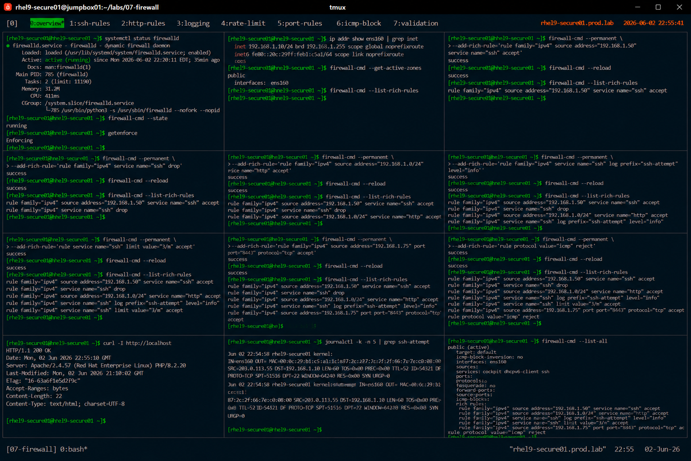

# firewalld Rich Rules Administration

## Overview

This lab demonstrates enterprise Linux firewall policy management using `firewalld` rich rules on RHEL 9 systems.

The workflow simulates advanced production firewall operations involving source filtering, service restrictions, logging, rate limiting, and granular network access control.

---

# Objective

This exercise covers:

- rich rule configuration
- source-based filtering
- service restriction policies
- logging rules
- rate limiting
- firewall auditing
- enterprise network security practices

---

# Environment Information

| Item | Details |
|---|---|
| Operating System | RHEL 9.6 |
| Hostname | rhel9-secure01.prod.lab |
| Firewall Service | firewalld |
| Firewall Backend | nftables |
| SELinux | Enforcing |

---

# Rich Rules Overview

Rich rules provide:

- granular firewall policies
- source-based access control
- logging integration
- protocol filtering
- advanced network segmentation

Rich rules extend standard firewalld service and port configuration.

---

# Initial Firewall Validation

## Verify firewalld Status

```bash
systemctl status firewalld
```

Expected output:

```text
active (running)
```

---

## Verify Firewall State

```bash
firewall-cmd --state
```

Expected output:

```text
running
```

---

## Verify SELinux Status

```bash
getenforce
```

Expected output:

```text
Enforcing
```

---

# Network Validation

## Verify Active Interfaces

```bash
ip addr
```

Expected output:

```text
ens160
```

---

## Verify Active Firewall Zones

```bash
firewall-cmd --get-active-zones
```

Expected output:

```text
public
```

---

# View Existing Rich Rules

## List Active Rich Rules

```bash
firewall-cmd --list-rich-rules
```

Expected output:

```text
(no output)
```

---

# Source-Based SSH Access

## Allow SSH from Trusted Host

```bash
firewall-cmd --permanent \
--add-rich-rule='rule family="ipv4" \
source address="192.168.1.50" \
service name="ssh" accept'
```

---

## Reload Firewall

```bash
firewall-cmd --reload
```

Expected output:

```text
success
```

---

## Verify SSH Rich Rule

```bash
firewall-cmd --list-rich-rules
```

Expected output:

```text
source address="192.168.1.50"
```

---

# Deny Unauthorized SSH Access

## Add SSH Drop Rule

```bash
firewall-cmd --permanent \
--add-rich-rule='rule family="ipv4" \
service name="ssh" drop'
```

---

## Reload Firewall

```bash
firewall-cmd --reload
```

---

## Verify Drop Rule

```bash
firewall-cmd --list-rich-rules
```

Expected output:

```text
service name="ssh" drop
```

---

# HTTP Access Restriction

## Allow HTTP from Internal Network

```bash
firewall-cmd --permanent \
--add-rich-rule='rule family="ipv4" \
source address="192.168.1.0/24" \
service name="http" accept'
```

---

## Reload Firewall

```bash
firewall-cmd --reload
```

---

## Verify HTTP Rule

```bash
firewall-cmd --list-rich-rules
```

Expected output:

```text
service name="http"
```

---

# Logging Rule Configuration

## Add Firewall Logging Rule

```bash
firewall-cmd --permanent \
--add-rich-rule='rule family="ipv4" \
service name="ssh" \
log prefix="ssh-attempt" level="info"'
```

---

## Reload Firewall

```bash
firewall-cmd --reload
```

---

## Verify Logging Rule

```bash
firewall-cmd --list-rich-rules
```

Expected output:

```text
log prefix="ssh-attempt"
```

---

# Rate Limiting Configuration

## Limit SSH Connection Attempts

```bash
firewall-cmd --permanent \
--add-rich-rule='rule service name="ssh" \
limit value="3/m" accept'
```

---

## Reload Firewall

```bash
firewall-cmd --reload
```

---

## Verify Rate Limiting Rule

```bash
firewall-cmd --list-rich-rules
```

Expected output:

```text
limit value="3/m"
```

---

# Port-Based Filtering

## Allow Application Port from Specific Host

```bash
firewall-cmd --permanent \
--add-rich-rule='rule family="ipv4" \
source address="192.168.1.75" \
port port="8443" protocol="tcp" accept'
```

---

## Reload Firewall

```bash
firewall-cmd --reload
```

---

## Verify Port Rule

```bash
firewall-cmd --list-rich-rules
```

Expected output:

```text
port port="8443"
```

---

# Reject ICMP Traffic

## Block Ping Requests

```bash
firewall-cmd --permanent \
--add-rich-rule='rule protocol value="icmp" reject'
```

---

## Reload Firewall

```bash
firewall-cmd --reload
```

---

## Verify ICMP Rule

```bash
firewall-cmd --list-rich-rules
```

Expected output:

```text
protocol value="icmp"
```

---

# Connectivity Validation

## Verify HTTP Connectivity

```bash
curl http://localhost
```

---

## Verify Listening Ports

```bash
ss -tulnp
```

Expected output:

```text
LISTEN
```

---

# Firewall Logging Validation

## Verify Firewall Logs

```bash
journalctl | grep ssh-attempt
```

Expected output:

```text
ssh-attempt
```

---

# Rich Rule Removal

## Remove SSH Drop Rule

```bash
firewall-cmd --permanent \
--remove-rich-rule='rule family="ipv4" service name="ssh" drop'
```

---

## Reload Firewall

```bash
firewall-cmd --reload
```

---

## Verify Rule Removal

```bash
firewall-cmd --list-rich-rules
```

Expected output:

```text
drop rule removed
```

---

# Persistence Validation

## Reboot Validation

```bash
reboot
```

After reboot:

```bash
firewall-cmd --list-rich-rules
```

Expected output:

```text
persistent rich rules
```

Rich rules remain active after reboot.

---

# Security Validation

## Verify Full Firewall Configuration

```bash
firewall-cmd --list-all
```

---

## Verify Active Rich Rules

```bash
firewall-cmd --list-rich-rules
```

---

# Operational Recommendations

## Use Rich Rules for Granular Security Policies

Recommended use cases:

- source-based restrictions
- privileged service exposure
- logging integration
- enterprise segmentation policies

---

## Apply Least Exposure Principles

Enterprise firewalls should expose:

- only required services
- trusted source networks
- monitored application ports

---

## Enable Logging for Critical Services

Logging improves:

- intrusion visibility
- audit readiness
- incident investigation
- firewall troubleshooting

---

## Audit Rich Rules Regularly

Enterprise monitoring should validate:

- unauthorized rich rules
- exposed management services
- inactive restrictions
- unexpected firewall logging events

---

# Operational Notes

- rich rules provide advanced firewall control
- source-based filtering improves segmentation
- logging rules improve visibility
- rate limiting reduces brute-force risk
- enterprise environments require continuous firewall auditing

---

# Expected Outcome

After completing this lab:

- rich rule administration is operational
- source-based filtering is validated
- logging and rate limiting are configured
- advanced firewall segmentation is verified
- enterprise firewall governance practices are applied

---

# Screenshot Reference


