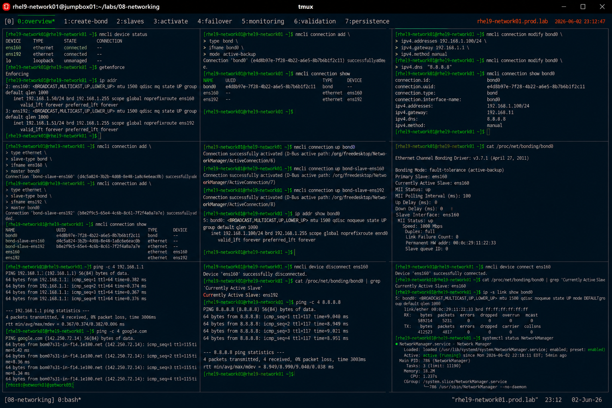

# Network Bonding Configuration

## Overview

This lab demonstrates enterprise Linux network bonding configuration on RHEL 9 systems.

The workflow simulates production high-availability networking scenarios involving NIC redundancy, failover validation, load balancing, and enterprise network resilience.

---

# Objective

This exercise covers:

- network bonding configuration
- active-backup bonding mode
- interface redundancy
- failover validation
- NetworkManager integration
- bonding monitoring
- enterprise network availability practices

---

# Environment Information

| Item | Details |
|---|---|
| Operating System | RHEL 9.6 |
| Hostname | rhel9-network01.prod.lab |
| Bond Interface | bond0 |
| Physical Interfaces | ens160, ens192 |
| Bonding Mode | active-backup |
| SELinux | Enforcing |

---

# Bonding Overview

Network bonding provides:

- NIC redundancy
- failover protection
- network resilience
- increased availability
- enterprise fault tolerance

Bonding modes include:

| Mode | Purpose |
|---|---|
| active-backup | Failover redundancy |
| balance-rr | Round-robin balancing |
| 802.3ad | LACP aggregation |

---

# Initial Network Validation

## Verify Active Interfaces

```bash
nmcli device status
```

Expected output:

```text
ens160
ens192
```

---

## Verify SELinux Status

```bash
getenforce
```

Expected output:

```text
Enforcing
```

---

## Verify IP Configuration

```bash
ip addr
```

Expected output:

```text
ens160
ens192
```

---

# Create Bond Interface

## Create bond0 Connection

```bash
nmcli connection add \
type bond \
ifname bond0 \
mode active-backup
```

Expected output:

```text
Connection 'bond0' successfully added
```

---

## Verify Bond Connection

```bash
nmcli connection show
```

Expected output:

```text
bond0
```

---

# Configure Bond IP Address

## Assign Static IP Address

```bash
nmcli connection modify bond0 \
ipv4.addresses 192.168.1.100/24 \
ipv4.gateway 192.168.1.1 \
ipv4.method manual
```

---

## Configure DNS Server

```bash
nmcli connection modify bond0 \
ipv4.dns "8.8.8.8"
```

---

# Add Slave Interfaces

## Add ens160 to bond0

```bash
nmcli connection add \
type ethernet \
slave-type bond \
ifname ens160 \
master bond0
```

---

## Add ens192 to bond0

```bash
nmcli connection add \
type ethernet \
slave-type bond \
ifname ens192 \
master bond0
```

---

## Verify Slave Interfaces

```bash
nmcli connection show
```

Expected output:

```text
bond-slave-ens160
bond-slave-ens192
```

---

# Activate Bonding

## Bring Up bond0

```bash
nmcli connection up bond0
```

---

## Activate Slave Interfaces

```bash
nmcli connection up bond-slave-ens160
nmcli connection up bond-slave-ens192
```

---

## Verify Bond Activation

```bash
ip addr show bond0
```

Expected output:

```text
bond0
```

---

# Bond Status Validation

## Verify Bonding Information

```bash
cat /proc/net/bonding/bond0
```

Expected output:

```text
Bonding Mode: fault-tolerance (active-backup)
```

---

## Verify Active Slave

```bash
cat /proc/net/bonding/bond0
```

Expected output:

```text
Currently Active Slave: ens160
```

---

# Connectivity Validation

## Verify Gateway Reachability

```bash
ping -c 4 192.168.1.1
```

Expected output:

```text
4 packets transmitted
```

---

## Verify DNS Connectivity

```bash
ping -c 4 google.com
```

Expected output:

```text
bytes from
```

---

# Failover Validation

## Simulate Primary Interface Failure

```bash
nmcli device disconnect ens160
```

---

## Verify Bond Status

```bash
cat /proc/net/bonding/bond0
```

Expected output:

```text
Currently Active Slave: ens192
```

Failover occurs automatically.

---

## Verify Network Connectivity

```bash
ping -c 4 8.8.8.8
```

Expected output:

```text
0% packet loss
```

---

# Restore Primary Interface

## Reconnect ens160

```bash
nmcli device connect ens160
```

---

## Verify Bond Recovery

```bash
cat /proc/net/bonding/bond0
```

Expected output:

```text
ens160
```

---

# Monitoring Validation

## Verify Interface Statistics

```bash
ip -s link show bond0
```

---

## Verify NetworkManager Status

```bash
systemctl status NetworkManager
```

Expected output:

```text
active (running)
```

---

# Persistence Validation

## Reboot Validation

```bash
reboot
```

After reboot:

```bash
ip addr show bond0
```

Expected output:

```text
bond0
```

Bonding configuration remains persistent after reboot.

---

# Security Validation

## Verify Listening Services

```bash
ss -tulnp
```

---

## Verify Routing Table

```bash
ip route
```

Expected output:

```text
default via 192.168.1.1
```

---

# Operational Recommendations

## Use Bonding for Critical Systems

Recommended environments:

- virtualization hosts
- enterprise application servers
- database servers
- production clusters

---

## Prefer Active-Backup for Simplicity

Benefits:

- predictable failover
- simple switch configuration
- enterprise reliability
- easier troubleshooting

---

## Monitor Bond Health Continuously

Enterprise monitoring should validate:

- slave interface failures
- failover events
- packet loss
- interface errors
- link degradation

---

# Operational Notes

- bonding improves network redundancy
- active-backup mode prioritizes availability
- NetworkManager simplifies bonding administration
- failover occurs automatically
- enterprise environments require continuous interface monitoring

---

# Expected Outcome

After completing this lab:

- network bonding is operational
- failover redundancy is validated
- bond monitoring is configured
- connectivity resilience is verified
- enterprise high-availability networking practices are applied

---

# Screenshot Reference


