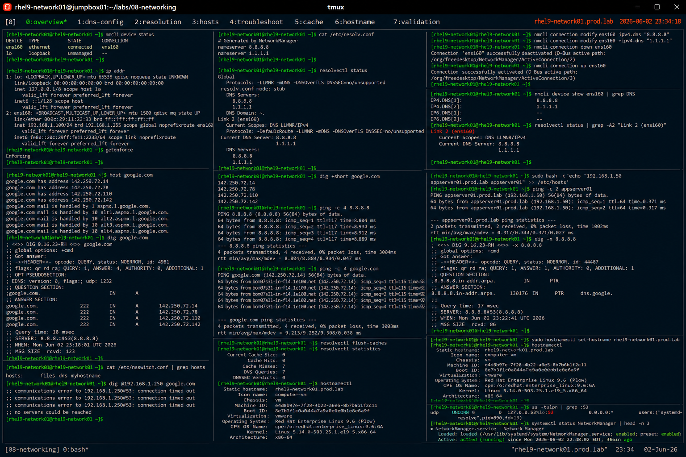

# DNS Resolution and Name Services

## Overview

This lab demonstrates enterprise Linux DNS configuration and troubleshooting on RHEL 9 systems.

The workflow simulates production name resolution operations involving DNS server configuration, resolver validation, hostname mapping, troubleshooting, and enterprise network diagnostics.

---

# Objective

This exercise covers:

- DNS server configuration
- resolver validation
- hostname resolution
- DNS troubleshooting
- NetworkManager DNS integration
- local host mapping
- enterprise name service practices

---

# Environment Information

| Item | Details |
|---|---|
| Operating System | RHEL 9.6 |
| Hostname | rhel9-network01.prod.lab |
| DNS Resolver | systemd-resolved |
| Network Utility | nmcli |
| SELinux | Enforcing |

---

# DNS Overview

DNS provides:

- hostname resolution
- service discovery
- enterprise application connectivity
- network resource mapping
- centralized naming services

---

# Initial Network Validation

## Verify Active Interfaces

```bash
nmcli device status
```

Expected output:

```text
ens160
```

---

## Verify Current IP Address

```bash
ip addr
```

Expected output:

```text
192.168.1.
```

---

## Verify SELinux Status

```bash
getenforce
```

Expected output:

```text
Enforcing
```

---

# Current DNS Validation

## View DNS Configuration

```bash
cat /etc/resolv.conf
```

Expected output:

```text
nameserver
```

---

## Verify Active DNS Servers

```bash
resolvectl status
```

Expected output:

```text
DNS Servers:
```

---

# Configure DNS Using NetworkManager

## Configure Primary DNS Server

```bash
nmcli connection modify ens160 \
ipv4.dns "8.8.8.8"
```

---

## Configure Secondary DNS Server

```bash
nmcli connection modify ens160 \
+ipv4.dns "1.1.1.1"
```

---

## Apply DNS Changes

```bash
nmcli connection down ens160
nmcli connection up ens160
```

Expected output:

```text
successfully activated
```

---

# Verify DNS Configuration

## Validate DNS Settings

```bash
nmcli device show ens160 | grep DNS
```

Expected output:

```text
8.8.8.8
1.1.1.1
```

---

## Verify Resolver Status

```bash
resolvectl status
```

Expected output:

```text
Current DNS Server
```

---

# DNS Resolution Validation

## Resolve Public Hostname

```bash
host google.com
```

Expected output:

```text
has address
```

---

## Verify DNS Queries

```bash
dig google.com
```

Expected output:

```text
ANSWER SECTION
```

---

## Verify Short DNS Query

```bash
dig +short google.com
```

Expected output:

```text
142.
```

---

# Connectivity Validation

## Verify Network Connectivity

```bash
ping -c 4 8.8.8.8
```

Expected output:

```text
0% packet loss
```

---

## Verify Hostname Resolution

```bash
ping -c 4 google.com
```

Expected output:

```text
bytes from
```

---

# Local Hostname Mapping

## Edit Local Hosts File

```bash
vi /etc/hosts
```

Add:

```text
192.168.1.50 appserver01.prod.lab appserver01
```

---

## Verify Local Resolution

```bash
ping -c 2 appserver01
```

Expected output:

```text
192.168.1.50
```

---

# Reverse Lookup Validation

## Verify PTR Resolution

```bash
dig -x 8.8.8.8
```

Expected output:

```text
PTR
```

---

# Resolver Troubleshooting

## Verify Name Service Order

```bash
cat /etc/nsswitch.conf | grep hosts
```

Expected output:

```text
files dns
```

---

## Test DNS Timeout Scenario

```bash
dig @192.168.1.250 google.com
```

Expected output:

```text
connection timed out
```

---

# DNS Cache Validation

## Flush Resolver Cache

```bash
resolvectl flush-caches
```

---

## Verify Resolver Statistics

```bash
resolvectl statistics
```

Expected output:

```text
Current Cache Size
```

---

# Hostname Validation

## Verify System Hostname

```bash
hostnamectl
```

Expected output:

```text
Static hostname:
```

---

## Configure Persistent Hostname

```bash
hostnamectl set-hostname rhel9-network01.prod.lab
```

---

## Verify Updated Hostname

```bash
hostnamectl
```

Expected output:

```text
rhel9-network01.prod.lab
```

---

# Monitoring Validation

## Verify Open DNS Connections

```bash
ss -tulpn | grep :53
```

---

## Verify NetworkManager Status

```bash
systemctl status NetworkManager
```

Expected output:

```text
active (running)
```

---

# Persistence Validation

## Reboot Validation

```bash
reboot
```

After reboot:

```bash
cat /etc/resolv.conf
```

Expected output:

```text
8.8.8.8
1.1.1.1
```

DNS configuration remains persistent after reboot.

---

# Security Validation

## Verify Resolver Configuration

```bash
resolvectl status
```

---

## Verify Routing Table

```bash
ip route
```

Expected output:

```text
default via
```

---

# Operational Recommendations

## Use Multiple DNS Servers

Enterprise environments should configure:

- primary DNS servers
- secondary fallback resolvers
- geographically redundant resolvers
- monitored DNS infrastructure

---

## Prefer Centralized DNS Management

Benefits:

- consistent name resolution
- simplified troubleshooting
- enterprise scalability
- operational visibility

---

## Monitor DNS Resolution Continuously

Enterprise monitoring should validate:

- DNS latency
- resolution failures
- unreachable resolvers
- hostname inconsistencies
- resolver cache issues

---

# Operational Notes

- DNS is critical for enterprise connectivity
- NetworkManager simplifies DNS administration
- resolver troubleshooting improves service reliability
- local hosts entries override DNS lookups
- enterprise environments require resilient name services

---

# Expected Outcome

After completing this lab:

- DNS configuration is operational
- hostname resolution is validated
- resolver troubleshooting is understood
- local host mapping is verified
- enterprise name service practices are applied

---

# Screenshot Reference


