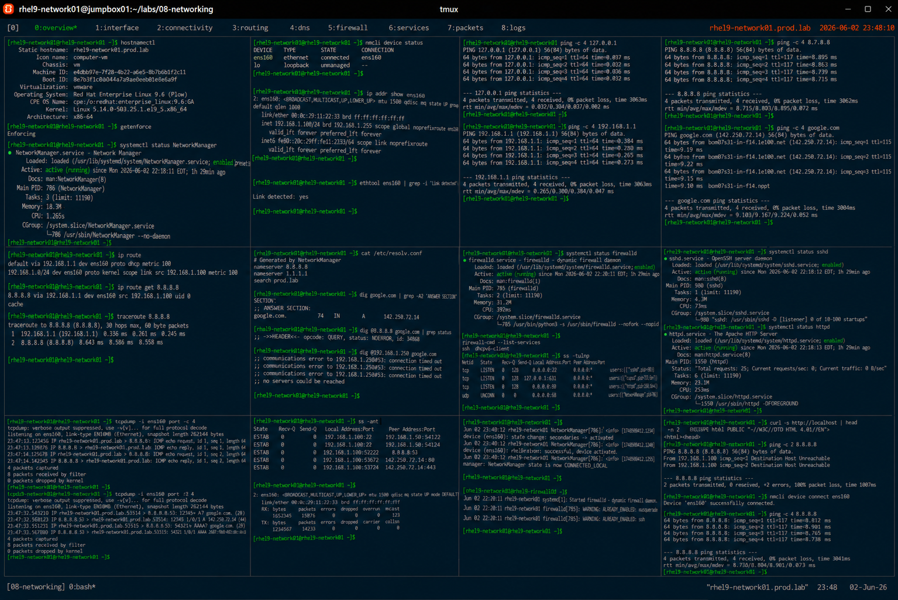

# Enterprise Network Troubleshooting Lab

## Overview

This lab demonstrates enterprise Linux network troubleshooting procedures on RHEL 9 systems.

The workflow simulates production incident response scenarios involving connectivity failures, DNS issues, routing validation, packet analysis, firewall diagnostics, and service troubleshooting.

---

# Objective

This exercise covers:

- interface troubleshooting
- connectivity diagnostics
- DNS troubleshooting
- routing analysis
- firewall validation
- packet inspection
- enterprise network incident response practices

---

# Environment Information

| Item | Details |
|---|---|
| Operating System | RHEL 9.6 |
| Hostname | rhel9-network01.prod.lab |
| Primary Interface | ens160 |
| Firewall Service | firewalld |
| SELinux | Enforcing |

---

# Troubleshooting Overview

Enterprise network troubleshooting requires:

- layered diagnostics
- connectivity validation
- service verification
- packet analysis
- firewall inspection
- routing analysis

---

# Initial System Validation

## Verify Hostname

```bash
hostnamectl
```

Expected output:

```text
rhel9-network01.prod.lab
```

---

## Verify SELinux Status

```bash
getenforce
```

Expected output:

```text
Enforcing
```

---

## Verify NetworkManager Status

```bash
systemctl status NetworkManager
```

Expected output:

```text
active (running)
```

---

# Interface Troubleshooting

## Verify Interface Status

```bash
nmcli device status
```

Expected output:

```text
ens160 connected
```

---

## Verify Interface Details

```bash
ip addr show ens160
```

Expected output:

```text
inet 192.168.1.
```

---

## Verify Link State

```bash
ethtool ens160
```

Expected output:

```text
Link detected: yes
```

---

# Connectivity Diagnostics

## Verify Loopback Connectivity

```bash
ping -c 4 127.0.0.1
```

Expected output:

```text
0% packet loss
```

---

## Verify Gateway Reachability

```bash
ping -c 4 192.168.1.1
```

Expected output:

```text
bytes from
```

---

## Verify External Connectivity

```bash
ping -c 4 8.8.8.8
```

Expected output:

```text
0% packet loss
```

---

## Verify DNS Resolution

```bash
ping -c 4 google.com
```

Expected output:

```text
bytes from
```

---

# Routing Troubleshooting

## View Routing Table

```bash
ip route
```

Expected output:

```text
default via 192.168.1.1
```

---

## Verify Route Selection

```bash
ip route get 8.8.8.8
```

Expected output:

```text
via 192.168.1.1
```

---

## Trace Network Path

```bash
traceroute 8.8.8.8
```

Expected output:

```text
1 192.168.1.1
```

---

# DNS Troubleshooting

## Verify Resolver Configuration

```bash
cat /etc/resolv.conf
```

Expected output:

```text
nameserver
```

---

## Verify DNS Query

```bash
dig google.com
```

Expected output:

```text
ANSWER SECTION
```

---

## Test Alternate Resolver

```bash
dig @8.8.8.8 google.com
```

Expected output:

```text
status: NOERROR
```

---

## Test Failed Resolver Scenario

```bash
dig @192.168.1.250 google.com
```

Expected output:

```text
connection timed out
```

---

# Firewall Troubleshooting

## Verify firewalld Status

```bash
systemctl status firewalld
```

Expected output:

```text
active (running)
```

---

## Verify Open Services

```bash
firewall-cmd --list-services
```

Expected output:

```text
ssh
```

---

## Verify Listening Ports

```bash
ss -tulnp
```

Expected output:

```text
LISTEN
```

---

# Service Troubleshooting

## Verify SSH Service

```bash
systemctl status sshd
```

Expected output:

```text
active (running)
```

---

## Verify HTTP Service

```bash
systemctl status httpd
```

Expected output:

```text
active (running)
```

---

## Verify HTTP Connectivity

```bash
curl http://localhost
```

Expected output:

```text
Test Page
```

---

# Packet Capture Validation

## Capture ICMP Traffic

```bash
tcpdump -i ens160 icmp
```

Expected output:

```text
ICMP echo request
```

---

## Capture DNS Queries

```bash
tcpdump -i ens160 port 53
```

Expected output:

```text
DNS query
```

---

# Socket Troubleshooting

## Verify Open TCP Ports

```bash
ss -tulpn
```

---

## Verify Established Connections

```bash
ss -ant
```

Expected output:

```text
ESTAB
```

---

# Log Analysis

## Verify System Logs

```bash
journalctl -xe
```

---

## Verify NetworkManager Logs

```bash
journalctl -u NetworkManager
```

Expected output:

```text
connection activated
```

---

## Verify Firewall Logs

```bash
journalctl | grep firewalld
```

Expected output:

```text
firewalld
```

---

# Interface Recovery Simulation

## Disable Interface

```bash
nmcli device disconnect ens160
```

---

## Verify Connectivity Failure

```bash
ping -c 2 8.8.8.8
```

Expected output:

```text
Network is unreachable
```

---

## Restore Interface

```bash
nmcli device connect ens160
```

---

## Verify Recovery

```bash
ping -c 4 8.8.8.8
```

Expected output:

```text
0% packet loss
```

---

# Monitoring Validation

## Verify Interface Statistics

```bash
ip -s link show ens160
```

---

## Verify Routing Statistics

```bash
netstat -rn
```

Expected output:

```text
Kernel IP routing table
```

---

# Security Validation

## Verify SELinux Enforcement

```bash
getenforce
```

---

## Verify Active Firewall Zones

```bash
firewall-cmd --get-active-zones
```

Expected output:

```text
public
```

---

# Operational Recommendations

## Follow Layered Troubleshooting

Enterprise diagnostics should validate:

1. interface status
2. IP configuration
3. gateway connectivity
4. DNS resolution
5. firewall rules
6. application services

---

## Use Multiple Diagnostic Utilities

Recommended tools:

- ping
- traceroute
- dig
- ss
- tcpdump
- journalctl

---

## Monitor Network Health Continuously

Enterprise monitoring should validate:

- packet loss
- interface failures
- DNS latency
- routing instability
- firewall changes
- service outages

---

# Operational Notes

- network troubleshooting requires layered validation
- DNS failures commonly appear as connectivity issues
- firewall policies may block application traffic
- packet captures improve incident visibility
- enterprise environments require continuous network monitoring

---

# Expected Outcome

After completing this lab:

- enterprise network troubleshooting workflows are operational
- connectivity diagnostics are validated
- DNS and routing troubleshooting is understood
- packet analysis is verified
- enterprise incident response practices are applied

---

# Screenshot Reference


