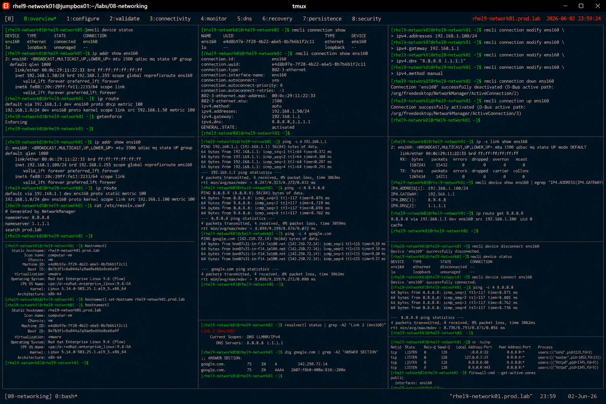

# Static IP Configuration with nmcli

## Overview

This lab demonstrates enterprise Linux static IP configuration using `nmcli` and NetworkManager on RHEL 9 systems.

The workflow simulates production network provisioning tasks involving static addressing, gateway configuration, DNS setup, interface validation, and enterprise network administration.

---

# Objective

This exercise covers:

- static IP configuration
- gateway management
- DNS configuration
- NetworkManager administration
- interface validation
- persistent networking
- enterprise network provisioning practices

---

# Environment Information

| Item | Details |
|---|---|
| Operating System | RHEL 9.6 |
| Hostname | rhel9-network01.prod.lab |
| Primary Interface | ens160 |
| Network Utility | nmcli |
| SELinux | Enforcing |

---

# Networking Overview

Static IP addressing provides:

- predictable network access
- stable infrastructure connectivity
- reliable DNS integration
- enterprise service consistency
- simplified network administration

---

# Initial Network Validation

## Verify Interface Status

```bash
nmcli device status
```

Expected output:

```text
ens160 connected
```

---

## Verify Current IP Address

```bash
ip addr show ens160
```

Expected output:

```text
inet
```

---

## Verify Routing Table

```bash
ip route
```

Expected output:

```text
default via
```

---

## Verify SELinux Status

```bash
getenforce
```

Expected output:

```text
Enforcing
```

---

# View Existing Connection

## List Network Connections

```bash
nmcli connection show
```

Expected output:

```text
ens160
```

---

## View Current Interface Settings

```bash
nmcli connection show ens160
```

Expected output:

```text
ipv4.method
```

---

# Configure Static IP Address

## Assign Static Address

```bash
nmcli connection modify ens160 \
ipv4.addresses 192.168.1.100/24
```

---

## Configure Default Gateway

```bash
nmcli connection modify ens160 \
ipv4.gateway 192.168.1.1
```

---

## Configure DNS Server

```bash
nmcli connection modify ens160 \
ipv4.dns "8.8.8.8 1.1.1.1"
```

---

## Configure Manual Addressing

```bash
nmcli connection modify ens160 \
ipv4.method manual
```

---

# Apply Network Configuration

## Restart Network Connection

```bash
nmcli connection down ens160
nmcli connection up ens160
```

Expected output:

```text
successfully activated
```

---

# Validate IP Configuration

## Verify Assigned Address

```bash
ip addr show ens160
```

Expected output:

```text
192.168.1.100/24
```

---

## Verify Gateway Configuration

```bash
ip route
```

Expected output:

```text
default via 192.168.1.1
```

---

## Verify DNS Configuration

```bash
cat /etc/resolv.conf
```

Expected output:

```text
8.8.8.8
1.1.1.1
```

---

# Connectivity Validation

## Verify Gateway Reachability

```bash
ping -c 4 192.168.1.1
```

Expected output:

```text
0% packet loss
```

---

## Verify Internet Connectivity

```bash
ping -c 4 8.8.8.8
```

Expected output:

```text
bytes from
```

---

## Verify DNS Resolution

```bash
ping -c 4 google.com
```

Expected output:

```text
bytes from
```

---

# Interface Monitoring

## Verify Interface Statistics

```bash
ip -s link show ens160
```

---

## Verify Active Connections

```bash
nmcli device show ens160
```

Expected output:

```text
IP4.ADDRESS
```

---

## Verify Routing Details

```bash
ip route get 8.8.8.8
```

Expected output:

```text
via 192.168.1.1
```

---

# Hostname Validation

## Verify Hostname

```bash
hostnamectl
```

Expected output:

```text
Static hostname:
```

---

## Configure Persistent Hostname

```bash
hostnamectl set-hostname rhel9-network01.prod.lab
```

---

## Verify Hostname Configuration

```bash
hostnamectl
```

Expected output:

```text
rhel9-network01.prod.lab
```

---

# DNS Validation

## Verify Resolver Status

```bash
resolvectl status
```

Expected output:

```text
DNS Servers
```

---

## Verify DNS Query

```bash
dig google.com
```

Expected output:

```text
ANSWER SECTION
```

---

# Network Recovery Validation

## Simulate Interface Failure

```bash
nmcli device disconnect ens160
```

---

## Verify Interface State

```bash
nmcli device status
```

Expected output:

```text
disconnected
```

---

## Restore Network Interface

```bash
nmcli device connect ens160
```

---

## Verify Connectivity Recovery

```bash
ping -c 4 8.8.8.8
```

Expected output:

```text
0% packet loss
```

---

# Persistence Validation

## Reboot Validation

```bash
reboot
```

After reboot:

```bash
ip addr show ens160
```

Expected output:

```text
192.168.1.100/24
```

Static network configuration remains persistent after reboot.

---

# Security Validation

## Verify Listening Services

```bash
ss -tulnp
```

---

## Verify Firewall Zones

```bash
firewall-cmd --get-active-zones
```

Expected output:

```text
public
```

---

# Operational Recommendations

## Use Static IPs for Critical Infrastructure

Recommended systems:

- DNS servers
- database servers
- application servers
- virtualization hosts
- enterprise gateways

---

## Use Multiple DNS Servers

Enterprise systems should configure:

- primary resolvers
- secondary fallback resolvers
- monitored DNS infrastructure

---

## Monitor Interface Health Continuously

Enterprise monitoring should validate:

- connectivity loss
- DNS failures
- routing instability
- interface errors
- gateway reachability

---

# Operational Notes

- nmcli simplifies enterprise network administration
- static addressing improves infrastructure consistency
- NetworkManager manages persistent configuration
- DNS validation is critical after provisioning
- enterprise environments require continuous connectivity monitoring

---

# Expected Outcome

After completing this lab:

- static IP configuration is operational
- gateway and DNS settings are validated
- persistent networking is verified
- interface recovery workflows are understood
- enterprise network provisioning practices are applied

---

# Screenshot Reference


