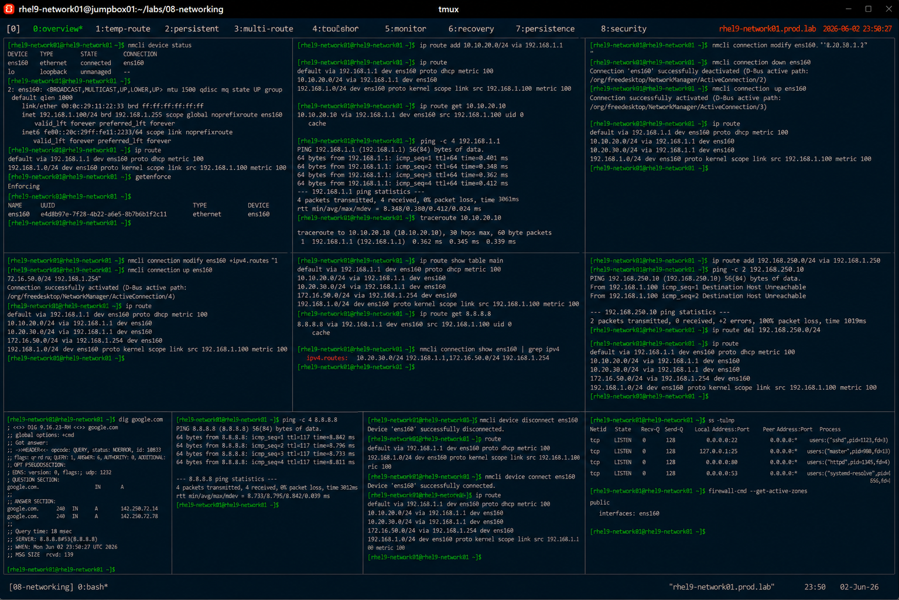

# Static Route Configuration

## Overview

This lab demonstrates enterprise Linux static route configuration on RHEL 9 systems.

The workflow simulates production routing scenarios involving custom network paths, gateway management, persistent route configuration, and enterprise traffic engineering.

---

# Objective

This exercise covers:

- static route configuration
- custom gateway management
- route persistence
- traffic path validation
- NetworkManager route administration
- routing troubleshooting
- enterprise network routing practices

---

# Environment Information

| Item | Details |
|---|---|
| Operating System | RHEL 9.6 |
| Hostname | rhel9-network01.prod.lab |
| Primary Interface | ens160 |
| Network Utility | nmcli |
| SELinux | Enforcing |

---

# Routing Overview

Static routes provide:

- custom network paths
- traffic segmentation
- alternate gateway control
- enterprise network optimization
- predictable routing behavior

---

# Initial Network Validation

## Verify Interface Status

```bash
nmcli device status
```

Expected output:

```text
ens160 connected
```

---

## Verify Current IP Address

```bash
ip addr show ens160
```

Expected output:

```text
192.168.1.
```

---

## Verify Existing Routes

```bash
ip route
```

Expected output:

```text
default via
```

---

## Verify SELinux Status

```bash
getenforce
```

Expected output:

```text
Enforcing
```

---

# Temporary Static Route Configuration

## Add Runtime Static Route

```bash
ip route add 10.10.20.0/24 via 192.168.1.1
```

---

## Verify Added Route

```bash
ip route
```

Expected output:

```text
10.10.20.0/24 via 192.168.1.1
```

---

## Verify Route Selection

```bash
ip route get 10.10.20.10
```

Expected output:

```text
via 192.168.1.1
```

---

# Connectivity Validation

## Verify Gateway Reachability

```bash
ping -c 4 192.168.1.1
```

Expected output:

```text
0% packet loss
```

---

## Trace Route Path

```bash
traceroute 10.10.20.10
```

Expected output:

```text
1 192.168.1.1
```

---

# Persistent Static Route Configuration

## Configure Persistent Route

```bash
nmcli connection modify ens160 \
+ipv4.routes "10.20.30.0/24 192.168.1.1"
```

---

## Apply Connection Changes

```bash
nmcli connection down ens160
nmcli connection up ens160
```

Expected output:

```text
successfully activated
```

---

## Verify Persistent Route

```bash
ip route
```

Expected output:

```text
10.20.30.0/24 via 192.168.1.1
```

---

# Multiple Route Configuration

## Add Additional Route

```bash
nmcli connection modify ens160 \
+ipv4.routes "172.16.50.0/24 192.168.1.254"
```

---

## Restart Connection

```bash
nmcli connection up ens160
```

---

## Verify Multiple Routes

```bash
ip route
```

Expected output:

```text
172.16.50.0/24
```

---

# Route Monitoring

## Verify Detailed Routing Table

```bash
ip route show table main
```

---

## Verify Interface Routing

```bash
ip route get 8.8.8.8
```

Expected output:

```text
dev ens160
```

---

## Verify Active Connections

```bash
nmcli connection show ens160
```

Expected output:

```text
ipv4.routes
```

---

# Route Troubleshooting

## Simulate Incorrect Route

```bash
ip route add 192.168.250.0/24 via 192.168.1.250
```

---

## Verify Failed Route

```bash
ping -c 2 192.168.250.10
```

Expected output:

```text
Destination Host Unreachable
```

---

## Remove Incorrect Route

```bash
ip route del 192.168.250.0/24
```

---

## Verify Route Removal

```bash
ip route
```

Expected output:

```text
route removed
```

---

# DNS and Connectivity Validation

## Verify DNS Resolution

```bash
dig google.com
```

Expected output:

```text
ANSWER SECTION
```

---

## Verify Internet Connectivity

```bash
ping -c 4 8.8.8.8
```

Expected output:

```text
0% packet loss
```

---

# Interface Recovery Validation

## Disconnect Interface

```bash
nmcli device disconnect ens160
```

---

## Verify Route Removal

```bash
ip route
```

Expected output:

```text
routes unavailable
```

---

## Restore Interface

```bash
nmcli device connect ens160
```

---

## Verify Route Recovery

```bash
ip route
```

Expected output:

```text
10.20.30.0/24
```

---

# Persistence Validation

## Reboot Validation

```bash
reboot
```

After reboot:

```bash
ip route
```

Expected output:

```text
10.20.30.0/24
172.16.50.0/24
```

Persistent routes remain active after reboot.

---

# Security Validation

## Verify Listening Services

```bash
ss -tulnp
```

---

## Verify Firewall Zones

```bash
firewall-cmd --get-active-zones
```

Expected output:

```text
public
```

---

# Operational Recommendations

## Use Static Routes for Predictable Traffic Flows

Recommended environments:

- enterprise WANs
- segmented application networks
- backup links
- isolated infrastructure networks

---

## Avoid Excessive Manual Routes

Too many static routes may increase:

- troubleshooting complexity
- operational overhead
- routing inconsistencies

Dynamic routing may be preferred for large environments.

---

## Monitor Routing Health Continuously

Enterprise monitoring should validate:

- route availability
- gateway reachability
- traffic latency
- routing changes
- interface failures

---

# Operational Notes

- static routes provide controlled traffic paths
- NetworkManager simplifies persistent routing
- incorrect routes may disrupt connectivity
- routing validation is critical after configuration changes
- enterprise environments require continuous routing monitoring

---

# Expected Outcome

After completing this lab:

- static route configuration is operational
- persistent routing is validated
- route troubleshooting is understood
- traffic path validation is verified
- enterprise routing practices are applied

---

# Screenshot Reference


