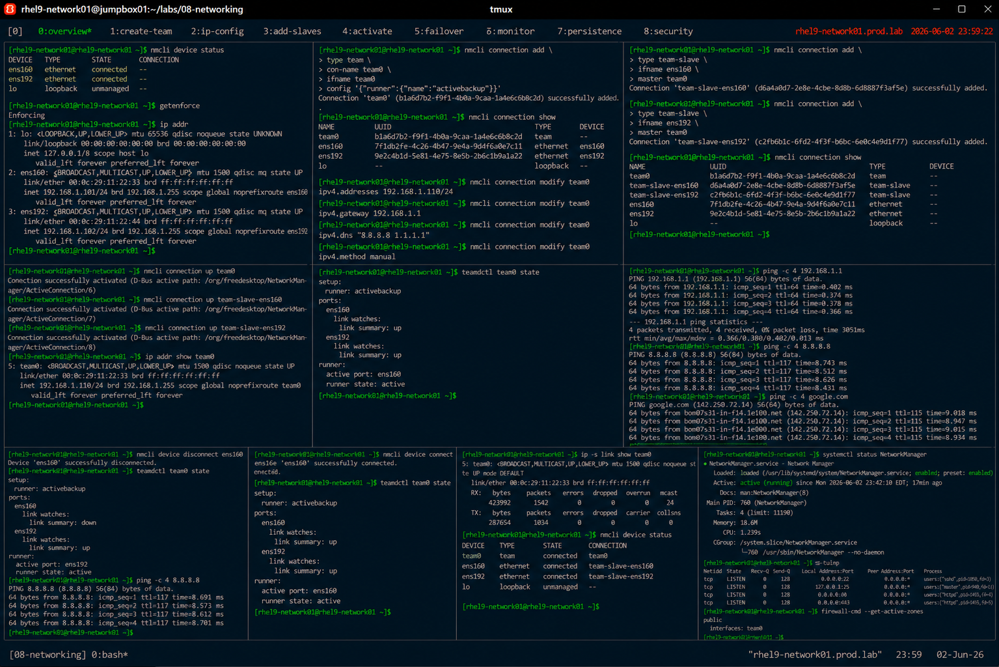

# Network Teaming Configuration

## Overview

This lab demonstrates enterprise Linux network teaming configuration on RHEL 9 systems.

The workflow simulates production high-availability networking scenarios involving interface aggregation, failover protection, load balancing, and enterprise network resiliency.

---

# Objective

This exercise covers:

- network teaming configuration
- active-backup teaming
- interface failover
- NetworkManager administration
- team monitoring
- connectivity validation
- enterprise high-availability networking practices

---

# Environment Information

| Item | Details |
|---|---|
| Operating System | RHEL 9.6 |
| Hostname | rhel9-network01.prod.lab |
| Team Interface | team0 |
| Physical Interfaces | ens160, ens192 |
| Team Mode | activebackup |
| SELinux | Enforcing |

---

# Teaming Overview

Network teaming provides:

- interface redundancy
- failover protection
- traffic balancing
- enterprise resiliency
- simplified network management

Team modes include:

| Mode | Purpose |
|---|---|
| activebackup | High availability |
| loadbalance | Traffic distribution |
| roundrobin | Sequential balancing |

---

# Initial Network Validation

## Verify Active Interfaces

```bash
nmcli device status
```

Expected output:

```text
ens160
ens192
```

---

## Verify SELinux Status

```bash
getenforce
```

Expected output:

```text
Enforcing
```

---

## Verify Current IP Configuration

```bash
ip addr
```

Expected output:

```text
192.168.1.
```

---

# Create Team Interface

## Create team0 Connection

```bash
nmcli connection add \
type team \
con-name team0 \
ifname team0 \
config '{"runner":{"name":"activebackup"}}'
```

Expected output:

```text
Connection 'team0' successfully added
```

---

## Verify Team Connection

```bash
nmcli connection show
```

Expected output:

```text
team0
```

---

# Configure Static IP Address

## Assign Team IP Address

```bash
nmcli connection modify team0 \
ipv4.addresses 192.168.1.110/24
```

---

## Configure Default Gateway

```bash
nmcli connection modify team0 \
ipv4.gateway 192.168.1.1
```

---

## Configure DNS Servers

```bash
nmcli connection modify team0 \
ipv4.dns "8.8.8.8 1.1.1.1"
```

---

## Configure Manual Addressing

```bash
nmcli connection modify team0 \
ipv4.method manual
```

---

# Add Team Slave Interfaces

## Add ens160 to team0

```bash
nmcli connection add \
type team-slave \
ifname ens160 \
master team0
```

---

## Add ens192 to team0

```bash
nmcli connection add \
type team-slave \
ifname ens192 \
master team0
```

---

## Verify Team Slaves

```bash
nmcli connection show
```

Expected output:

```text
team-slave-ens160
team-slave-ens192
```

---

# Activate Teaming

## Start team0 Connection

```bash
nmcli connection up team0
```

---

## Activate Team Slaves

```bash
nmcli connection up team-slave-ens160
nmcli connection up team-slave-ens192
```

Expected output:

```text
successfully activated
```

---

## Verify Team Interface

```bash
ip addr show team0
```

Expected output:

```text
192.168.1.110/24
```

---

# Team Status Validation

## Verify Team Configuration

```bash
teamdctl team0 state
```

Expected output:

```text
runner: activebackup
```

---

## Verify Active Port

```bash
teamdctl team0 state
```

Expected output:

```text
active port: ens160
```

---

# Connectivity Validation

## Verify Gateway Reachability

```bash
ping -c 4 192.168.1.1
```

Expected output:

```text
0% packet loss
```

---

## Verify Internet Connectivity

```bash
ping -c 4 8.8.8.8
```

Expected output:

```text
bytes from
```

---

## Verify DNS Resolution

```bash
ping -c 4 google.com
```

Expected output:

```text
bytes from
```

---

# Failover Validation

## Disconnect Primary Interface

```bash
nmcli device disconnect ens160
```

---

## Verify Team Failover

```bash
teamdctl team0 state
```

Expected output:

```text
active port: ens192
```

Failover occurs automatically.

---

## Verify Network Connectivity

```bash
ping -c 4 8.8.8.8
```

Expected output:

```text
0% packet loss
```

---

# Restore Primary Interface

## Reconnect ens160

```bash
nmcli device connect ens160
```

---

## Verify Team Recovery

```bash
teamdctl team0 state
```

Expected output:

```text
active port: ens160
```

---

# Monitoring Validation

## Verify Interface Statistics

```bash
ip -s link show team0
```

---

## Verify Team Status

```bash
nmcli device status
```

Expected output:

```text
team0 connected
```

---

## Verify NetworkManager Status

```bash
systemctl status NetworkManager
```

Expected output:

```text
active (running)
```

---

# Persistence Validation

## Reboot Validation

```bash
reboot
```

After reboot:

```bash
ip addr show team0
```

Expected output:

```text
192.168.1.110/24
```

Teaming configuration remains persistent after reboot.

---

# Security Validation

## Verify Listening Services

```bash
ss -tulnp
```

---

## Verify Active Firewall Zones

```bash
firewall-cmd --get-active-zones
```

Expected output:

```text
public
```

---

# Operational Recommendations

## Use Teaming for Enterprise Availability

Recommended environments:

- virtualization platforms
- clustered applications
- enterprise database servers
- high-availability services

---

## Monitor Team Failover Events

Enterprise monitoring should validate:

- interface failures
- failover transitions
- packet loss
- latency spikes
- link degradation

---

## Prefer Active-Backup for Simplicity

Benefits:

- predictable behavior
- easier troubleshooting
- enterprise reliability
- reduced switch complexity

---

# Operational Notes

- teaming improves network availability
- failover occurs automatically
- NetworkManager simplifies teaming administration
- DNS validation is important after failover
- enterprise environments require continuous network monitoring

---

# Expected Outcome

After completing this lab:

- network teaming is operational
- interface failover is validated
- team monitoring is configured
- persistent high-availability networking is verified
- enterprise resiliency practices are applied

---

# Screenshot Reference


